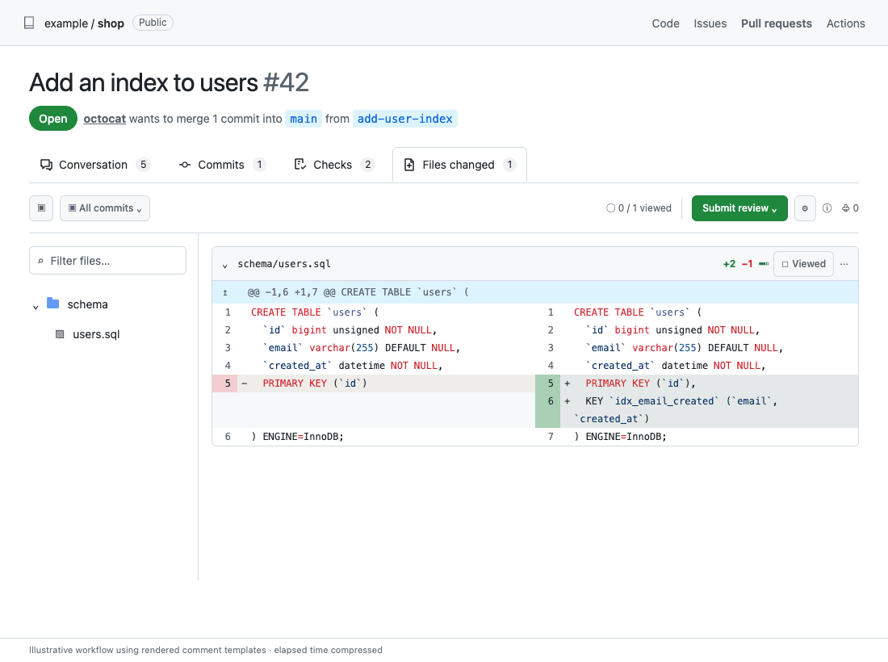

<p align="center">
  
</p>

<h1 align="center">SchemaBot</h1>

<p align="center"><b>Ship schema changes as fast as your code, with the safety net your database deserves</b></p>

<p align="center">
  
  
  
</p>

<p align="center">
  <a href="./docs/vision.md">Vision</a> ·
  <a href="#the-pr-workflow">PR workflow</a> ·
  <a href="#from-your-terminal">CLI</a> ·
  <a href="#quick-start">Quick start</a> ·
  <a href="#docs">Docs</a>
</p>

---

SchemaBot is declarative and GitOps-driven: SQL files in your repository provide a shared source of truth across environments. It compares those files with the live database, shows the exact change, and applies it through pull requests or the CLI.

## The PR workflow

[](./docs/pre-merge-workflow.md)

[Walk through the illustrated PR workflow](./docs/pre-merge-workflow.md#the-pr-workflow-step-by-step)

Block runs SchemaBot for the majority of its production schema changes, including MySQL tables spanning terabytes and Vitess databases with hundreds of shards.

## Your policies, enforced

Review the proposed SQL before it runs. Configure who can apply it and which environments it must pass through.

| Protection | How it works |
|---|---|
| **Require a review before apply** | Enable the [review gate](./docs/configuration.md#review-gate) to require approval from a configured reviewer before PR changes run. The author's own approval does not count |
| **Prove the change in earlier environments** | Set the [promotion order](./docs/pre-merge-workflow.md#promotion-order), such as staging → production. PR applies are blocked until the earlier environment's check passes |
| **Keep destructive changes explicit** | Lint findings flag unsafe changes. Applying them requires acknowledgment of the exact plan; a changed plan needs a new acknowledgment |
| **Merge what is already live** | Configure SchemaBot's checks as [required checks](./docs/github-app-setup.md). They pass when the managed live schema matches the PR, so unfinished changes cannot merge |

These are PR workflow gates. Direct CLI and API calls use [server permissions](./docs/auth.md); they do not require PR review or enforce promotion order.

These boundaries matter just as much for a coding agent as for a person. Give agents [schema context and scoped access](./docs/ai-agents.md) while keeping policy on the server.

## Quick start

Try the local demo with Docker Compose, Make, the MySQL client (`mysql`), and the Go version in [go.mod](./go.mod). No cloud account or GitHub App is needed. Use a fresh clone: the demo resets its sample schemas and local database volumes, and installs the CLI into `/usr/local/bin` (which must be writable).

```bash
git clone https://github.com/block/schemabot.git
cd schemabot
make demo
```

The demo builds SchemaBot, starts local MySQL and Vitess databases, applies the sample schemas, and seeds data. SchemaBot's API is then available at `http://localhost:13370`.

**Make your first change.** In `examples/mysql/schema/testapp/users.sql`, add this line before the table's closing parenthesis, with a comma after the preceding definition:

```sql
    phone VARCHAR(20) DEFAULT NULL
```

Review the plan against the demo's staging database:

```bash
./bin/schemabot plan -s examples/mysql/schema/testapp -e staging --endpoint http://localhost:13370
```

The plan shows one change to `users`: an `ALTER TABLE` adding the nullable `phone` column. Planning does not apply it. When it looks right, run:

```bash
./bin/schemabot apply -s examples/mysql/schema/testapp -e staging --endpoint http://localhost:13370
```

Review the interactive confirmation and approve it. The CLI follows the change to completion. Run the same plan command again: it should report no changes, because the live staging schema now matches your file.

Stop the demo when you're done:

```bash
make down
```

This stops and removes the demo containers while retaining their database volumes. See the [CLI guide](./docs/cli.md) for more commands and example output.

## From your terminal

**Plan and apply a change.** Review the SQL, apply the change, and follow it to completion.


**Know your database fleet.** Explore live schemas, spot lint issues, and follow changes through their logs.


[Get started with the CLI](./docs/cli.md) · [Explore your database fleet](./docs/schema-intelligence.md)

## Supported databases

| Database | Status | How changes run |
|---|---|---|
| MySQL | Generally available | [Spirit](https://github.com/block/spirit), with instant DDL where supported and online copying when needed |
| Vitess on PlanetScale | Generally available | [Deploy requests](https://planetscale.com/docs/vitess/schema-changes/deploy-requests), with per-shard progress |
| PostgreSQL | Early alpha | [pg-sprite](https://github.com/block/pg-sprite); see the [support envelope](./docs/postgresql.md) |

Follow progress, choose cutover timing, and pause, resume, cancel, or roll back where the engine supports it. Execution methods, throttling, and recovery differ by engine; the [capability matrix](./docs/engines.md) explains the choices.

## Use your own databases

Install a [release](#releases), then choose your setup:

- [Start locally](./docs/cli.md#initialize-your-database): Import an existing schema and verify that the files match your database
- [Set up the PR workflow](./docs/github-app-setup.md): Connect a GitHub App and configure the server for your databases
- [Configure access and review policies](./docs/auth.md): Decide who can inspect schemas, approve changes, and run commands

## Docs

Guides and reference:

- [Vision](./docs/vision.md): See what we’re building toward
- [Quick start](#quick-start): Try it on your machine
- [Pre-merge workflow](./docs/pre-merge-workflow.md): Take a schema change from your first edit to a merged PR
- [CLI guide](./docs/cli.md): Set up the CLI, inspect your databases, and run changes
- [Schema intelligence](./docs/schema-intelligence.md): Get to know your fleet and what’s changing
- [Engines](./docs/engines.md): See how changes run on your database engine
- [PostgreSQL](./docs/postgresql.md): Find out what’s supported today
- [Configuration](./docs/configuration.md): Set things up for your environment
- [Storage schema](./docs/storage-schema.md): Keep SchemaBot’s own bookkeeping database converged across deploys
- [Authentication](./docs/auth.md): Choose who can read and change your databases
- [AI agents](./docs/ai-agents.md): Set clear boundaries for your assistants
- [Safety invariants](./docs/invariants.md): Understand the guardrails behind each change
- [Architecture](./docs/architecture.md): Follow a change from start to finish
- [Target credential self-heal](./docs/target-credential-self-heal.md): Understand target probes and credential rotation recovery
- [Partition-aware index builds](./docs/partitioned-parent-index-flow.md): See the decision for online indexes on partitioned PostgreSQL tables
- [Contributing](./CONTRIBUTING.md): Come build with us

## Releases

Releases are published as binaries on the [GitHub Releases page](https://github.com/block/schemabot/releases), as container images at `ghcr.io/block/schemabot`, and, if you run Kubernetes, as a Helm chart at `oci://ghcr.io/block/charts/schemabot`.

Every release tag is deployed to production at Block. SchemaBot is pre-1.0, so read the release notes before upgrading: they describe compatibility changes.

See [docs/release.md](./docs/release.md) for how releases are cut and what is checked before a tag is published.

## Contributing

Contributors are welcome. See [CONTRIBUTING.md](./CONTRIBUTING.md).

For feature requests and bugs, [open an issue](https://github.com/block/schemabot/issues).
