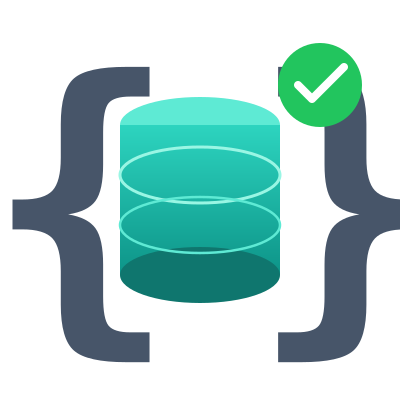

<p align="center">
  
</p>

<h1 align="center">SchemaBot</h1>

<p align="center"><b>Ship schema changes as fast as your code, with the safety net your database deserves</b></p>

<p align="center">
  
  
  
</p>

<p align="center">
  <a href="./docs/vision.md">Vision</a> ·
  <a href="#see-it-in-action">See it in action</a> ·
  <a href="#why-schemabot">Why SchemaBot</a> ·
  <a href="#how-it-works">How it works</a> ·
  <a href="#quick-start">Quick start</a> ·
  <a href="#docs">Docs</a>
</p>

---

SchemaBot makes database schema changes safe and easy. Declare the schema you want in plain SQL files, then ship it through the PR workflow you already use or an interactive CLI. No migration scripts, no hand-written ALTER statements: SchemaBot computes the DDL, lints it, gates anything destructive behind explicit approval, and executes with smart defaults, instant DDL when safe and a zero-downtime online copy when not. Live progress and operator controls the whole way.

SchemaBot is built for the agentic era. In a world where agents build product features from scratch, SchemaBot gives them the guardrails, context, and tooling to safely evolve your database schema. Declarative SQL files are a version-controlled source of truth an agent can read and reason about, and every change passes the same linting, safety gates, and merge-blocking checks, no matter who (or what) wrote it. Block runs SchemaBot today for the majority of its production schema changes, across a large fleet of MySQL and Vitess databases, with PostgreSQL in-flight.

## See It in Action

**The PR workflow.** Open a PR with your schema changes, and SchemaBot plans, applies, and verifies them across environments, right from the PR timeline:


**The interactive CLI.** The same power from your terminal: plan, apply, and watch schema changes live:


## Why SchemaBot

- 🛡️ **Guardrails built in.** Every change is parsed with a real DDL parser and linted with sophisticated rules before anything executes. Destructive changes are gated behind explicit acknowledgment, and merge-blocking checks keep a PR red until the live schema matches your files.
- ⚡ **Smart execution.** Instant when safe, online when needed, zero downtime always. Automatic throttling backs off when your database is under pressure.
- 🚀 **Ship faster.** The entire workflow runs in PR comments: plan previews on every PR, apply with a comment, watch live progress stream in. No scripts to write, no consoles to click through.
- 🎛️ **Stay in control.** `stop`, `start`, `cutover`, `cancel`, and `rollback` a running change from the PR or the CLI. Promotion order is enforced: production won't apply until the earlier environments are green.
- 🤖 **Agent-ready.** Declarative SQL files give agents the schema as context, and the same gates hold for every author, human or agent.

## How It Works

SchemaBot uses **declarative schema**. Each table is one `CREATE TABLE` file in your repo; you describe the desired end state, and SchemaBot figures out the DDL needed to get there.

**1. Edit the table's file.** Want a new column? Add it to the definition. That's the whole change:

```sql
-- schema/testapp/users.sql
CREATE TABLE users (
    id BIGINT UNSIGNED NOT NULL AUTO_INCREMENT PRIMARY KEY,
    name VARCHAR(255) NOT NULL,
    email VARCHAR(255) NOT NULL,       -- add a column: just edit this file
    created_at TIMESTAMP DEFAULT CURRENT_TIMESTAMP
) ENGINE=InnoDB DEFAULT CHARSET=utf8mb4 COLLATE=utf8mb4_0900_ai_ci;
```

**2. Open a PR.** SchemaBot diffs your files against the live database and comments the exact DDL it will run. Review it like any code.

**3. Apply.** Comment `schemabot apply -e staging`, then `-e production`, or run the same from the CLI. Changes run online, with live progress:

```
$ schemabot plan -s ./schema -e staging

╭─────────────────────────────────────────────╮
│  MySQL Schema Change Plan                   │
│                                             │
│  Database: testapp                          │
│  Environment: staging                       │
│  Schema name: testapp                       │
╰─────────────────────────────────────────────╯

     ~ users
       ALTER TABLE `users` ADD COLUMN `email` varchar(255) NOT NULL;

📋 Plan: 1 table to alter

$ schemabot apply -s ./schema -e staging -y

  users: 🟦🟦🟦🟦🟦🟦🟦🟦🟦🟦🟦🟦🟦⬜⬜⬜⬜⬜⬜⬜ 65% (1,742,301/2,680,463 rows) ETA 2m 10s
         ALTER TABLE `users` ADD COLUMN `email` varchar(255) NOT NULL

  users: 🟩🟩🟩🟩🟩🟩🟩🟩🟩🟩🟩🟩🟩🟩🟩🟩🟩🟩🟩🟩 ✓ Complete
```

**4. Merge when green.** The required check passes only when the live schema matches your files. Applied, verified, merged, in that order.

SchemaBot handles the full lifecycle:
- **Plan**: diff the desired schema against the live database and compute the DDL
- **Apply**: execute the DDL online using [Spirit](https://github.com/block/spirit) (MySQL), [PlanetScale deploy requests](https://planetscale.com/docs/vitess/schema-changes/deploy-requests) (Vitess), or [pg-sprite](https://github.com/block/pg-sprite) (PostgreSQL)
- **Progress**: track row copy progress, the ETA, and per-table and per-shard status
- **Control**: `stop` (pause), `start` (resume), `cutover` (trigger the table swap), `cancel` (end the change), and `revert` (roll back)

Simple changes (e.g., adding a column) use instant DDL and complete in milliseconds. Operations that require a row copy (e.g., adding an index) run online without blocking reads or writes.

Not every engine supports every feature, and some share a verb without sharing its meaning: pausing and resuming a running change, `revert`, automatic throttling, and drop recovery all vary by engine. [docs/engines.md](./docs/engines.md) is the capability matrix showing which engine does what and why.

## Quick Start

Try it from a clone. The demo brings up local MySQL containers, applies a schema, and seeds data; the schemas and configs it uses are documented in [examples/](./examples/README.md):

```bash
make demo    # Start services, apply schema, seed data
make test    # Run all tests (unit + integration + e2e)
```

Connect to the demo databases:
```bash
make mysql              # SchemaBot storage DB (port 13371)
make mysql DB=staging   # Staging testapp (port 13372)
make mysql DB=production # Production testapp (port 13373)
```

To run SchemaBot against your own databases, grab a build from [Releases](#releases) (binary, container image, or Helm chart), then follow [docs/github-app-setup.md](./docs/github-app-setup.md) to wire up the PR workflow and [docs/configuration.md](./docs/configuration.md) for the server config. [`schemabot onboard`](./docs/github-app-setup.md#6-add-schemabotyaml-config-to-your-repository) pulls a live database's schema into a new declarative schema directory, so you start from your real tables rather than writing them out by hand.

## Docs

Guides and reference:

- [Vision](./docs/vision.md): See what we’re building toward
- [Quick start](#quick-start): Try it on your machine
- [Schema intelligence](./docs/schema-intelligence.md): Get to know your fleet and what’s changing
- [Engines](./docs/engines.md): See how changes run on your database engine
- [PostgreSQL](./docs/postgresql.md): Find out what’s supported today
- [Configuration](./docs/configuration.md): Set things up for your environment
- [Authentication](./docs/auth.md): Choose who can read and change your databases
- [AI agents](./docs/ai-agents.md): Set clear boundaries for your assistants
- [Safety invariants](./docs/invariants.md): Understand the guardrails behind each change
- [Architecture](./docs/architecture.md): Follow a change from start to finish
- [Contributing](./CONTRIBUTING.md): Come build with us

## Releases

Releases are published as binaries on the [GitHub Releases page](https://github.com/block/schemabot/releases), as container images at `ghcr.io/block/schemabot`, and, if you run Kubernetes, as a Helm chart at `oci://ghcr.io/block/charts/schemabot`.

We run what we ship. Every tag is deployed to production at Block, where SchemaBot runs the majority of Block's schema change traffic across a large fleet of MySQL and Vitess databases (with PostgreSQL planned). We actively use SchemaBot to run schema changes against tables of many shapes and sizes, with some spanning many terabytes in MySQL and 100s of shards in Vitess. Our release cadence keeps the project continuously validated against real production workloads and gets fixes out fast. Because SchemaBot is pre-1.0, the release notes are the compatibility contract: give them a read before upgrading.

See [docs/release.md](./docs/release.md) for how releases are cut and what is checked before a tag is published.

## Contributing

Contributors are welcome. See [CONTRIBUTING.md](./CONTRIBUTING.md).

For feature requests and bugs, [open an issue](https://github.com/block/schemabot/issues).
