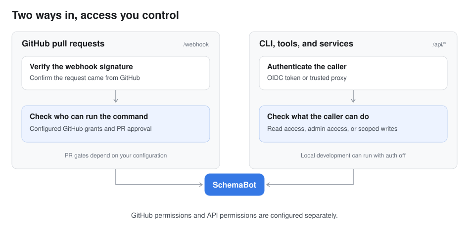
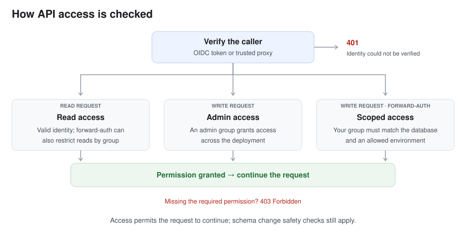

# Authentication and authorization

<!-- BEGIN TOC (auto-generated by `make docs-toc`) -->

## Table of Contents

- [Set up your server](#set-up-your-server)
  - [Where SchemaBot runs](#where-schemabot-runs)
  - [Choose your setup](#choose-your-setup)
  - [Connect GitHub](#connect-github)
  - [Run locally](#run-locally)
  - [Connect your identity provider](#connect-your-identity-provider)
  - [Use your existing proxy](#use-your-existing-proxy)
- [Set permissions](#set-permissions)
  - [What read and write access include](#what-read-and-write-access-include)
  - [Grant a team access to its database](#grant-a-team-access-to-its-database)
  - [Choose who can run GitHub commands](#choose-who-can-run-github-commands)
  - [Give a tool read-only access](#give-a-tool-read-only-access)
  - [How access checks work](#how-access-checks-work)
- [Check your access](#check-your-access)
  - [Check the GitHub connection](#check-the-github-connection)
  - [Check CLI and API access](#check-cli-and-api-access)
- [Troubleshoot access](#troubleshoot-access)
  - [Check how group names match](#check-how-group-names-match)
  - [When a check cannot be completed](#when-a-check-cannot-be-completed)
  - [Monitor access](#monitor-access)
- [Advanced configuration](#advanced-configuration)
  - [Proxy and network details](#proxy-and-network-details)
  - [Protect the other server connections](#protect-the-other-server-connections)

<!-- END TOC (auto-generated by `make docs-toc`) -->

Set up your SchemaBot server and control who can view schemas and run schema
changes. Authentication checks who is making a request;
authorization checks what they are allowed to do.

Follow the setup for your chosen authentication method, set permissions,
and check your access. Troubleshooting and advanced configuration are here
when you need them.

You can use SchemaBot through GitHub pull requests, the command line (CLI), or
the API. GitHub commands use the comment author's GitHub account. The CLI and
API use the access settings on your server. Configure each path you use.



## Set up your server

### Where SchemaBot runs

SchemaBot runs as a service that connects to your databases, plans schema
changes, and coordinates running them. You host that service yourself: on your
laptop while trying it out, or on infrastructure your team manages for shared
use. Hosting it means keeping that process running and giving it access to
the databases it manages.

The CLI connects to this service. If you use the GitHub workflow, GitHub sends
it webhook events when someone opens a PR or posts a command. SchemaBot also
uses a storage database to remember plans, change history, and ongoing work.

#### Choose where to run it

For your first try, follow the [local quick start](../README.md#quick-start).
It starts SchemaBot and demo databases on your machine, so you can explore
without connecting your own databases. Then use [Run locally](#run-locally)
below to check API access.

For a shared installation, choose a [released binary, container image, or
Helm chart](../README.md#releases) and create a
[server configuration](configuration.md) with your storage and target database
connections. The [Docker Compose example](../deploy/local/docker-compose.yml)
shows how the local installation fits together.
The installation steps depend on where you host it; this guide covers the
access settings you add to that installation.

#### Give the server an address

Your **SchemaBot server URL** is the address the CLI and API clients connect
to. It is separate from your database address:

- The local quick start uses `http://localhost:13370`
- A shared installation uses an HTTPS URL, such as
  `https://schemabot.example.com`

For shared use, your hosting platform may provide an HTTPS URL for the service.
Use that URL as the `endpoint` in your CLI profile. If you manage HTTPS
yourself, configure it through your proxy or load balancer.

Configure authentication below before opening API access to other callers,
unless you deliberately restrict access through your network. You can set up
the hostname and routing while keeping access private.

#### Prepare the server configuration

You will work with two configuration files:

| File | What you configure there |
|---|---|
| Server configuration, loaded by the SchemaBot service | Database connections and the access rules in this guide |
| CLI profile at `~/.schemabot/config.yaml` on your machine | The server URL and your login settings |

The YAML examples belong in the server configuration unless they explicitly
say they are a CLI profile. Merge them into the file you created for your
installation; do not add duplicate `auth` or `databases` keys. Replace example
hostnames and group names with your own values.

Choose an authentication method below, add its server settings, then start
the service. If you change authentication settings after starting it, restart
the service to load them. You will connect the CLI after that.

If you also want commands in pull requests, follow the
[GitHub App setup](github-app-setup.md) to connect GitHub to your server, then
[configure command permissions](#github-side-authorization). The database
credentials in the server configuration let SchemaBot connect to databases;
GitHub and API permissions decide who may ask it to act.

### Choose your setup

For shared use, there are two ways to prove who is making a CLI or API
request. The difference is **where that identity gets checked**:

- **OIDC: SchemaBot checks a token from your login provider.** You sign in
  through your identity provider, which issues a signed token. The CLI sends
  that token to SchemaBot, and SchemaBot verifies it. You do not need a proxy
  to authenticate callers. OIDC support is **alpha**.
- **Forward-auth: a proxy checks the caller first.** Requests pass through an
  authenticating reverse proxy before reaching SchemaBot. The proxy verifies
  the caller and sends their username and groups in trusted headers;
  SchemaBot uses those values to check permissions. This is the method
  **Block uses in production**.

Both can use your team's identity provider. With OIDC, SchemaBot verifies its
tokens directly; with forward-auth, your proxy handles authentication. Choose
forward-auth if you have or plan to set up an authenticating proxy, or need
per-database write permissions. OIDC lets you connect your provider directly
if its current alpha status fits your needs.

| What you want to do | Start here |
|---|---|
| Try SchemaBot on your machine | [Run locally](#run-locally) |
| Use pull requests to manage schemas | [Connect GitHub](#connect-github) |
| Let your team use its existing login | [Connect your identity provider](#oidc-bearer-tokens) |
| Use a proxy that already checks who's signed in | [Use your existing proxy](#forward_auth-authenticating-proxy) |
| Connect a dashboard, tool, or agent | [Give a tool read-only access](#calling-schemabot-as-a-service) |
| Let a team change its own databases | [Grant access to a database](#per-database-operator-scoping) |
| Choose who can run commands in PR comments | [Set GitHub permissions](#github-side-authorization) |

GitHub is optional. If you only use the CLI or API, you can skip the GitHub
permissions section.

The permission options differ too:

| Setup | Who can read? | Who can run changes? |
|---|---|---|
| OIDC | Anyone with a valid token for this server | Configured admin groups, across all databases managed by the server |
| Forward-auth | Authenticated users, optionally limited by group | Admin groups, or teams granted specific databases and environments |

If you do not have an identity provider or an authenticating proxy yet, you
can still try SchemaBot locally without either. Sharing an authenticated
server requires setting up one of those services first; SchemaBot does not
provide its own user accounts or password login.

### Connect GitHub

For the PR workflow, create and install your own GitHub App. People use their
GitHub accounts to review changes and post commands; they do not need to sign
in through the CLI or your identity provider to use this workflow.

Three pieces work together:

| Piece | What it does |
|---|---|
| App installation and private key | Let SchemaBot read files and reviews, then post plans, comments, and checks in the repositories you select |
| Webhook secret | Lets SchemaBot verify that an incoming event was signed with the secret you configured in GitHub |
| Command permissions | Decide which GitHub users and teams may run commands against each database |

Follow the [GitHub App setup guide](github-app-setup.md) to create the App,
select its permissions and events, generate a private key, and install it on
your schema repositories. Include **Members: Read** when using GitHub teams
for command permissions or review checks.

Add the App credentials to your server configuration:

```yaml
github:
  app-id: "123456"
  private-key: "file:/run/secrets/github-app.pem"
  webhook-secret: "env:GITHUB_WEBHOOK_SECRET"
```

Replace `123456` with your App ID. Make the downloaded private key available
at that path on the server, and set `GITHUB_WEBHOOK_SECRET` in the server's
environment to the same secret you entered in the App's webhook settings.
The private key authenticates SchemaBot to GitHub; the webhook secret verifies
incoming deliveries. They are different credentials.

Set the App's webhook URL to your server's `/webhook` endpoint, for example
`https://schemabot.example.com/webhook`. GitHub must be able to reach it
without an interactive login. If your proxy protects `/api/*`, give `/webhook`
a separate route that accepts GitHub deliveries and lets SchemaBot verify
their signatures. This does not require making the API public.

Always configure the webhook secret for a shared installation. Without it,
the single-App configuration skips signature verification. A signed delivery
proves where the event came from; it does not grant the comment author
permission to apply a change.

Next, [set GitHub command permissions](#github-side-authorization), then
[check the GitHub connection](#check-the-github-connection). CLI and API
access can be configured separately if you need those interfaces too.

### Run locally

For local development, you can leave authentication off:

```yaml
auth:
  type: none
```

This is also the default when `auth` is unset. Anyone who can reach the API
can read and write, so keep access restricted to your machine. Before sharing
the server, add authentication or a network restriction that limits access
to the callers you intend. Signing GitHub webhooks does not protect the API.

Requests still appear in metrics, and writes are logged with the method,
path, and source address. Without authentication, they are recorded as
anonymous rather than as a particular person.

With the local quick-start server running on its default port, check the API:

```sh
curl --fail-with-body http://localhost:13370/api/databases
```

A successful response contains a `databases` list. For example, a server with
no databases registered returns:

```json
{"databases": []}
```

The quick start lists its demo databases instead. This confirms the API is
reachable; it does not check connectivity to each database.

<a id="oidc-bearer-tokens"></a>

### Connect your identity provider

> **Alpha:** OIDC support is still evolving. Test login and permissions with
> your identity provider before relying on this setup in production.

An identity provider is the service your team uses to sign in. SchemaBot
supports OpenID Connect (OIDC), a standard that lets it verify that login.
Your provider issues a signed token, and the CLI sends it with each request.

#### Configure the server

You'll need permission to register an application with your identity provider
to complete this setup. Register a **public client** for the
CLI: this is a client that does not keep a client secret on the user's machine.

| Provider setting | Value for this example |
|---|---|
| Client ID | `schemabot-cli`, or the ID your provider assigns |
| Login flow | Authorization code with PKCE |
| Redirect URI | `http://127.0.0.1:8765/callback` |
| Requested scopes | `openid`, `email`, `groups`, `offline_access` |

PKCE protects the browser login, and the redirect returns the result to the
CLI on your own machine. The CLI requests those four scopes: `openid` enables
login, `email` identifies the user, `groups` supplies memberships, and
`offline_access` requests a refresh token so you do not have to sign in for
every session. Configure your provider to accept them and include group
memberships in the ID token when users need write access.

Use your provider's documentation for registering a native or public OIDC
application. The registration screens differ, but these are the values you
need to carry into SchemaBot:

| Value | Where it comes from | Where you use it |
|---|---|---|
| Issuer URL | Your provider's OIDC settings; it may include a tenant or realm path | Server `auth.issuer` and CLI `oidc.issuer` |
| Client ID | The application registration you just created | Server `auth.audience` and CLI `oidc.client_id` |
| Server URL | The address where you host SchemaBot | CLI `endpoint` |
| Admin group | A group your provider includes in the user's ID token | Server `pr_command_authorization.admin_teams` |

Use those actual values in the examples below. `schemabot-cli` is an example
client ID, not a value every provider will assign.

Add these settings to the server configuration:

```yaml
auth:
  type: oidc
  issuer: "https://issuer.example.com"
  audience: "schemabot-cli"
  groups_claim: "groups"
```

- `issuer` is your provider's OIDC issuer URL
- `audience` identifies the application a token was issued for; for CLI login,
  it must match the client ID you registered
- `groups_claim` names the field in the token that contains group memberships;
  the default is `groups`

SchemaBot checks the token's signature, expiry, issuer, and audience. It
caches the provider's signing keys but needs network access to discover the
provider and refresh those keys.

#### Sign in from the CLI

Start the server with the OIDC settings above before continuing. If startup
fails during provider discovery, check the issuer URL and whether the server
can reach it. Your CLI and browser also need to reach the identity provider.

A profile tells the CLI which server to contact and which provider to use
for login. Create `~/.schemabot/config.yaml` (and its parent directory if it
does not exist), or add this profile to your existing file:

```yaml
default_profile: demo
profiles:
  demo:
    endpoint: https://schemabot.example.com
    oidc:
      issuer: https://issuer.example.com
      client_id: schemabot-cli
```

Keep the file accessible only to your account, then sign in:

```sh
chmod 600 ~/.schemabot/config.yaml
schemabot login --profile demo
```

After you sign in through the browser, the CLI confirms that it saved the
login. Example output:

```text
Logged in as jane@example.com. Token cached for profile "demo".
```

You now have read access. [List your databases](#verify-a-request) to check
that the login works; you can add write permissions when you need them.

Your CLI requests now use that saved token. Reconfiguring the same endpoint
keeps your login; changing the endpoint clears the tokens, so you must sign
in again. The CLI refuses to send tokens over unencrypted HTTP except to your
own machine's loopback address.

#### Choose who can run changes

With OIDC, anyone with a valid token can view schemas and change history
across the deployment. To let a group run changes too, add it to the server's
admin team list:

```yaml
pr_command_authorization:
  admin_teams: [myorg/schema-admins]
```

Configure your provider to include a matching group in those users' ID tokens.
Despite its name, `pr_command_authorization.admin_teams` also supplies the
OIDC API admin list. `admin_users` does not: it contains GitHub usernames,
which cannot be matched to an OIDC login.

OIDC admins can operate across the deployment. If you need to limit a team to
particular databases or environments, use the proxy option below. The
`read_groups` and `operator_groups` settings apply only to that option.

You can now [check your access](#verify-a-request).

<a id="forward_auth-authenticating-proxy"></a>

### Use your existing proxy

A proxy sits between your callers and SchemaBot. If it already checks who's
signed in, it can pass their username and groups to SchemaBot in HTTP headers.
Set `auth.type: forward_auth` to use that information. This setting does not
install a proxy or create a login page; your proxy must already handle login
and forward requests to SchemaBot.

Tell SchemaBot which proxy may supply identities. If your infrastructure uses
a service mesh, its certificates can identify the proxy by a **SPIFFE ID**—a
name such as `spiffe://example.org/ns/ingress/sa/proxy`. The mesh verifies the
certificate and forwards that identity to SchemaBot.

Block uses this pattern in production, with `trusted_proxy_spiffe` rather
than source-IP allowlisting (`trusted_proxy_cidrs`).

This example uses illustrative names. Replace the SPIFFE ID
and header names with the values your mesh and proxy supply:

```yaml
auth:
  type: forward_auth
  forward_auth:
    trusted_proxy_spiffe:
      - spiffe://example.org/ns/ingress/sa/proxy
    user_header: X-Forwarded-User
    groups_header: X-Forwarded-Groups
    groups_delimiter: ","
    read_groups: []
    write_groups: [myorg/schema-admins]
```

The proxy must remove identity headers supplied by callers and set its own
values after authenticating them. With SPIFFE-based trust, the mesh must also
sanitize `X-Forwarded-Client-Cert` (XFCC), the header carrying the verified
certificate identity. Callers must not be able to bypass the mesh and reach
SchemaBot directly; SchemaBot does not verify the certificate itself.

**No service mesh? You can trust the proxy's source IP instead.** Replace
`trusted_proxy_spiffe` with `trusted_proxy_cidrs` in the example above:

```yaml
trusted_proxy_cidrs: [192.0.2.10/32]
```

This field belongs under `auth.forward_auth`. Replace the example address
with the proxy source address SchemaBot sees; `/32` means one IPv4 address.
Only allow addresses controlled by your proxy, since callers from those
addresses can supply identity headers. If you configure both SPIFFE IDs and
CIDRs, requests must match both. See [proxy trust details](#choose-which-proxies-to-trust)
for the full behavior.

In this example:

- Any authenticated user can read because `read_groups` is empty
- Members of `myorg/schema-admins` can run changes across the deployment
- Other users cannot write unless you [grant database access](#per-database-operator-scoping)

To limit readers too, put their group names in `read_groups`. Members of
`write_groups` or any database's `operator_groups` also have read access;
you do not need to list them twice. Read access covers the entire deployment,
not just the databases a team may change.

To check browser access, open `https://schemabot.example.com/api/databases`
through your proxy and complete its login. Use your actual hostname. You
should see JSON containing a `databases` list, as in the
[response example](#verify-a-request). A login page or redirect in place of
JSON means the request has not reached the authenticated API yet.

**CLI access needs the proxy's supported authentication method.** A browser
login does not sign the CLI in, and `schemabot login` handles OIDC rather than
arbitrary proxy login flows. Use the authentication method your proxy supports for terminal clients.
For example, a proxy that accepts Bearer tokens may work with the CLI's `--token` or `SCHEMABOT_TOKEN`; a proxy that only accepts browser
cookies will need a different client integration. Do not send your own
`X-Forwarded-User` or group headers to work around this.

If you use a service mesh, see the
[proxy and network details](#proxy-and-network-details) for certificate-based
identity and port-forwarding considerations.

## Set permissions

<a id="the-two-tier-api-model"></a>

### What read and write access include

Before granting access, choose what the caller needs to do. The API has two
permission levels, called **tiers** in configuration and logs:

| Access | Operations |
|---|---|
| Read | List databases, pull live schemas, view stored plans, status, progress, logs, history, and locks |
| Write | Create plans, apply changes, stop or resume work, cut over, cancel, revert, skip revert, roll back, acquire or release locks, change settings, and run check or webhook maintenance |

Creating a plan requires write access because it stages a change. Reading a
plan that already exists requires only read access.

Read permission covers all databases managed by the server; it cannot be
restricted to one database. Per-database and per-environment permissions apply
to writes under `forward_auth`.

In the route rules, `GET` and `HEAD` requests are reads, as is `POST /api/pull`.
Other requests require write access by default.

<a id="per-database-operator-scoping"></a>

### Grant a team access to its database

With `forward_auth`, you can let a team run changes against its own database
without making it an admin. Add the team's group to `operator_groups`, and
choose the environments where that access applies with `operator_environments`.

Add these fields to your existing proxy and database settings; keep the
trusted proxy settings you already configured. Set `STAGING_PAYMENTS_DSN`
and `PROD_PAYMENTS_DSN` in the server's environment to the corresponding
database connection strings.

```yaml
auth:
  type: forward_auth
  forward_auth:
    operator_environments: [staging]     # scoped writes allowed here, instance-wide
databases:
  payments:
    type: mysql
    operator_groups: [myorg/payments-team]
    environments:
      staging:
        dsn: "env:STAGING_PAYMENTS_DSN"
      production:
        dsn: "env:PROD_PAYMENTS_DSN"
```

This group can plan and apply changes to `payments` in `staging`. This grant
does not let it apply to production or another database. An admin group still
has access everywhere. Configuring `operator_groups` with another auth type
is a startup error.

There are two details to account for:

- **Direct changes do not require a PR.** Repository restrictions
  (`allowed_repos` and `allowed_dirs`) apply to plans from PRs. Direct API
  access still records plans, applies, and the caller, but has no PR review
  trail. Leave production out of `operator_environments` if you want these
  teams to use PRs there.
- **Locks cover all environments.** A staging operator can lock its database
  across the deployment, which can also hold up production changes. Forcing
  someone else's lock to release requires an admin.

<a id="github-side-authorization"></a>

### Choose who can run GitHub commands

When someone posts a command in a PR comment, SchemaBot checks their GitHub
account. The API's `auth` settings do not control these commands.

Add permissions to the server configuration:

```yaml
pr_command_authorization:
  enabled: true
  admin_teams: [myorg/db-admins]         # may command any database
databases:
  payments:
    operator_teams: [myorg/payments-operators]   # may command this database
```

This enables command permissions: `myorg/db-admins` can operate any database,
and `myorg/payments-operators` can operate `payments`.

You can configure two separate checks:

- **Who may run the command.** `pr_command_authorization` checks the comment
  author against server admins, repository-specific admins, and the target
  database's operator teams and users. Team membership is checked through
  GitHub. If GitHub cannot answer, SchemaBot blocks the command and explains
  the failure in a PR comment.
- **Whether the PR has approval.** The [review gate](configuration.md#review-gate)
  requires a qualifying approval before apply where it is enabled. The PR
  author's own approval does not count.

For GitHub command permissions, `*_teams` and `*_users` refer to GitHub
accounts. For proxy access, `*_groups` refers to groups supplied by the proxy.
Configure both if you use both paths. OIDC also uses the `admin_teams` list,
matched against token groups as described [above](#oidc-bearer-tokens).

Keep these permissions in server configuration controlled by the people who
operate SchemaBot, rather than in schema files that database teams can edit.

#### Example: two teams in one monorepo

Suppose `myorg/monorepo` contains a payments module and a catalog module.
Each keeps its schema next to its application code:

```text
modules/
  payments/schema/
    schemabot.yaml       # database: payments, type: mysql
    payments/
      orders.sql
  catalog/schema/
    schemabot.yaml       # database: catalog, type: mysql
    catalog/
      products.sql
```

For example, `modules/payments/schema/schemabot.yaml` contains:

```yaml
database: payments
type: mysql
```

The catalog file uses `database: catalog`. These files identify the target
database; they do not grant access to it. In the **server configuration**,
restrict each database to its module's directory and its team's GitHub group:

```yaml
repos:
  myorg/monorepo: {}

pr_command_authorization:
  enabled: true
  admin_teams: [myorg/db-admins]

databases:
  payments:
    type: mysql
    allowed_repos: [myorg/monorepo]
    allowed_dirs: [modules/payments/schema]
    operator_teams: [myorg/payments-team]
    environments:
      staging:
        dsn: "env:PAYMENTS_STAGING_DSN"
  catalog:
    type: mysql
    allowed_repos: [myorg/monorepo]
    allowed_dirs: [modules/catalog/schema]
    operator_teams: [myorg/catalog-team]
    environments:
      staging:
        dsn: "env:CATALOG_STAGING_DSN"
```

Merge these fields into your existing server configuration, retaining your
other database environments. Set the two DSN environment variables to your
staging database connection strings. Installing the App on the repository
is still required; listing it in `repos` does not install it.

| Situation | Result |
|---|---|
| A payments-team member runs a command targeting `payments` | The database's operator grant allows the command to continue through the remaining checks |
| The same person targets `catalog`, with no other grant | Command authorization denies it |
| A PR declares `payments` under `modules/catalog/schema` | That directory is not accepted as a schema source for `payments` |
| A database admin targets either database | The admin grant permits the command; source restrictions and other safety checks still apply |

`allowed_dirs` includes the named directory and its descendants. It controls
where a database's schema may be declared, not who may edit application code.
Use GitHub review rules or CODEOWNERS for code ownership. The operator grant
is per database, not per directory or environment; it covers that database's
configured environments. Keep review requirements separate from the grant.


<a id="calling-schemabot-as-a-service"></a>

### Give a tool read-only access

A dashboard or agent can list databases, read their schemas, and follow
changes without permission to run them. Give it its own account so its
requests are recorded separately from yours.

- **With OIDC**, use a signed JWT token for the configured issuer and audience.
  A JWT is a token whose contents and signature SchemaBot can verify; an
  opaque OAuth token is not accepted. Keep admin groups out of the token,
  because a service token with an admin group can write. Check your provider’s
  documentation for issuing compatible tokens to service accounts.
- **With a service mesh**, the proxy can forward the service's verified
  certificate identity. SchemaBot's dedicated service-access option permits
  only reads. See [service mesh setup](#service-mesh-setup).

Once connected, follow the examples in [Schema intelligence](schema-intelligence.md):

| Start with | What you get |
|---|---|
| [List databases](schema-intelligence.md#what-databases-exist) | Database names, engines, environments, and deployments |
| [Pull a schema](schema-intelligence.md#whats-in-this-database) | Live table definitions and supported schema checks |
| [Read change history](schema-intelligence.md#what-changed-in-this-database) | Recorded changes and their outcomes |
| [Follow a change](schema-intelligence.md#what-happened-in-this-change) | Progress and per-table details |

Read access covers every database managed by the server. Schema pulls query
the live database, so schedule and cache them rather than repeating a fleet
scan for every question. If the server returns `429`, wait for the interval in
`Retry-After` before retrying. Operators can adjust the
[request limits](configuration.md#rate-limits).

If your agent uses your own credentials, it has your permissions. Agree on
what it may do before giving it access; [Working with AI agents](ai-agents.md)
has a policy you can adapt.

<a id="the-decision-flow"></a>

### How access checks work

With API authentication enabled, SchemaBot first checks who is calling, then
whether they have permission for the request.



A valid OIDC token can read; writes require an admin group. With `forward_auth`,
you can also restrict readers and grant writes to specific databases and
environments. With `auth.type: none`, these access checks are disabled.

For example, a team granted staging access to `payments` can apply there, but
cannot apply to production or another database. SchemaBot checks the target
before allowing the request to continue. See
[per-database operator scoping](#per-database-operator-scoping) for the config
and how the check works.

Some operations always need an admin: changing settings, maintaining checks,
redriving webhooks, and forcing a lock release. A database operator grant does
not permit those operations.

<a id="verify-a-request"></a>

## Check your access

Check each interface you configured. A working GitHub connection does not
verify CLI access, and a successful CLI login does not verify GitHub.

### Check the GitHub connection

Open a PR in a repository where you installed the App and post this comment:

```text
schemabot help
```

SchemaBot should reply with its command reference. Excerpt:

```markdown
## 📚 SchemaBot Help

| Command | Description |
|---------|-------------|
| `schemabot plan [-e <env>]` | Preview schema changes |
| `schemabot apply -e <env>` | Plan, lock, and apply after safety rechecks |
```

This checks that GitHub can deliver the comment event and SchemaBot can post
a reply. It does not prove that you may plan or apply a database change.
Follow the [App setup test](github-app-setup.md#7-test-it) to test a schema change and
its checks after configuring command permissions.

If no reply arrives, inspect the App's **Recent Deliveries** in GitHub:

| What you see | What to check |
|---|---|
| No delivery for the comment | Confirm the App is installed on this repository and subscribed to **Issue comment** events |
| A redirect to a login page | Route `/webhook` to SchemaBot without requiring a browser login |
| `401` | Check that the server and App use the same webhook secret |
| A successful delivery, but no reply | Inspect SchemaBot's logs for that delivery; acceptance does not mean the command completed |
| A reply denying your command | Check the comment author's GitHub team membership and the target database's command permissions |

### Check CLI and API access

For the OIDC profile configured above, list the databases your server manages:

```sh
schemabot databases --profile demo
```

Example output:

```text
DATABASE  TYPE   ENVIRONMENTS  DEPLOYMENTS
shop      mysql  staging       staging: us-east
```

If you use only the CLI, that is enough to check read access. A successful
read does not prove that your credentials allow you to create plans or apply changes; those
also require the write permissions described above.

**Optional: call the API directly.** This example assumes you already have a
valid token from your provider in `SCHEMABOT_TOKEN`. The CLI's saved login does
not set this variable. For an application calling the API, follow your
provider's token-issuance documentation; the token must be a signed JWT from
the configured issuer and include the configured audience. A token for some
other API will not work. See [tool access](#calling-schemabot-as-a-service)
for service accounts.

Replace the hostname below with your server:

```sh
curl --fail-with-body https://schemabot.example.com/api/databases \
  -H "Authorization: Bearer ${SCHEMABOT_TOKEN}"
```

`200 OK`, with illustrative database names (an empty deployment returns
`{"databases": []}`):

```json
{
  "databases": [
    {
      "database": "shop",
      "type": "mysql",
      "environments": [
        {"environment": "staging", "deployments": ["us-east"]}
      ]
    }
  ]
}
```

For forward-auth, call through the authenticating proxy using its sign-in
method. Do not set user or group headers yourself; the proxy must strip
caller-supplied identity headers and supply the verified values.

#### If your request is denied

An invalid or missing OIDC token returns:

```http
HTTP/1.1 401 Unauthorized
Content-Type: application/json
WWW-Authenticate: Bearer

{"error":"invalid or missing authentication token"}
```

A valid OIDC token without an admin group, used to create a plan or run a
change, returns:

```http
HTTP/1.1 403 Forbidden
Content-Type: application/json

{"error":"this operation requires membership in an admin group"}
```

| Response | What to check |
|---|---|
| `401` with OIDC | Check that the token has not expired, came from the configured provider, and was issued for this application |
| Browser login reports an invalid scope or redirect | Check the client registration against the scope list and redirect URI above; these errors come from your identity provider |
| `401` with forward-auth | Make sure the request went through your proxy and the proxy supplied the expected username header and matched your configured proxy trust settings |
| `403` | Your identity was accepted, but you lack permission; check your groups and the requested database and environment |
| `429` | The request budget was exceeded; wait for the `Retry-After` interval before retrying |
| `500` | A server-side operation failed; inspect server logs before changing permissions |

Continue with [schema intelligence](schema-intelligence.md) for live schema,
history, and progress requests with response examples.

## Troubleshoot access

<a id="group-and-team-matching"></a>

### Check how group names match

Group matching is case-sensitive. An exact name matches. A short name such
as `schema-admins` also matches the final part of `myorg/schema-admins`.
Two different fully qualified names do not match:

| Caller group | Configured group | Result |
|---|---|---|
| `myorg/admins` | `myorg/admins` | Match |
| `schema-admins` | `myorg/schema-admins` | Match |
| `org-a/admins` | `org-b/admins` | No match |

Use full organization-qualified names when groups come from multiple
organizations. A configured short name such as `admins` could match that
group in any organization. Where a log records the granting group, it uses
the configured name so you can find it in your settings.

<a id="fail-closed-principles"></a>

### When a check cannot be completed

SchemaBot does not grant access because a check failed. A missing permission
returns `403`; a server failure, such as a failed stored-plan lookup, returns
the operation's error instead. Check the server logs before changing access.

Invalid combinations of settings can prevent startup. For example, a
service allowlist without a trusted gateway returns:

```text
forward_auth read_service_spiffe requires at least one trusted_gateway_spiffe gateway
```

Check the named fields together. Likewise, database operator groups require
allowed operator environments, and proxy authentication requires a configured
way to recognize the proxy. The [configuration reference](configuration.md#authentication)
explains these requirements.

<a id="observability"></a>

### Monitor access

Use these counters to see which requests are allowed or denied. The
[metrics reference](../pkg/metrics/README.md) lists their attributes.

| Metric | What it tells you |
|---|---|
| `schemabot.auth_decisions.total` | API authentication and permission decisions |
| `schemabot.direct_write_authorization.total` | Write-permission decisions for a target database |
| `schemabot.pr_command_actor_authorization.total` | Permission decisions for GitHub commands |
| `schemabot.rate_limit_decisions.total` | Requests allowed or denied by rate limits |

Filter by `decision` and `reason` to investigate denials. For example,
`decision=deny` with `reason=not_admin` on the API auth counter means callers
lacked admin access. These are metric attributes; the query syntax depends on
your monitoring system.

Use the matching server logs to investigate individual requests. Some
requests are denied before SchemaBot knows the target database, so that
field may be absent. Metrics do not include caller identities.

## Advanced configuration

### Proxy and network details

Use this reference when configuring proxy trust or connecting services
through a service mesh.

#### Choose which proxies to trust

SchemaBot can recognize a trusted proxy by source address, certificate
identity, or both:

- `trusted_proxy_cidrs` lists source IP addresses or networks. Any caller from
  those addresses can supply identity headers, so restrict the list to your
  proxy's actual sources.
- `trusted_proxy_spiffe` lists service identities from a service mesh. A
  SPIFFE ID names a service in its certificate. The mesh verifies that
  certificate using mutual TLS (mTLS), where both sides prove their identity,
  and forwards it in `X-Forwarded-Client-Cert` (XFCC).
- When both are configured, the request must satisfy both checks.

XFCC is an HTTP header, not a certificate SchemaBot verifies itself. Your
mesh must remove untrusted copies of the header, and callers must not be able
to reach SchemaBot directly. SPIFFE-only mode logs a startup warning about
this requirement. Configuring neither source addresses nor SPIFFE identities
prevents the server from starting.

#### Account for local access

A port-forward may make a request appear to come from the server's own
machine. If you trust `127.0.0.1`, that caller can supply identity headers.
The same risk exists in SPIFFE-only mode if the caller can reach SchemaBot
without passing through the mesh.

Leave loopback addresses out of the trusted proxy networks unless you intend
this access. Writes accepted from loopback are logged at warning level and
counted with reason `loopback_source`. Logging makes that access visible; it
does not prevent it.

#### Service mesh setup

For a service calling as itself, configure a gateway that verifies its
certificate and forwards the service's SPIFFE ID. The gateway must remove
any caller-supplied identity header before setting the verified value.

SchemaBot accepts the request only from a trusted gateway, for a listed
service identity, and for a read operation. User and group headers do not
grant additional permissions on this path.

```yaml
auth:
  type: forward_auth
  forward_auth:
    trusted_proxy_spiffe:                # identifies the trusted proxy
      - spiffe://example.org/ns/ingress/sa/proxy
    trusted_gateway_spiffe:              # gateways allowed to vouch for a caller
      - spiffe://example.org/ns/service-ingress/sa/gateway
    read_service_spiffe:                 # services allowed to read
      - spiffe://example.org/ns/reporting/sa/reporting
    caller_spiffe_header: X-Forwarded-Caller-Spiffe-Id   # optional (default)
```

Replace the SPIFFE IDs with the identities in your mesh. `trusted_proxy_spiffe`
identifies the trusted proxy; `trusted_gateway_spiffe` lists gateways allowed
to report a service identity; `read_service_spiffe` lists services that may read.

If a service is denied, inspect the server log for the identity that arrived.
Confirm it belongs to the intended service before adding it to the list.
The server refuses to start if the gateway and service lists are not paired,
or if this setup lacks SPIFFE-based proxy trust. See the
[configuration reference](configuration.md#forward-auth-authenticating-proxy)
for the full validation rules.

<a id="the-trust-surfaces"></a>

### Protect the other server connections

API authentication does not cover every connection to SchemaBot:

| Connection | How it is protected |
|---|---|
| GitHub webhooks (`/webhook`) | SchemaBot checks the signature using the configured webhook secret |
| CLI and API (`/api/*`) | The `auth` settings in this guide |
| Health checks (`/livez`, `/health`, `/tern-health/*`) | No authentication, so load balancers and health probes can reach them |
| Metrics | A separate listener; restrict access through your network |
| Control plane to data plane (gRPC) | Your infrastructure must secure the connection |

If you use gRPC mode, SchemaBot connects to the data planes listed in
`tern_deployments` without adding authentication or encryption itself. Use
network restrictions and, where needed, a service mesh with mTLS to protect
those connections. See [configuration](configuration.md) for deployment modes.
