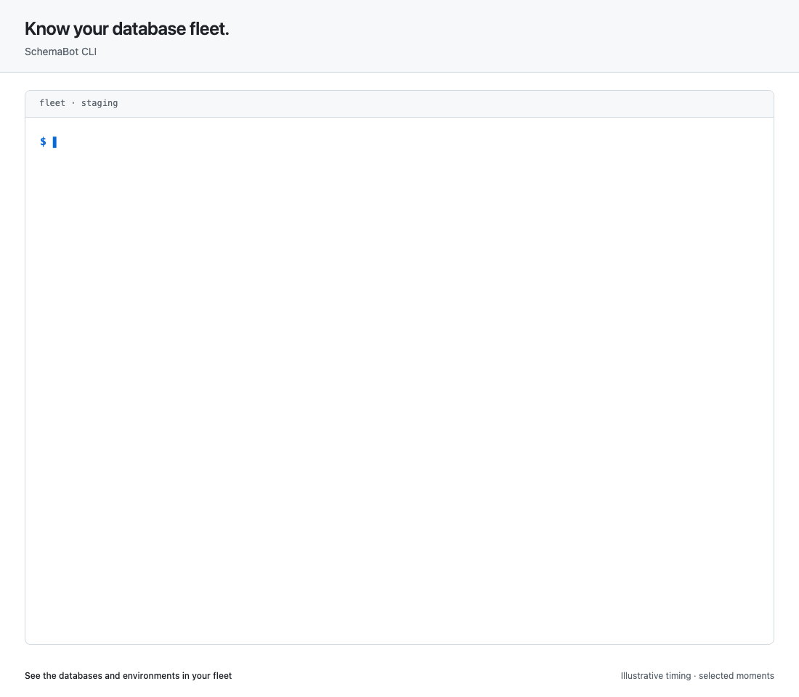
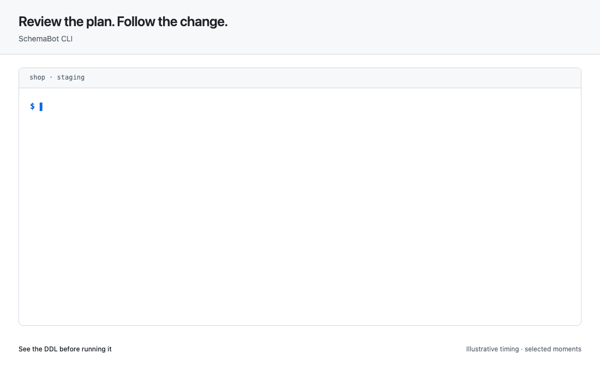
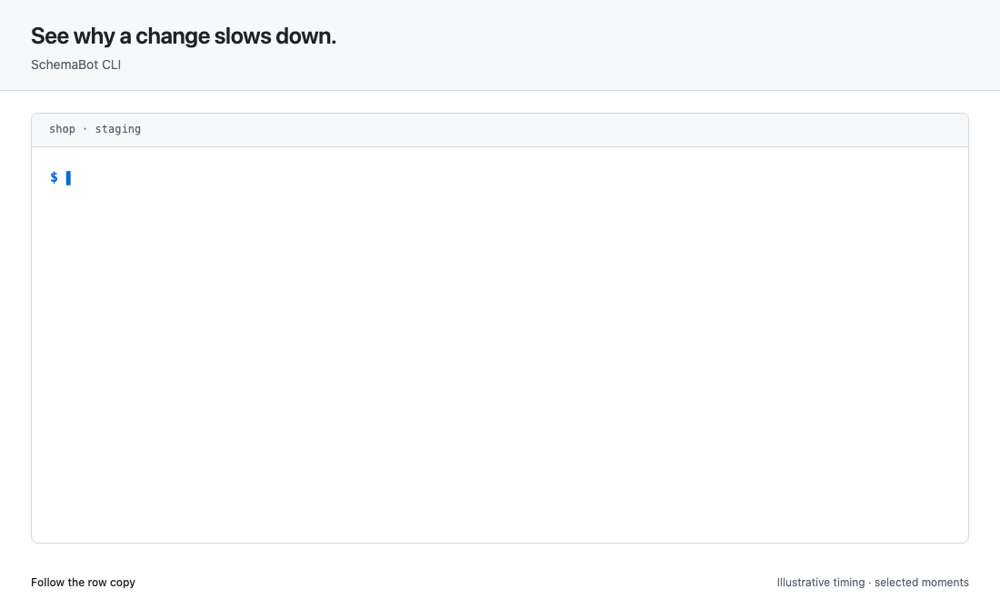
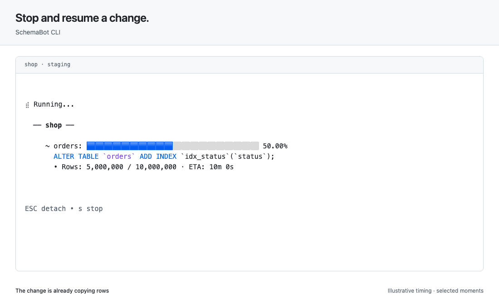
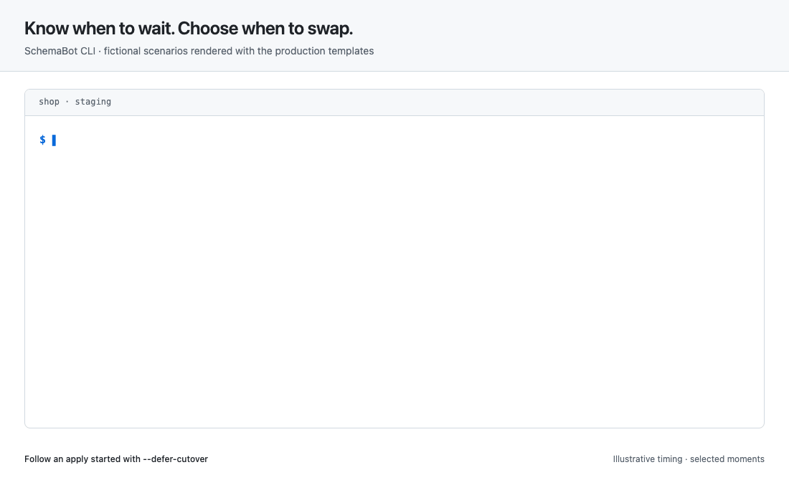
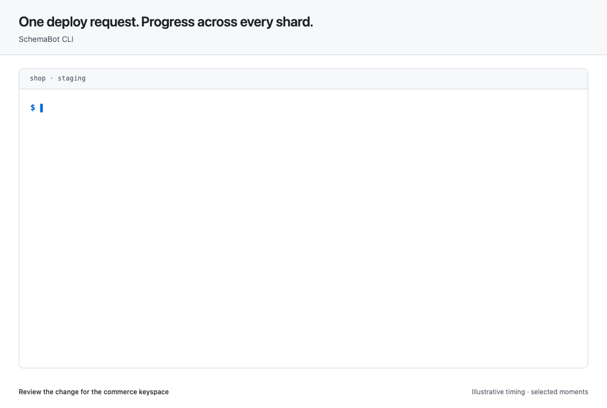

# Use the CLI

Inspect your databases, review the SQL a change needs, and follow it to
completion from your terminal. Start with one database; use the same commands
to see what is changing across your fleet.

| What would you like to do? | Start here |
|---|---|
| Try SchemaBot for the first time | [Run the local quick start](../README.md#quick-start), then [connect the CLI](#connect-to-a-server) |
| See what is in a database | [Read the live schema](#read-the-live-schema) |
| Make a schema change | [Plan and apply a change](#plan-and-apply-a-change) |
| Check an ongoing change | [Follow progress and control the apply](#follow-and-control-a-change) |
| Follow a PlanetScale deploy request | [Watch progress across shards](#planetscale-progress-across-every-shard) |
| Build an integration | [Use structured output](#use-the-cli-from-scripts-and-agents) |

The examples use a MySQL database named `shop` in `staging`.
Substitute a database and environment from your server's inventory. The local
quick start uses `testapp`; it does not create the `shop` database shown here.

## Connect to a server

Install a [released CLI binary](../README.md#releases). If you have not set
up a server yet, the [local quick start](../README.md#quick-start) starts one
with demo databases. For your own installation, follow the
[server and access guide](auth.md#where-schemabot-runs).

A **profile** saves a server URL and its login settings. A profile is not a
database environment: one server can manage staging and production, and
`-e staging` selects the environment for a command.

### Save your endpoint

Create `~/.schemabot/config.yaml` and its parent directory if needed:

```yaml
default_profile: demo
profiles:
  demo:
    endpoint: http://localhost:13370
```

Use the quick start's URL above for local testing, or your own server's HTTPS
URL. The endpoint is SchemaBot's address, not a database connection string.
Database credentials belong in the server's configuration; the CLI does not
need them to call the API.

Check the saved settings:

```console
$ schemabot configure show
SchemaBot Configuration

  Config file: /home/alex/.schemabot/config.yaml

  Active profile: demo (from config default_profile)
  Endpoint: http://localhost:13370 (from profile)

  Profiles:
    * demo: http://localhost:13370
```

The config path depends on your machine. You can also use the interactive
`configure` prompt; it saves the same file. When a profile contains a token,
keep the file private to your user (mode `0600`).

### Check the connection

If you followed the local quick start, no login is needed. For an authenticated
server, complete [sign-in](#authenticate-when-the-server-requires-it) first.

Check that the CLI can reach your server:

```console
$ schemabot databases
DATABASE  TYPE   ENVIRONMENTS  DEPLOYMENTS
shop      mysql  staging       -
```

A successful response confirms the connection and lists the database names
and environments available on this server. An empty list means the connection
works, but no databases are visible to this caller. Use the listed names in
the commands below.

| If you see… | What to check |
|---|---|
| Connection refused or a timeout | The server is running, the endpoint and port are correct, and your terminal can reach it |
| A certificate error | The endpoint uses the server's HTTPS hostname and your machine trusts its certificate |
| `401 Unauthorized` | Your token or login has expired, or the server expects a different sign-in method |
| `403 Forbidden` | The caller needs permission for this operation; check the [server's access rules](auth.md#what-read-and-write-access-include) |

### Authenticate when the server requires it

Use the setup that matches your server. Local quick-start users can continue
to [Explore your databases](#explore-your-databases).

<details>
<summary>Sign in with an identity provider (OIDC, alpha)</summary>

First [register your provider and configure the server](auth.md#connect-your-identity-provider).
Then add the provider settings to your CLI profile:

```yaml
default_profile: demo
profiles:
  demo:
    endpoint: https://schemabot.example.com
    oidc:
      issuer: https://issuer.example.com
      client_id: schemabot-cli
```

Then sign in:

```console
$ schemabot login --profile demo
Open this URL in your browser to log in:

  https://issuer.example.com/authorize?...

Logged in as alex@example.com. Token cached for profile "demo".
```

The authorization URL above is abbreviated; use the full URL the CLI prints.
Login opens your browser and returns to `http://127.0.0.1:8765/callback` on
the machine running the CLI. `--no-browser` prints the URL without opening
it; it does not move the callback to another machine. The CLI caches an ID
token and, when the provider issues one, a refresh token. See the
[authentication guide](auth.md#connect-your-identity-provider) for scopes,
groups, and refresh requirements.

</details>

For **an authenticating proxy**, use the proxy's supported terminal login
method. A browser session does not automatically authenticate the CLI, and
`schemabot login` handles OIDC, not arbitrary proxy logins. If the proxy
accepts bearer tokens, it may work with `SCHEMABOT_TOKEN`. See
[proxy access](auth.md#use-your-existing-proxy) before configuring it.

For **local access or a tunnel**, network access and API authentication are
separate. A tunnel does not bypass an enabled authentication check. With auth
disabled, anyone who can reach the API can run commands; keep the endpoint
restricted to the intended callers.

### Choose a profile for a command

Settings resolve independently, using the first available value:

| Setting | Precedence |
|---|---|
| Profile | `--profile` → `SCHEMABOT_PROFILE` → `default_profile` → `default` |
| Endpoint | `--endpoint` → `SCHEMABOT_ENDPOINT` → the profile's `endpoint` |
| Token | `--token` → `SCHEMABOT_TOKEN` → the profile's cached token |

A cached token is bound to its profile's endpoint. Changing the endpoint
through `configure` clears the cached login; sign in again for the new server.
When supplying a token explicitly, use the endpoint it was issued for.

## Explore your databases

These commands read schemas and change history without applying database
changes. For a shared server, read access is enough to start exploring.

### Read the live schema

```sh
schemabot pull -d shop -e staging
```

SQL excerpt, formatted for readability:

```sql
-- Namespace `shop` — 1 table

CREATE TABLE `orders` (
  `id` bigint unsigned NOT NULL AUTO_INCREMENT,
  `status` varchar(32) NOT NULL DEFAULT 'new',
  PRIMARY KEY (`id`)
) ENGINE=InnoDB DEFAULT CHARSET=utf8mb4 COLLATE=utf8mb4_0900_ai_ci;
```

`pull` prints SQL by default. It reads the environment's primary deployment;
it is not a comparison of every replica or shard. Use the
[schema intelligence guide](schema-intelligence.md#whats-in-this-database)
for namespace and table filters, structured columns and indexes, and lint
findings, each with output examples.

### Find recent changes and plans



```console
$ schemabot status -e staging
1 active schema change
4 total: 2 Completed · 1 Failed · 1 Running

  APPLY ID          DATABASE  ENV      STATE      STARTED         SOURCE
  apply-example-73  shop      staging  Running    10 minutes ago  https://github.com/acme/store/pull/42
  apply-example-72  billing   staging  Completed  1 hour ago      https://github.com/acme/billing/pull/18
  apply-example-71  catalog   staging  Failed     2 hours ago     https://github.com/acme/store/pull/40
  apply-example-70  accounts  staging  Completed  3 hours ago     https://github.com/acme/accounts/pull/12

Use 'schemabot status <apply_id>' to view details
```

Inspect one apply with `status <apply_id>` for a single snapshot, or use
`progress <apply_id>` to keep watching. The [progress example](#follow-and-control-a-change) shows the live view.
Stored plans have their own inventory:

```console
$ schemabot list-plans -e staging
Recent plans

  PLAN ID          DATABASE  ENV      CHANGES   CREATED         SOURCE
  plan-example-42  shop      staging  1 alter   10 minutes ago  acme/store#42
  plan-example-41  billing   staging  1 create  1 hour ago      acme/billing#18
  plan-example-40  catalog   staging  1 alter   2 hours ago     acme/store#40
```

Read [a stored plan](schema-intelligence.md#inspect-a-stored-plan) to see
its DDL, or [change history](schema-intelligence.md#what-changed-in-this-database)
to follow what actually ran. A plan and an apply have separate identifiers.

## Plan and apply a change

This walkthrough adds an index to an existing `orders` table. You edit the
schema you want; SchemaBot works out the `ALTER TABLE` statement. Planning
and applying require write access to the chosen database and environment.

### Start from the live schema

If your repository already has schema files, use that directory. Otherwise,
run `onboard` from your repository root to create a new `schema` directory:

```console
$ schemabot onboard -d shop -e staging -s ./schema
Pulled 1 tables from shop/staging.
Wrote declarative schema files:
  schema/schemabot.yaml
  schema/shop/orders.sql

Verifying pulled schema against the source environment...
Verified: pulled schema produces no schema changes in the source environment.

Onboarding complete for shop from staging.
Next: open a normal PR with these files. SchemaBot will reconcile other configured environments.
```

`onboard` writes local files and verifies them with a plan; it does not apply
DDL. It refuses to overwrite existing files by default. Keep the complete
schema for the namespaces you manage: omitting an existing table can propose
a drop. See [namespace scope](namespaces.md) for shared databases.

The command's PR hint is for GitHub automation. You can also use the generated
files directly with the CLI, as shown below.

### Review an index change

For this example, `schema/schemabot.yaml` contains:

```yaml
database: shop
type: mysql
```

For the one-table example, edit `schema/shop/orders.sql` to include the new
`idx_status` index. Keep the rest of the table definition as pulled:

```sql
CREATE TABLE `orders` (
  `id` bigint unsigned NOT NULL AUTO_INCREMENT,
  `status` varchar(32) NOT NULL DEFAULT 'new',
  PRIMARY KEY (`id`),
  KEY `idx_status` (`status`)
) ENGINE=InnoDB DEFAULT CHARSET=utf8mb4 COLLATE=utf8mb4_0900_ai_ci;
```

Ask SchemaBot to compare those files with staging:

```console
$ schemabot plan -s ./schema -e staging
╭─────────────────────────────────────────────╮
│  MySQL Schema Change Plan                   │
│                                             │
│  Database: shop                             │
│  Schema name: schema                        │
╰─────────────────────────────────────────────╯

Staging
     ~ orders
       ALTER TABLE `orders` ADD INDEX `idx_status`(`status`);

📋 Plan: 1 table to alter
```

Planning does not apply DDL, but it stores a proposed change and requires
write access. Leaving out `-e` plans for all environments registered for the
database. Specify it when you want to review one target.



### Apply and verify

Apply the schema directory when you are ready. The CLI generates a fresh
plan, shows it, asks for confirmation, acquires the database lock, and watches
the accepted apply. Example prompt excerpt:

```console
$ schemabot apply -s ./schema -e staging
...
Do you want to apply these changes? Only 'yes' will be accepted: yes
```

The animation shows the progress after confirmation. `-y` skips the prompt;
it does not grant permissions or bypass safety checks. `--no-watch` returns
after starting the apply so you can follow it later.

After the apply completes, plan again against the same environment:

```console
$ schemabot plan -s ./schema -e staging
╭─────────────────────────────────────────────╮
│  MySQL Schema Change Plan                   │
│                                             │
│  Database: shop                             │
│  Schema name: schema                        │
╰─────────────────────────────────────────────╯

Staging
✓ No schema changes detected.
```

This confirms that the live schema matches your files. Commit the files so
your repository records the schema you now run. If your team uses GitHub
merge gates, follow the [PR workflow](pre-merge-workflow.md) instead.

### Understand a refusal

Changes classified as unsafe require an explicit `--allow-unsafe` opt-in.
Review the exact DDL and its consequences before providing it. Some changes
are unsupported or blocked by the engine; the flag does not make them valid.

A database lock can also block a new apply. Inspect the owner and ongoing
work before releasing it. Locks span the database's environments; forcing
one away from its owner is an administrative action, not a routine retry.
See [locks](schema-intelligence.md#check-locks) for the inspection request and
response, and [access rules](auth.md#what-read-and-write-access-include) for
who may act.

For changes that need PR approval and merge checks, use the
[PR workflow](pre-merge-workflow.md). Direct CLI access is a separate path;
it does not create a PR review trail.

## Follow and control a change

An apply can outlive your terminal. Keep its apply ID to inspect it or
reattach to progress. A single status snapshot and a live watch read the
same underlying change.

```console
$ schemabot progress apply-example-73
⣾ Running...

  ── shop ──

     ~ orders: 🟦🟦🟦🟦🟦🟦🟦🟦🟦🟦🟦🟦⬜⬜⬜⬜⬜⬜⬜⬜ 60.00% (throttled)
       ALTER TABLE `orders` ADD INDEX `idx_status`(`status`);
       • Rows: 6,000,000 / 10,000,000 · ETA: 8m 0s
       • ℹ️ Throttled: Replication lag exceeds the configured limit


ESC detach • s stop
```

The live view refreshes until completion or a state that needs your decision.
It includes rows copied, ETA when available, and the reason for throttling.
Press **Esc** to detach while copying; the apply keeps running. **s** requests
a stop for this MySQL example. At deferred cutover, **Enter** requests the
swap. During cutover, the watcher asks you to wait and disables Esc/stop.

### Understand throttling

When copying is throttled, the live view explains why. This MySQL example
pauses for replication lag, then continues as conditions improve.



### Stop and resume a change

For a MySQL online copy, press **s** in the live view to request a stop.
Once the watcher confirms **Stopped**, run the displayed `start` command
to resume from the checkpoint and reopen live progress.
**Esc** only detaches your terminal and leaves the change running.



### Choose when to cut over

For engines that support deferred cutover, start the apply with
`--defer-cutover` to hold the final swap. Copying can finish while the live
table continues to accept writes. When the apply is ready, request cutover
from the watch or with the cutover command. The CLI acknowledges the request
and then watches progress. Initial output:

```console
$ schemabot cutover -e staging apply-example-73
✓ Cutover requested successfully.
🔄 Cutting over...
...
```

Keep watching until the state is `Completed`; acceptance alone does not mean
the swap has finished.



### PlanetScale: progress across every shard

For a Vitess database using PlanetScale, the CLI follows the deploy request
from creation through deployment and its revert window. This example uses
`shop` registered as a Vitess database, `type: vitess` in `schema/schemabot.yaml`,
and table files under `schema/commerce/` for the `commerce` keyspace.



Use `--defer-deploy` to review the deploy request before starting deployment.
The animation confirms the apply with `yes`, then uses **Enter** at the deploy
prompt. During copying, **Esc** detaches and **c** cancels the deploy request
permanently; PlanetScale cancellation cannot be resumed.

The CLI and PlanetScale console control the same deployment, with PlanetScale
as the source of truth. You can cut over, revert, or close the revert window
from either interface. If you act in the console, the CLI watcher follows
along automatically; there is no need to repeat the action.

You can attach to the same apply later. Each shard reports its own progress,
rows, and ETA, so you can see which shard is still working:

```console
$ schemabot progress apply-example-84
⣾ Running...
  Deploy Request:  https://app.planetscale.com/acme/shop/deploy-requests/42

  ── commerce ──

     ~ orders: 🟦🟦🟦🟦🟦🟦🟦🟦🟦🟦🟦🟦🟦🟦⬜⬜⬜⬜⬜⬜ 72.50%
       ALTER TABLE `orders` ADD INDEX `idx_status`(`status`);
       • Rows: 2,900,000 / 4,000,000 · ETA: 2m 45s
       • Shards: 4 (1 complete, 3 copying)
           ✓ -40: 1,000,000 rows
           ◉ 40-80: 80.00% (800,000/1,000,000 rows) ETA 1m 0s
           ◉ 80-c0: 65.00% (650,000/1,000,000 rows) ETA 1m 45s
           ◉ c0-: 45.00% (450,000/1,000,000 rows) ETA 2m 45s


ESC detach • c cancel
```

Per-shard rows and ETA require a server-side SQL connection to vtgate, where
SchemaBot reads migration progress. Without that connection, the CLI reports
the deploy-request state instead.

After deployment, the watcher shows the open revert window. **Esc** leaves
that window open; **Enter** closes it when you are ready to finalize. The
animation takes the latter path. To undo the deployment while its window is
open, use the [revert operation](engines.md); closing the window gives up
that option. The deploy-request URL stays visible during the live workflow.

### Respond to a change that needs attention

Pick the operation for the current state and engine:

| Command | When to use it |
|---|---|
| `stop` | Request a pause where the engine supports it |
| `start` | Resume a stopped apply |
| `cutover` | Request the final swap for a ready, deferred apply |
| `cancel` | End the apply permanently; it cannot be resumed |
| `revert` | Undo a completed Vitess/PlanetScale apply while its revert window remains open |
| `skip-revert` | Close that Vitess/PlanetScale revert window |
| `release` | Let a rollout continue after a failure paused later deployments |
| `rollback` | Plan a new change toward the schema stored before an earlier apply |

Support and timing differ by engine; see the [engine capability matrix](engines.md).
A request being accepted does not mean its effect has landed. Check progress
until you see the resulting state. For example, a completed apply returns:

```console
$ schemabot status apply-example-73
┌──────────────────────────────────┐
│  Apply ID:     apply-example-73  │
│  Database:     shop              │
│  Environment:  staging           │
│  State:        Completed         │
└──────────────────────────────────┘


  ── shop ──

     ~ orders: 🟩🟩🟩🟩🟩🟩🟩🟩🟩🟩🟩🟩🟩🟩🟩🟩🟩🟩🟩🟩 ✓ Complete
       ALTER TABLE `orders` ADD INDEX `idx_status`(`status`);
```

### Review a rollback before running it

Here is a rollback of the index added earlier. This example declines the
confirmation, so nothing changes:

```console
$ schemabot rollback -e staging apply-example-73
Rollback Plan
=============
Database: shop
Environment: staging

The following changes will be applied to rollback:

  orders (alter):
    ALTER TABLE `orders` DROP INDEX `idx_status`;
⚠️ Unsafe Changes Detected:
  1. orders: Index "idx_status" should be made invisible before dropping to ensure it's not needed

Do you want to apply this rollback? Only 'yes' will be accepted: no
Rollback cancelled.
```

Rollback uses the stored schema and current database to produce a new plan.
It is not a data restore, and feasibility depends on the engine, intervening
changes, and retained history. Review the generated DDL and confirmation
before running it. Recreating a dropped column cannot recover its old data.

### Read the logs

```console
$ schemabot logs apply-example-73
11:47:07 [INF] Apply queued: apply-example-73
11:47:07 [INF] [orders] Starting spirit migration
11:47:07 [INF] [orders] acquired advisory lock
...
```

The default is the newest 50 entries, printed oldest first. `-n` changes that
window; `-f` follows new entries. Follow mode is text output and cannot be
combined with `--json`.

In local mode, omit `--deployment`: the stored log includes engine activity.
In gRPC mode, add it with a deployment name from the apply's progress to read
remote engine details such as copying, throttling, or cutover. It requires an
explicit apply ID. See [deployment log examples](schema-intelligence.md#read-deployment-logs).

### Recover missing GitHub checks

SchemaBot has automatic reconciliation for missing checks. When you need an
explicit recovery sweep, `checks backfill` finds missing checks and recreates
them through the normal server flow. Start with a bounded dry run once GitHub
is reachable; it cannot repair a GitHub outage while the API is unavailable.

```console
$ schemabot checks backfill acme/store -e staging --last 2h --dry-run
Scanned 8 open PRs updated in the last 2h in acme/store for SchemaBot (staging).
No missing SchemaBot Check Runs found.
```

Review the findings before running the same sweep without `--dry-run`.
Existing unfinished checks are reported for investigation, not overwritten.
A long-running apply can legitimately own one. The command returns nonzero
when findings remain; do not treat every nonzero exit as a transport error.
This is an admin operation. See [PR recovery](pre-merge-workflow.md) for the
workflow and automatic recovery behavior.

## Use the CLI from scripts and agents

Prefer structured output when another program consumes the result:

| Commands | JSON option |
|---|---|
| `databases`, `status`, `list-plans`, `logs`, `plan` | `--json` |
| `pull` | `-o json` |

For example:

```console
$ schemabot databases --json
{
  "databases": [
    {
      "database": "shop",
      "type": "mysql",
      "environments": [
        {"environment": "staging"}
      ]
    }
  ]
}
```

`apply -o json` controls its progress stream; it is not a single JSON response
for the entire command, which also prints the plan and other messages.
For fully structured writes, use the API. `progress` has no JSON output flag;
use `status --json` for a structured snapshot.

Do not scrape colored tables or progress bars. Check the exit status and the
returned payload, and retain plan/apply IDs for follow-up reads. An accepted
apply may still be running. Use [schema intelligence](schema-intelligence.md)
for response shapes and [agent access](ai-agents.md) to choose credentials
and boundaries.

### Wrap the CLI for your team

A wrapper can resolve your server URL and perform your terminal login before
launching SchemaBot. Keep those organization-specific steps in the wrapper;
use the upstream CLI for plans and operations.

An exec-style wrapper passes `--cli-name "acme schemabot"` so generated hints
lead back through the wrapper. It can supply the endpoint with `--endpoint`
and a bearer token through `SCHEMABOT_TOKEN`. Avoid placing credentials in
shell history or printing them in diagnostics.

For a Go wrapper, embed the command types from `pkg/cmd/commands` and set
`cliname.Set("acme schemabot")` before parsing. See the
[command package](../pkg/cmd/) for the upstream wiring. Wrapper routing and
authentication remain your integration's responsibility; changing the
printed name does not grant permissions.
