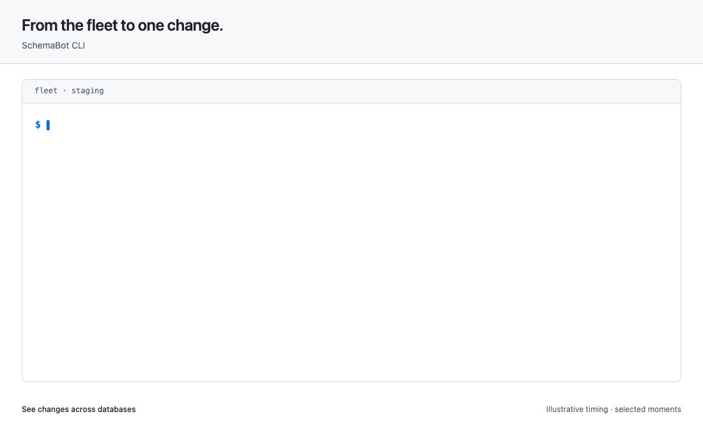

# Use the CLI

<!-- BEGIN TOC (auto-generated by `make docs-toc`) -->

## Table of Contents

- [Connect to a server](#connect-to-a-server)
  - [Save your endpoint](#save-your-endpoint)
  - [Authenticate when the server requires it](#authenticate-when-the-server-requires-it)
  - [Choose a profile for a command](#choose-a-profile-for-a-command)
- [Explore your databases](#explore-your-databases)
  - [Read the live schema](#read-the-live-schema)
  - [Find recent changes and plans](#find-recent-changes-and-plans)
- [Plan and apply a change](#plan-and-apply-a-change)
  - [Understand a refusal](#understand-a-refusal)
- [Follow and control a change](#follow-and-control-a-change)
  - [Wait for the right moment to swap](#wait-for-the-right-moment-to-swap)
  - [Respond to a change that needs attention](#respond-to-a-change-that-needs-attention)
  - [Review a rollback before running it](#review-a-rollback-before-running-it)
  - [Read the logs](#read-the-logs)
- [Use the CLI from scripts and agents](#use-the-cli-from-scripts-and-agents)
  - [Recover missing GitHub checks](#recover-missing-github-checks)
  - [Wrap the CLI for your team](#wrap-the-cli-for-your-team)

<!-- END TOC (auto-generated by `make docs-toc`) -->

Connect to your SchemaBot server, see what is changing, and take a schema
change from a plan to completion. The CLI uses the same API as your tools
and agents, with readable tables, SQL, and live progress.

Start with [Connect to a server](#connect-to-a-server), then choose the task
you need. Examples use fictional databases and identifiers; replace them
with values from your own server.

## Connect to a server

Install a [released CLI binary](../README.md#releases). If you have not set
up a server yet, the [local quick start](../README.md#quick-start) starts one
with demo databases. For your own installation, follow the
[server and access guide](auth.md#where-schemabot-runs).

A **profile** saves a server URL and its login settings. A profile is not a
database environment: one server can manage staging and production, and
`-e staging` selects the environment for a command.

### Save your endpoint

Create `~/.schemabot/config.yaml` and its parent directory if needed:

```yaml
default_profile: demo
profiles:
  demo:
    endpoint: http://localhost:13370
```

Use the quick start's URL above for local testing, or your own server's HTTPS
URL. The endpoint is SchemaBot's address, not a database connection string.
Database credentials belong in the server's configuration; the CLI does not
need them to call the API.

Check the saved settings:

```console
$ schemabot configure show
SchemaBot Configuration

  Config file: /home/alex/.schemabot/config.yaml

  Active profile: demo (from config default_profile)
  Endpoint: http://localhost:13370 (from profile)

  Profiles:
    * demo: http://localhost:13370
```

The config path depends on your machine. You can also use the interactive
`configure` prompt; it saves the same file. When a profile contains a token,
keep the file private to your user (mode `0600`).

### Authenticate when the server requires it

For **OIDC**, first [register your provider and configure the server](auth.md#connect-your-identity-provider).
OIDC support is alpha. Add the provider settings to your CLI profile:

```yaml
default_profile: demo
profiles:
  demo:
    endpoint: https://schemabot.example.com
    oidc:
      issuer: https://issuer.example.com
      client_id: schemabot-cli
```

Then sign in:

```console
$ schemabot login --profile demo
Open this URL in your browser to log in:

  https://issuer.example.com/authorize?...

Logged in as alex@example.com. Token cached for profile "demo".
```

The authorization URL above is abbreviated; use the full URL the CLI prints.
Login opens your browser and returns to `http://127.0.0.1:8765/callback` on
the machine running the CLI. `--no-browser` prints the URL without opening
it; it does not move the callback to another machine. The CLI caches an ID
token and, when the provider issues one, a refresh token. See the
[authentication guide](auth.md#connect-your-identity-provider) for scopes,
groups, and refresh requirements.

For **an authenticating proxy**, use the proxy's supported terminal login
method. A browser session does not automatically authenticate the CLI, and
`schemabot login` handles OIDC, not arbitrary proxy logins. If the proxy
accepts bearer tokens, it may work with `SCHEMABOT_TOKEN`. See
[proxy access](auth.md#use-your-existing-proxy) before configuring it.

For **local access or a tunnel**, network access and API authentication are
separate. A tunnel does not bypass an enabled authentication check. With auth
disabled, anyone who can reach the API can run commands; keep the endpoint
restricted to the intended callers.

### Choose a profile for a command

Settings resolve independently, using the first available value:

| Setting | Precedence |
|---|---|
| Profile | `--profile` → `SCHEMABOT_PROFILE` → `default_profile` → `default` |
| Endpoint | `--endpoint` → `SCHEMABOT_ENDPOINT` → the profile's `endpoint` |
| Token | `--token` → `SCHEMABOT_TOKEN` → the profile's cached token |

A cached token is bound to its profile's endpoint. Changing the endpoint
through `configure` clears the cached login; sign in again for the new server.
An explicit token is your responsibility to supply to the correct endpoint.

## Explore your databases

Start with the inventory. It tells you which database names and environments
you can use in later commands:

```console
$ schemabot databases
DATABASE  TYPE   ENVIRONMENTS  DEPLOYMENTS
shop      mysql  staging       -
```

Inventory covers the server's configured databases. There is no `-e` flag on
`databases`; use the environment listed in its output for the reads below.

### Read the live schema

```sh
schemabot pull -d shop -e staging
```

SQL excerpt, formatted for readability:

```sql
-- Namespace `shop` — 1 table

CREATE TABLE `orders` (
  `id` bigint unsigned NOT NULL AUTO_INCREMENT,
  `status` varchar(32) NOT NULL DEFAULT 'new',
  PRIMARY KEY (`id`)
) ENGINE=InnoDB DEFAULT CHARSET=utf8mb4 COLLATE=utf8mb4_0900_ai_ci;
```

`pull` prints SQL by default. It reads the environment's primary deployment;
it is not a comparison of every replica or shard. Use the
[schema intelligence guide](schema-intelligence.md#whats-in-this-database)
for namespace and table filters, structured columns and indexes, and lint
findings, each with output examples.

### Find recent changes and plans



*Fictional fleet, rendered with the CLI's production templates.*

```console
$ schemabot status -e staging
1 active schema change
4 total: 2 Completed · 1 Failed · 1 Running

  APPLY ID          DATABASE  ENV      STATE      STARTED         SOURCE
  apply-example-73  shop      staging  Running    10 minutes ago  https://github.com/acme/store/pull/42
  apply-example-72  billing   staging  Completed  1 hour ago      https://github.com/acme/billing/pull/18
  apply-example-71  catalog   staging  Failed     2 hours ago     https://github.com/acme/store/pull/40
  apply-example-70  accounts  staging  Completed  3 hours ago     https://github.com/acme/accounts/pull/12

Use 'schemabot status <apply_id>' to view details
```

Inspect one apply with `status <apply_id>` for a single snapshot, or use
`progress <apply_id>` to keep watching. The next section shows the live view.
Stored plans have their own inventory:

```console
$ schemabot list-plans -e staging
Recent plans

  PLAN ID          DATABASE  ENV      CHANGES   CREATED         SOURCE
  plan-example-42  shop      staging  1 alter   10 minutes ago  acme/store#42
  plan-example-41  billing   staging  1 create  1 hour ago      acme/billing#18
  plan-example-40  catalog   staging  1 alter   2 hours ago     acme/store#40
```

Read [a stored plan](schema-intelligence.md#inspect-a-stored-plan) to see
its DDL, or [change history](schema-intelligence.md#what-changed-in-this-database)
to follow what actually ran. A plan and an apply have separate identifiers.

## Plan and apply a change

Keep the desired schema in SQL files alongside a `schemabot.yaml` file that
names the database. For an existing database, follow
[onboarding](github-app-setup.md#6-add-schemabotyaml-config-to-your-repository)
to create the directory from its live schema first.

For this example, `schema/schemabot.yaml` contains:

```yaml
database: shop
type: mysql
```

Edit the table's `CREATE TABLE` definition to add an index on `status`.
Ask SchemaBot to compare those files with staging:

```console
$ schemabot plan -s ./schema -e staging
╭─────────────────────────────────────────────╮
│  MySQL Schema Change Plan                   │
│                                             │
│  Database: shop                             │
│  Schema name: schema                        │
╰─────────────────────────────────────────────╯

Staging
     ~ orders
       ALTER TABLE `orders` ADD INDEX `idx_status`(`status`);

📋 Plan: 1 table to alter
```

Planning does not apply DDL, but it stores a proposed change and requires
write access. Leaving out `-e` plans for all environments registered for the
database. Specify it when you want to review one target.


*Selected plan and progress views, rendered from fictional data with the CLI's production templates.*

Apply the schema directory when you are ready. The CLI generates a fresh
plan, shows it, asks for confirmation, acquires the database lock, and watches
the accepted apply. Example prompt excerpt:

```console
$ schemabot apply -s ./schema -e staging
...
Do you want to apply these changes? Only 'yes' will be accepted: yes
```

The animation shows the progress after confirmation. `-y` skips the prompt;
it does not grant permissions or bypass safety checks. `--no-watch` returns
after starting the apply so you can follow it later.

### Understand a refusal

Changes classified as unsafe require an explicit `--allow-unsafe` opt-in.
Review the exact DDL and its consequences before providing it. Some changes
are unsupported or blocked by the engine; the flag does not make them valid.

A database lock can also block a new apply. Inspect the owner and ongoing
work before releasing it. Locks span the database's environments; forcing
one away from its owner is an administrative action, not a routine retry.
See [locks](schema-intelligence.md#check-locks) for the inspection request and
response, and [access rules](auth.md#what-read-and-write-access-include) for
who may act.

For changes that need PR approval and merge checks, use the
[PR workflow](pre-merge-workflow.md). Direct CLI access is a separate path;
it does not create a PR review trail.

## Follow and control a change

An apply can outlive your terminal. Keep its apply ID to inspect it or
reattach to progress. A single status snapshot and a live watch read the
same underlying change.

```console
$ schemabot progress apply-example-73
┌──────────────────────────────────┐
│  Apply ID:     apply-example-73  │
│  Database:     shop              │
│  Environment:  staging           │
│  State:        Running           │
└──────────────────────────────────┘


  ── shop ──

     ~ orders: 🟦🟦🟦🟦🟦🟦🟦🟦🟦🟦🟦🟦⬜⬜⬜⬜⬜⬜⬜⬜ 60.00% (throttled)
       ALTER TABLE `orders` ADD INDEX `idx_status`(`status`);
       • Rows: 6,000,000 / 10,000,000 · ETA: 8m 0s
       • ℹ️ Throttled: Replication lag exceeds the configured limit
```

The live view refreshes until completion or a state that needs your decision.
It includes rows copied, ETA when available, and the reason for throttling.
Detaching from the watch does not cancel the apply.

### Wait for the right moment to swap

For engines that support deferred cutover, start the apply with
`--defer-cutover` to hold the final swap. Copying can finish while the live
table continues to accept writes. When the apply is ready, request cutover
from the watch or with the cutover command.


*Fictional copy and cutover sequence using real CLI templates, with time compressed.*

### Respond to a change that needs attention

Pick the operation for the current state and engine:

| Command | When to use it |
|---|---|
| `stop` | Request a pause where the engine supports it |
| `start` | Resume a stopped apply |
| `cutover` | Request the final swap for a ready, deferred apply |
| `cancel` | End the apply permanently; it cannot be resumed |
| `revert` | Undo a completed Vitess/PlanetScale apply while its revert window remains open |
| `skip-revert` | Close that Vitess/PlanetScale revert window |
| `release` | Let a rollout continue after a failure paused later deployments |
| `rollback` | Plan a new change toward the schema stored before an earlier apply |

Support and timing differ by engine; see the [engine capability matrix](engines.md).
A request being accepted does not mean its effect has landed. Check progress
until you see the resulting state. For example, a completed apply returns:

```console
$ schemabot status apply-example-73
┌──────────────────────────────────┐
│  Apply ID:     apply-example-73  │
│  Database:     shop              │
│  Environment:  staging           │
│  State:        Completed         │
└──────────────────────────────────┘


  ── shop ──

     ~ orders: 🟩🟩🟩🟩🟩🟩🟩🟩🟩🟩🟩🟩🟩🟩🟩🟩🟩🟩🟩🟩 ✓ Complete
       ALTER TABLE `orders` ADD INDEX `idx_status`(`status`);
```

### Review a rollback before running it

Here is a rollback of the index added earlier. This example declines the
confirmation, so nothing changes:

```console
$ schemabot rollback -e staging apply-example-73
Rollback Plan
=============
Database: shop
Environment: staging

The following changes will be applied to rollback:

  orders (alter):
    ALTER TABLE `orders` DROP INDEX `idx_status`;
⚠️ Unsafe Changes Detected:
  1. orders: Index "idx_status" should be made invisible before dropping to ensure it's not needed

Do you want to apply this rollback? Only 'yes' will be accepted: no
Rollback cancelled.
```

Rollback uses the stored schema and current database to produce a new plan.
It is not a data restore, and feasibility depends on the engine, intervening
changes, and retained history. Review the generated DDL and confirmation
before running it. Recreating a dropped column cannot recover its old data.

### Read the logs

```console
$ schemabot logs apply-example-73
11:47:07 [INF] Apply queued: apply-example-73
11:47:07 [INF] [orders] Starting spirit migration
11:47:07 [INF] [orders] acquired advisory lock
...
```

The default is the newest 50 entries, printed oldest first. `-n` changes that
window; `-f` follows new entries. Follow mode is text output and cannot be
combined with `--json`.

In local mode, omit `--deployment`: the stored log includes engine activity.
In gRPC mode, add it with a deployment name from the apply's progress to read
remote engine details such as copying, throttling, or cutover. It requires an
explicit apply ID. See [deployment log examples](schema-intelligence.md#read-deployment-logs).

## Use the CLI from scripts and agents

Prefer structured output when another program consumes the result:

| Commands | JSON option |
|---|---|
| `databases`, `status`, `list-plans`, `logs`, `locks`, `plan` | `--json` |
| `pull` | `-o json` |

For example:

```console
$ schemabot databases --json
{
  "databases": [
    {
      "database": "shop",
      "type": "mysql",
      "environments": [
        {"environment": "staging"}
      ]
    }
  ]
}
```

`apply -o json` controls its progress stream; it is not a single JSON response
for the entire command, which also prints the plan and other messages.
For fully structured writes, use the API. `progress` has no JSON output flag;
use `status --json` for a structured snapshot.

Do not scrape colored tables or progress bars. Check the exit status and the
returned payload, and retain plan/apply IDs for follow-up reads. An accepted
apply may still be running. Use [schema intelligence](schema-intelligence.md)
for response shapes and [agent access](ai-agents.md) to choose credentials
and boundaries.

### Recover missing GitHub checks

SchemaBot has automatic reconciliation for missing checks. When you need an
explicit recovery sweep, `checks backfill` finds missing checks and recreates
them through the normal server flow. Start with a bounded dry run once GitHub
is reachable; it cannot repair a GitHub outage while the API is unavailable.

```console
$ schemabot checks backfill acme/store -e staging --last 2h --dry-run
Scanned 8 open PRs updated in the last 2h in acme/store for SchemaBot (staging).
No missing SchemaBot Check Runs found.
```

Review the findings before running the same sweep without `--dry-run`.
Existing unfinished checks are reported for investigation, not overwritten.
A long-running apply can legitimately own one. The command returns nonzero
when findings remain; do not treat every nonzero exit as a transport error.
This is an admin operation. See [PR recovery](pre-merge-workflow.md) for the
workflow and automatic recovery behavior.

### Wrap the CLI for your team

A wrapper can resolve your server URL and perform your terminal login before
launching SchemaBot. Keep those organization-specific steps in the wrapper;
use the upstream CLI for plans and operations.

An exec-style wrapper passes `--cli-name "acme schemabot"` so generated hints
lead back through the wrapper. It can supply the endpoint with `--endpoint`
and a bearer token through `SCHEMABOT_TOKEN`. Avoid placing credentials in
shell history or printing them in diagnostics.

For a Go wrapper, embed the command types from `pkg/cmd/commands` and set
`cliname.Set("acme schemabot")` before parsing. See the
[command package](../pkg/cmd/) for the upstream wiring. Wrapper routing and
authentication remain your integration's responsibility; changing the
printed name does not grant permissions.
