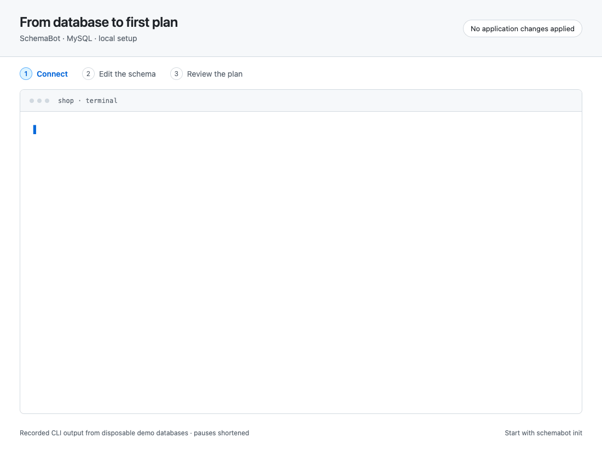

# Initialize a database

Run `schemabot init` in a terminal to bring an existing database into SchemaBot.
Setup reads its live schema into files and verifies they match, without changing application
tables or rewriting existing SQL scripts. An empty database follows the same flow.
The wizard and explicit CLI flags use the same setup workflow.


## Try without a database

Run `schemabot init` in an empty project directory and choose **Try a sample MySQL database**
or **Try a sample PostgreSQL database**. Docker must be running. SchemaBot starts a local
container, seeds `customers` and `orders`, and uses the same import and verification flow.
No connection string is needed.



For scripts, select the sample explicitly:

```console
$ schemabot init --sample --type mysql --non-interactive --json
{"database":"shop","environment":"development","profile":"schemabot-sample-example","schema_dir":"/project/schema","plan_id":"plan-example","tables":2,"verified":true}
```

Use `--type postgres` for PostgreSQL. Names and paths vary by project. The completion screen
prints your next command, including its profile. Each project gets its own sample and runtime;
retrying setup keeps your data and schema edits. Samples listen only on `127.0.0.1`.

Docker retains sample data across restarts. To stop the database, run `docker stop` with the
container name printed during setup; rerun `init --sample` in the same project to start it again.
When finished, stop its SchemaBot runtime with `schemabot local stop <container-name>` before
removing the disposable database with `docker rm -v <container-name>`. Removing the container
permanently deletes its sample data. Your schema files remain in your project.

## Before you start

Use MySQL or PostgreSQL with an existing application database. You can paste a connection string or enter host, port, database, username, and password
inside the wizard. Passwords and pasted strings are hidden. The final review asks you to
confirm saving entered credentials in private, **unencrypted** files under
`~/.schemabot/credentials`, outside the project. These files persist across terminal and
laptop restarts; keep them private and include them in your credential-management practices.
Cancelling before final confirmation writes no credentials.

If `DATABASE_URL` is already set, the wizard shows its destination and offers to use it.
Environment-variable and absolute file references remain available as an advanced option;
a referenced file must contain only the connection string. References stay references,
so environment variables must remain available to later CLI invocations. Schema files
never contain credentials. OS credential-store integration is not implemented.
Vitess is not offered by the wizard yet; use [server configuration](configuration.md).

The wizard asks **Where should SchemaBot store its own data?**

- **Integrated:** a simple setup for a single database project. SchemaBot creates a new
  `schemabot` database on your application's server, using the same credentials. Those
  credentials need permission to create a database. Your application's tables stay separate.
- **Standalone:** provide `SCHEMABOT_STORAGE_DSN` for an existing, dedicated state database.
  A separate server is a good fit for teams managing multiple databases.

Integrated setup refuses to adopt an existing `schemabot` database silently. If you already
prepared one for SchemaBot, choose Standalone and provide its connection explicitly.

You can move state to another server later, but this is an operator-managed transfer, not a
wizard toggle: drain in-flight work, stop the runtime, transfer the complete state database,
update its connection configuration, and verify it before restarting. Keep the original state
until the new connection is verified. Re-running `init` never replaces existing state storage.

Setup initializes SchemaBot's metadata tables in the state database. Baseline planning also
needs the engine's scratch privileges. Setup never applies application schema changes.

Private databases do not need a public endpoint. Run SchemaBot somewhere that can reach
them: on your VPN, through an existing tunnel, or on a machine inside the private network.
If a connection check fails, keep the wizard open, restore access, and retry.

## Follow the wizard

The wizard detects an available connection and offers **Use this connection**, or lets you
paste a connection string, enter details, or use a reference. It shows the host and database
without credentials and checks access before continuing. Failed checks can be retried;
Shift+Tab returns to connection choices without leaving the wizard.

Standalone setup uses the same adaptive connection flow. Integrated creates its database
only after final confirmation. Connection checks run a read-only query and create no metadata.
Environment, schema directory, and profile defaults remain editable in the final review.

Before setting up a runtime, SchemaBot reads the target catalog to discover namespaces. One
result is selected automatically; multiple results appear in a searchable list. Use Space to
select namespaces and Enter to continue. MySQL stays within the database named in the DSN;
PostgreSQL lists accessible application schemas. No results or a failed connection stops here
with a chance to retry, edit the connection, or press `m` to enter namespaces manually.
Explicit `--namespace` flags also bypass discovery. Discovery uses only the application connection. State metadata is initialized only after the final review.

Press Shift+Tab to go back and change your choices, or Escape to cancel.

SchemaBot imports into a temporary directory and verifies a no-change plan before publishing
the files. A successful setup ends with:

```text
  ✓ Your schema is ready

  1 table · schema
  Baseline plan: no changes.

  Make your first edit, then review the plan:

    schemabot plan -s 'schema' -e 'development'
```

The command names the profile with `--profile` only when the connection was saved under a
profile that is not your default, so the next step works as printed.

An empty namespace gets an explicit marker in `schema.sql` that preserves its scope. Keep that
marker until you add your
first table declaration there when you are ready; setup does not invent a sample table.

If schema files already exist, the review screen explains that they will be verified and reused. It checks their
database, engine, and namespace scope, and preserves their contents. Differences from the live
database stop setup with the plan details; they are not applied automatically.

## Use an agent or script

Supply the same decisions as flags. Both `--non-interactive` and `--json` suppress prompts;
`--json` also returns a structured result. For example, against a supported database with one table:

```console
$ schemabot init --non-interactive --json --type mysql \
    --database shop --environment development --namespace shop \
    --dsn env:DATABASE_URL --storage-dsn env:SCHEMABOT_STORAGE_DSN \
    --schema-dir schema
{"database":"shop","environment":"development","profile":"default","schema_dir":"/project/schema","plan_id":"plan-example","tables":1,"verified":true}
```

Use `--integrated` instead of `--storage-dsn` to create SchemaBot’s own database on the application server. The flags are mutually exclusive.

Paths and plan IDs vary. Existing schema directories with a valid `schemabot.yaml` are verified and
reused automatically, including with flags. `--reuse-schema` is also accepted. Select a named
connection with `--profile`; existing profiles and the default connection are preserved.

Missing inputs are explicit and exit unsuccessfully:

```console
$ schemabot init --non-interactive --json
{"error":{"code":"missing_inputs","message":"Provide the missing flags or run init interactively."},"missing":["database","environment","type","dsn","storage-dsn","namespace"]}
```

A failed setup preserves existing files and retains any runtime registration and state already
created. Correct the reported issue and retry with the same inputs. An identical import can be
reused; conflicting files or connections are never overwritten.
