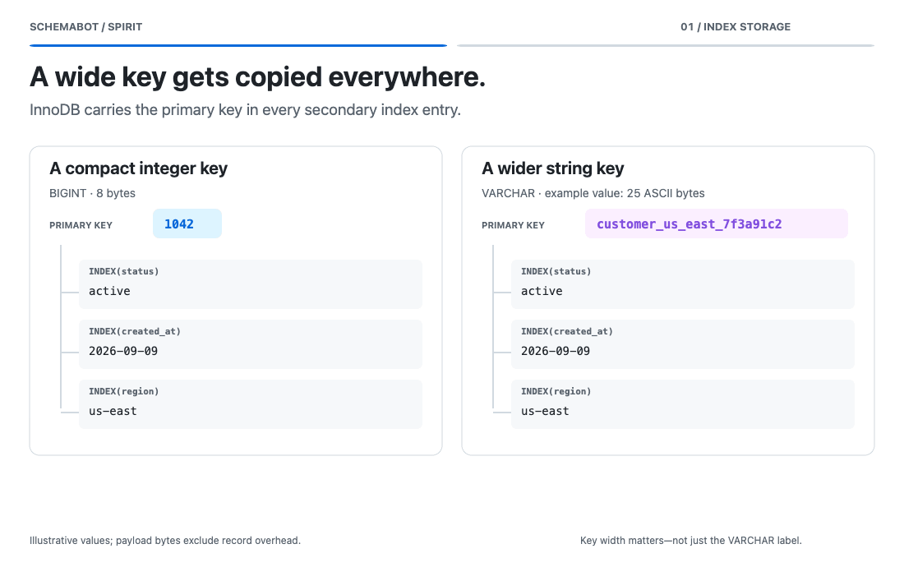

# MySQL schema changes with Spirit

<!-- BEGIN TOC (auto-generated by `make docs-toc`) -->

## Table of Contents

- [How a change runs](#how-a-change-runs)
- [Choosing a primary key](#choosing-a-primary-key)
- [Reading progress](#reading-progress)
- [TUI rendering reference](#tui-rendering-reference)

<!-- END TOC (auto-generated by `make docs-toc`) -->

[Spirit](https://github.com/block/spirit) is the online schema change engine behind SchemaBot's
MySQL support. It copies and verifies a replacement table while your application keeps writing,
then swaps it into place. SchemaBot supplies the reviewed plan, scheduling, and controls.

For engine setup and compatibility, see Spirit's [requirements](https://github.com/block/spirit#requirements)
and [supported operations and limitations](https://github.com/block/spirit#unsupported-features).

## How a change runs

If MySQL can execute a change instantly, Spirit uses that path. A change that needs a table copy
runs through a longer sequence:

```diagram
Copy rows → Catch up on writes → Verify → Catch up → Cut over
                                                    ↑
                                    wait for the chosen time, if deferred
```

The application keeps using the original table during the copy. Spirit adapts its work to the
available capacity and backs off under pressure; [throttling](throttle.md) explains the signals
and what to do when progress slows. Verification and cutover still have to finish after the
row copy reaches 100%. See [engine capabilities](engines.md) for stop, resume, and revert support,
and [direct execution](direct-execution.md) for statements routed outside the online engine.
Spirit documents the underlying [instant DDL path](https://github.com/block/spirit#attempt-instant-ddl),
[dynamic chunking](https://github.com/block/spirit#dynamic-chunking), and
[verification around deferred cutover](https://github.com/block/spirit/blob/main/docs/migrate.md#two-checksum-model).

## Choosing a primary key

**A compact, stable primary key is a good default for MySQL.** For a new table, consider
`BIGINT UNSIGNED AUTO_INCREMENT` as the primary key and keep the application's token or GUID in
a separate column with a `UNIQUE` constraint. Your public identifier can stay the same while
MySQL uses a smaller key internally:

```sql
CREATE TABLE `customers` (
  `id` bigint unsigned NOT NULL AUTO_INCREMENT,
  `public_id` varchar(64) NOT NULL,
  PRIMARY KEY (`id`),
  UNIQUE KEY `uq_public_id` (`public_id`)
) ENGINE=InnoDB DEFAULT CHARSET=utf8mb4 COLLATE=utf8mb4_0900_ai_ci;
```

This adds an index and changes how rows are stored and reached. A natural or composite primary
key can still be the right choice when its ordering serves your queries. For small tables the
performance difference may be negligible; weigh growth, write volume, and query patterns before
redesigning an existing key.



*Key width and copy strategy add different kinds of work; the animation is illustrative, not a benchmark.*

### Key width follows every index

InnoDB stores rows in primary-key order and includes primary-key columns in secondary index
entries. A wide key therefore costs space across the table's indexes, leaving fewer entries in
cache and more bytes to write or rebuild. Several string columns in a composite key can amplify
that cost. Actual stored values matter: `VARCHAR(191)` does not reserve 191 characters per row.
See [MySQL's clustered and secondary indexes](https://dev.mysql.com/doc/refman/8.0/en/innodb-index-types.html).

### Insert order matters too

Random identifiers send new rows to scattered parts of the clustered index, which can increase
page reads and splits. Increasing identifiers tend to keep inserts near the end of the index.
This is separate from width: compact binary UUIDs can still arrive in random order.

For applications that generate identifiers, a time-ordered format such as
[UUIDv7](https://www.rfc-editor.org/rfc/rfc9562.html#section-5.7) can improve insertion locality when
its stored representation preserves that order. It does not make the key smaller or give Spirit
an auto-increment key. A unique secondary index on a random public identifier still has its own
random-write cost; a surrogate primary key does not remove that index.

### Spirit's copy strategy depends on the key

A single auto-increment primary key lets Spirit calculate numeric chunk boundaries. String,
composite, and non-auto-increment keys use the general chunker, which reads the index to find
the next boundary before copying the range. Sparse numeric keys can use lookups too. These extra
reads matter on large table copies, but do not imply a fixed slowdown or affect instant changes.
Spirit's [chunker guide](https://github.com/block/spirit/blob/main/pkg/table/README.md) explains both
strategies, including how numeric chunking handles gaps.

`VARCHAR` keys are supported. Text collation also makes replay more involved: after copying,
Spirit preserves binlog event order for these keys rather than relying on in-memory key equality.
The database decides which strings identify the same row, and checksums verify the copied data.
For the replay optimization and its key-type limits, see Spirit's
[change row map](https://github.com/block/spirit#change-row-map).

### What the lint finding means

The default `primary_key` rule accepts `BIGINT`, `BINARY`, and `VARBINARY`. A discouraged type on
an unchanged existing key is advisory. On a newly created table or a newly added or modified key
column, the rule raises an error; SchemaBot presents it under **Issues**, requiring explicit
acknowledgement. A missing primary key is also a finding, and Spirit cannot copy a table without
one. See [lint and safety levels](lint-and-safety-levels.md).
Spirit's [linter reference](https://github.com/block/spirit/blob/main/docs/lint.md#built-in-linters)
covers the engine's rules; the SchemaBot guide explains how findings appear in a plan and affect approval.

The type rule is a design check, not a promise of fast copying: `BINARY` can pass lint while still
using the general chunker. Conversely, a varchar finding does not mean Spirit cannot copy the
table. Review the tradeoff rather than automatically rewriting a live primary key; changing an
existing primary key may itself need a different execution path.

## Reading progress

**Row-copy progress is not whole-change progress.** After the copy finishes, the change may still
be catching up on writes, restoring indexes, verifying data, or waiting for cutover. Use the named
phase to understand what remains after the copy reaches 100%.

Row totals and ETA are estimates. Numeric chunking can measure key-space traversal, while the
general chunker counts copied rows against estimated totals; neither is a promise of a finish
time. If the copy exceeds its estimated total, SchemaBot shows **Finalizing copy** and the number of rows
copied so far. It reconciles the total when the copy actually finishes. The row-copy ETA does not
include every later phase or a scheduled cutover wait.

For command and response examples, see [schema intelligence](schema-intelligence.md#what-happened-in-this-change).
If the change is throttled, start with the reported reason and the [throttle guide](throttle.md).

## TUI rendering reference

The TUI and CLI use emoji progress bars to convey state at a glance. Each color maps to a
specific state. The bar is 20 squares wide; filled squares represent percent complete.

### Progress bar colors

| Color | Emoji | Meaning | Used when |
|-------|-------|---------|-----------|
| Blue  | `🟦`  | In progress | Engine actively working: copying rows, cutting over, recovering state |
| Yellow | `🟨` | Not final | Waiting for cutover, revert window open, reverting, skipping revert, or retrying after a recoverable failure |
| Green | `🟩`  | Complete | Table finished successfully |
| Orange | `🟧` | Stopped | Stopped mid-progress (partially complete) |
| Red   | `🟥`  | Failed | Table failed |
| White | `⬜`  | Empty | Remaining (unfilled portion of any bar) |

### Per-table display by state

**Copying rows** — blue bar with percent, row counts, and ETA while the estimate still holds:
```
  orders: 🟦🟦🟦🟦🟦🟦⬜⬜⬜⬜⬜⬜⬜⬜⬜⬜⬜⬜⬜⬜ 32% (71,436/221,193 rows) ETA 5m 30s
          ALTER TABLE `orders` ADD COLUMN `discount` int NOT NULL DEFAULT 0
```

**Copying rows after estimate exceeded** — full-width activity indicator with no percentage:
```
  orders: 🟦🟦🟦🟦🟦🟦🟦🟦🟦🟦🟦🟦🟦🟦🟦🟦🟦🟦🟦🟦 Finalizing copy
          ALTER TABLE `orders` ADD COLUMN `discount` int NOT NULL DEFAULT 0
       • Rows copied: 145,000 so far
       • ℹ️ More rows than initially estimated, copying is still active and will continue
```

**Catching up** — blue bar at 100% with the first-drain label:
```
  orders: 🟦🟦🟦🟦🟦🟦🟦🟦🟦🟦🟦🟦🟦🟦🟦🟦🟦🟦🟦🟦 ⏩ Catching up on accumulated changes...
          ALTER TABLE `orders` ADD COLUMN `discount` int NOT NULL DEFAULT 0
       • Rows copied: 1,466,232
```

**Checksumming** — blue bar tracking verify progress once Spirit reports a total
(indeterminate "Checksumming to verify data..." before that):
```
  orders: 🟦🟦🟦🟦⬜⬜⬜⬜⬜⬜⬜⬜⬜⬜⬜⬜⬜⬜⬜⬜ 🔍 Checksumming to verify data (21%)
          ALTER TABLE `orders` ADD COLUMN `discount` int NOT NULL DEFAULT 0
       • Rows verified: 321,450 / 1,466,232
```

**Post-checksum** — blue bar at 100% with the second-drain label:
```
  orders: 🟦🟦🟦🟦🟦🟦🟦🟦🟦🟦🟦🟦🟦🟦🟦🟦🟦🟦🟦🟦 ⏩ Data verified, applying final changes...
          ALTER TABLE `orders` ADD COLUMN `discount` int NOT NULL DEFAULT 0
       • Rows copied: 1,466,232
```

**Queued** (pending, not yet started) — empty bar:
```
  products: ⬜⬜⬜⬜⬜⬜⬜⬜⬜⬜⬜⬜⬜⬜⬜⬜⬜⬜⬜⬜ queued
            ALTER TABLE `products` ADD COLUMN `weight` decimal(10,2)
```

**Starting** (running but no row data yet):
```
  users: ⬜⬜⬜⬜⬜⬜⬜⬜⬜⬜⬜⬜⬜⬜⬜⬜⬜⬜⬜⬜ starting...
         ALTER TABLE `users` ADD COLUMN `phone` varchar(20)
```

**Waiting for cutover** — yellow bar at 100%:
```
  orders: 🟨🟨🟨🟨🟨🟨🟨🟨🟨🟨🟨🟨🟨🟨🟨🟨🟨🟨🟨🟨 ⏸️ Waiting for cutover
          ALTER TABLE `orders` ADD COLUMN `discount` int NOT NULL DEFAULT 0
```

**Cutting over** — blue bar at 100% with spinner (the engine is working again, so the
bar returns to blue):
```
  orders: 🟦🟦🟦🟦🟦🟦🟦🟦🟦🟦🟦🟦🟦🟦🟦🟦🟦🟦🟦🟦 🔄 Cutting over...
          ALTER TABLE `orders` ADD COLUMN `discount` int NOT NULL DEFAULT 0
```

**Complete** — green bar at 100%:
```
  orders: 🟩🟩🟩🟩🟩🟩🟩🟩🟩🟩🟩🟩🟩🟩🟩🟩🟩🟩🟩🟩 ✓ Complete
          ALTER TABLE `orders` ADD COLUMN `discount` int NOT NULL DEFAULT 0
```

**Stopped** — orange bar at the progress when stop occurred:
```
  orders: 🟧🟧🟧🟧🟧🟧⬜⬜⬜⬜⬜⬜⬜⬜⬜⬜⬜⬜⬜⬜ ⏹️ Stopped at 32%
          ALTER TABLE `orders` ADD COLUMN `discount` int NOT NULL DEFAULT 0
```

**Failed** — red bar at the progress when failure occurred:
```
  orders: 🟥🟥🟥🟥🟥⬜⬜⬜⬜⬜⬜⬜⬜⬜⬜⬜⬜⬜⬜⬜ ❌ Failed
          ALTER TABLE `orders` ADD COLUMN `discount` int NOT NULL DEFAULT 0
```

**Cancelled** (sequential mode — earlier table failed, this one never ran):
```
  products: ⊘ Cancelled (not started)
            ALTER TABLE `products` ADD COLUMN `weight` decimal(10,2)
```

### Status line (above tables)

The TUI shows a single status line above the table list. It varies by overall state:

| State | Status line |
|-------|-------------|
| Starting | `⠋ Loading...` |
| Pending | `⠋ Starting...` |
| Running | `⠋ 🔄 Copying rows... ETA 5m 30s` |
| Stopping | `⠋ Stopping...` |
| Waiting for cutover | *(cutover prompt shown in footer instead)* |
| Cutting over | `⠋ Cutting over...` |
| Completed | *(no status line — completion message shown after tables)* |
| Stopped | *(no status line — stopped message shown after tables)* |

The `⠋` is a Braille spinner (animated in the TUI, static here).

### Footer

| State | Footer |
|-------|--------|
| Running | `ESC detach • s stop` |
| Waiting for cutover (with `--cutover`) | `Press Enter to proceed with cutover (or ESC to detach)` |
| Waiting for cutover (no `--cutover`) | `To proceed: schemabot cutover -e <env> <id>` |
| Cutting over | `Cutover in progress - please wait...` |
| Stopped | `Use 'schemabot start -e <env> <id>' to resume.` |

For a deep dive into engine fields, state mapping, polling, and persistence, see
[Spirit progress architecture](architecture.md#spirit-progress-architecture).
