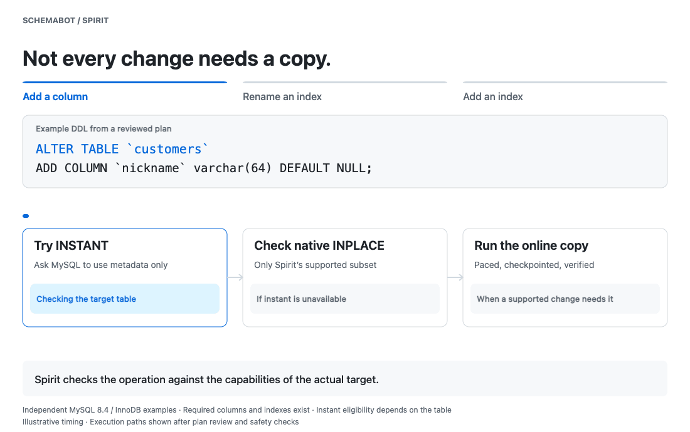
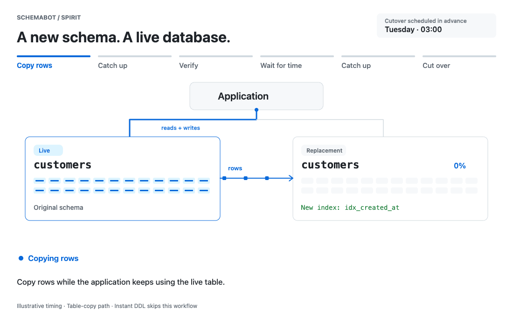
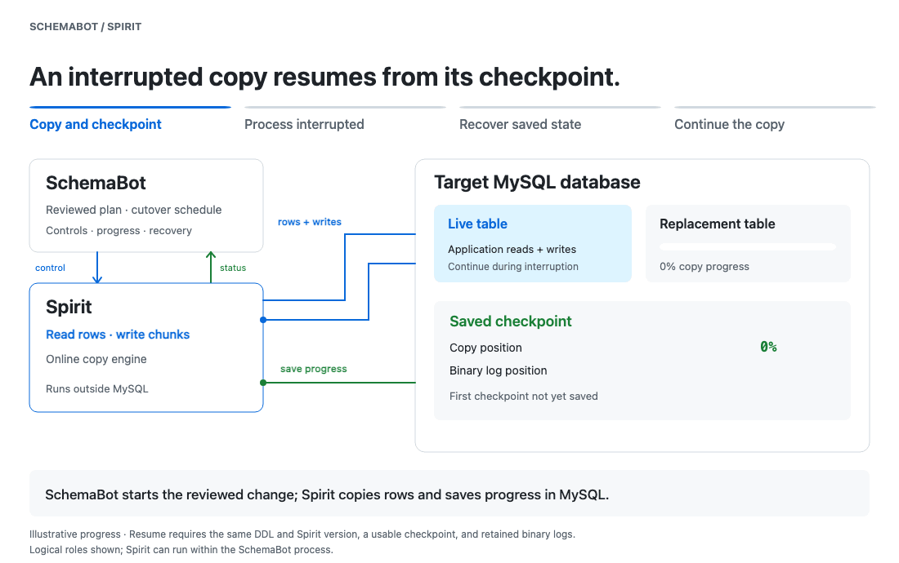
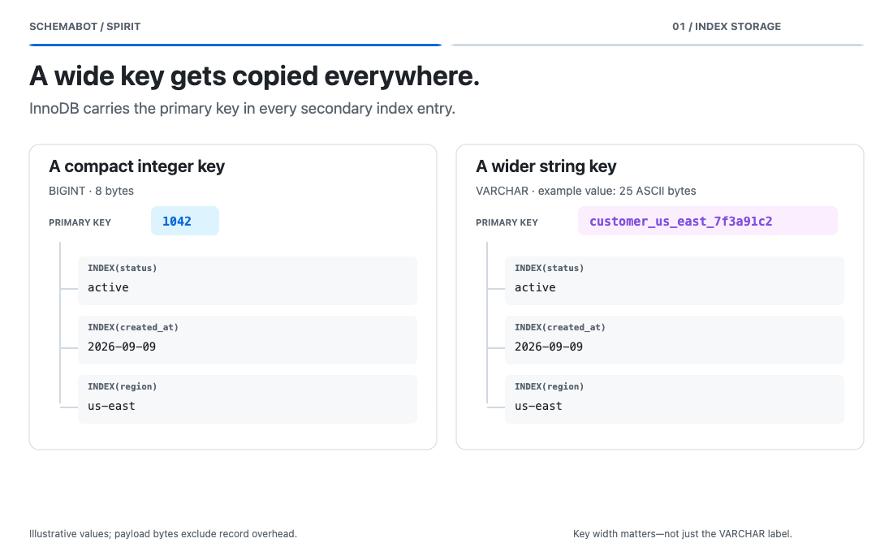
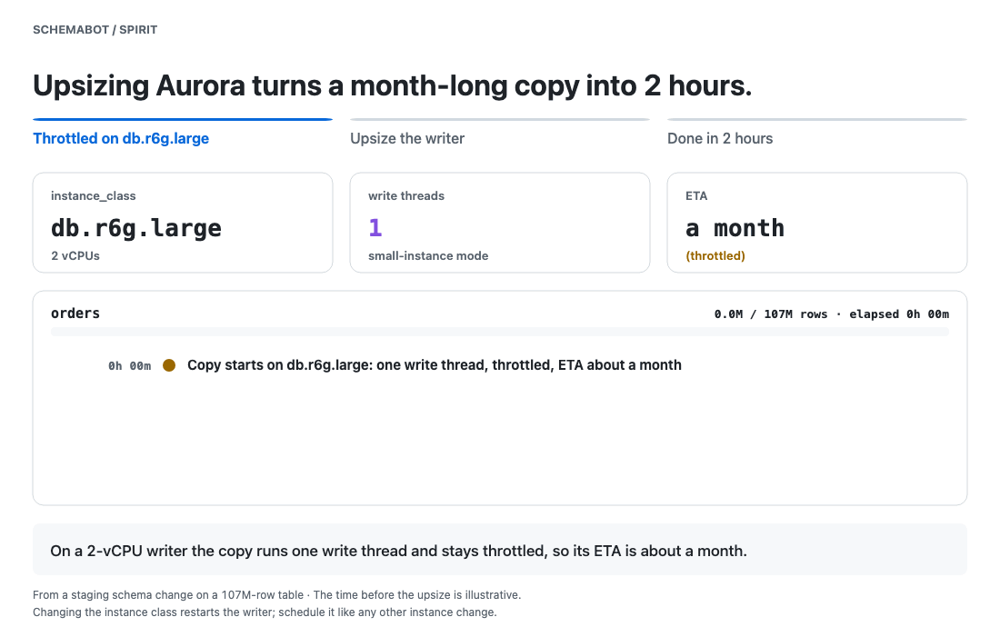

# MySQL schema changes with Spirit

<!-- BEGIN TOC (auto-generated by `make docs-toc`) -->

## Table of Contents

- [How a change runs](#how-a-change-runs)
- [When a change needs direct execution](#when-a-change-needs-direct-execution)
- [Why adding an index can copy the table](#why-adding-an-index-can-copy-the-table)
- [Checkpointing and resuming a change](#checkpointing-and-resuming-a-change)
- [Choosing a primary key](#choosing-a-primary-key)
- [Reading progress](#reading-progress)
- [Throttling](#throttling)
- [Upsizing Aurora to speed up a change](#upsizing-aurora-to-speed-up-a-change)

<!-- END TOC (auto-generated by `make docs-toc`) -->

[Spirit](https://github.com/block/spirit) is the online schema change engine behind SchemaBot's
MySQL support. It copies and verifies a replacement table while your application keeps writing,
then swaps it into place. SchemaBot supplies the reviewed plan, scheduling, and controls.

For more background, watch Morgan Tocker's [Introducing Spirit](https://www.youtube.com/watch?v=-d-NOzKZxdI)
talk at MySQL Belgian Days 2024.

See Spirit's [requirements](https://github.com/block/spirit#requirements) and
[supported operations and limitations](https://github.com/block/spirit#unsupported-features)
for setup and compatibility details.

## How a change runs

For a single-table `ALTER`, Spirit first tries instant DDL, then its supported subset of native
in-place operations. The operation and the actual target table determine which path can run:



When the change needs a table copy, Spirit carries it through the full workflow:



The application keeps using the original table during the copy. Spirit adapts its work to the
available capacity and backs off under pressure; [throttling](#throttling) explains the signals
and what to do when progress slows. Verification and cutover still have to finish after the
row copy reaches 100%. See [engine capabilities](engines.md) for stop, resume, and revert support,
and [direct execution](direct-execution.md) for statements routed outside the online engine.
Spirit documents the underlying [instant DDL path](https://github.com/block/spirit#attempt-instant-ddl),
[dynamic chunking](https://github.com/block/spirit#dynamic-chunking), and
[verification around deferred cutover](https://github.com/block/spirit/blob/main/docs/migrate.md#two-checksum-model).

## When a change needs direct execution

**Some changes need native MySQL DDL.** For example, reshaping a primary key can be
outside what Spirit's online copy supports. Direct execution lets you make those
changes through SchemaBot, with a reviewed plan and an audit trail, instead of
running SQL by hand.

This is a fallback inside the MySQL engine, not another engine to select. It only
routes statements Spirit explicitly refuses. Enabling it does not make ordinary
index additions skip the online copy, and an unexpected engine error is not
permission to retry the statement directly.

A refusal must be available during planning to qualify for this fallback.
The [primary-key collation check](#changing-a-primary-keys-collation) runs later,
so that check alone does not let SchemaBot offer direct execution for a collation change.

### Enable it with a table-size limit

Direct execution is disabled by default. To allow it for small tables, add this
at the top level of the **server configuration**:

```yaml
direct_execution:
  enabled: true
  max_table_bytes: 100MiB
  lock_acquisition_timeout: 10s
```

With this example, a refused statement can run directly on a table holding at
most 100 MiB of data and indexes. SchemaBot reads the table's size from InnoDB
statistics (`DATA_LENGTH + INDEX_LENGTH`). A table above the limit, an
unavailable size, or a failed check stays blocked. It checks again before
execution, so growth after planning can still prevent the change from running.

The size is an estimate, so it can lag a table that just grew. To confirm
eligibility with a bounded exact count instead, set `max_table_rows`; a policy
sets one bound or the other. See [the size bound](direct-execution.md#the-size-bound).

Choose the limit for the amount of disruption you can accept. A small table
can still have expensive DDL: this is a size limit, not a promise that a change
finishes within a particular time.

The policy covers MySQL databases on that server, including changes sent to a
remote deployment over gRPC. An environment can replace it with its own policy
or opt out with `enabled: false`; overrides replace the whole block rather than
inheriting individual fields. See [configuration examples](configuration.md#direct-execution).

### Know what changes operationally

| Online table copy | Direct execution |
|---|---|
| Copies a replacement while the application uses the original | Runs the statement against the live table and can block writes |
| Adapts throughput and backs off under pressure | Has no copy throttling |
| Saves checkpoints for a compatible resume | Has no copy checkpoint to resume |
| Can wait for a chosen cutover time | Has no separate cutover to schedule |
| Reports copy and verification progress | Reports the statement's running or terminal state |

The `10s` setting limits each metadata-lock wait, **not the DDL's runtime**.
If the table is busy, the statement fails with a retryable lock error rather
than waiting indefinitely. Once the lock is acquired, MySQL controls how long
the statement takes. There is no Spirit revert window for a direct statement;
undoing it requires another schema change.

For a plan that mixes both paths, direct ALTER statements run before the
Spirit-driven ALTER statements. Deferring cutover only delays the online
copy's swap; it does not delay the direct statements. An all-direct plan cannot
use deferred cutover.

### Review the direct change before it runs

The PR plan lists the direct statements and explains why Spirit cannot run them.
The PR apply flow requires a separate confirmation against that disclosure,
even when other changes would apply automatically. Unsafe-change consent is
still required where applicable. See the [PR confirmation workflow](direct-execution.md#operator-consent-in-the-pr-workflow).

The plan saves the policy used to make its decision. Applying that stored plan
uses the saved policy, even if the server configuration changes during review.
To use a new limit or withdraw permission for a pending change, generate and
review a new plan. Live table-size checks still run before execution.

## Why adding an index can copy the table

**A full copy for an index add is expected.** Spirit tries instant DDL first, then a conservative
subset of native `INPLACE` operations. Adding an index falls outside that subset, even when
MySQL could build it in place. The copy does more work, but gives Spirit control over pacing,
[checkpoint recovery](https://github.com/block/spirit#resume-from-checkpoint), verification,
and the timing of the final swap.

Native `INPLACE` can be faster, but `LOCK=NONE` does not mean there are no locks. It permits
concurrent reads and writes during the build; exclusive metadata locks are still needed, and
a waiting lock can hold up application queries. A short
[`lock_wait_timeout`](https://dev.mysql.com/doc/refman/8.4/en/server-system-variables.html#sysvar_lock_wait_timeout)
bounds each metadata lock wait, not the build's duration or resource use. See MySQL's
[online DDL concurrency guide](https://dev.mysql.com/doc/refman/8.4/en/innodb-online-ddl-performance.html).

Spirit's copy uses automatic write-thread scaling by default in SchemaBot, increasing throughput
when capacity permits and backing off under pressure. It still needs room for the replacement
table and a lock at cutover. For a long-running change, plan for the application's load as well
as the copy; see [capacity and automatic scaling](#capacity-and-automatic-scaling).

## Checkpointing and resuming a change

**An interrupted copy does not have to start over.** SchemaBot coordinates the plan, scheduling,
and recovery; Spirit drives the online copy. Spirit runs in the process executing the change,
outside MySQL. It reads rows and binary log events from the target database and writes the
replacement table back to that database. Both tables and the checkpoints live there, so the
copy adds work to the same database serving your application.



Spirit periodically saves the copy position and binary log position. On a compatible restart,
it uses that checkpoint to continue the copy and replay writes made since the saved position.
Some work after the last checkpoint may repeat. The application keeps using the original table
until cutover; finishing the copy still leaves verification and the final swap.

Resume needs the same DDL and Spirit binary version, the replacement and checkpoint tables,
and the required binary logs. Keep those logs long enough to cover an interruption and recovery.
SchemaBot defaults to a maximum checkpoint age of three days; a checkpoint older than the
configured limit causes a fresh copy. Drain in-flight copies before upgrading Spirit.
See Spirit's [resume requirements](https://github.com/block/spirit#resume-from-checkpoint) and
[checkpoint age and version compatibility](https://github.com/block/spirit/blob/main/docs/migrate.md#checkpoint-max-age).

For an intentional pause, use SchemaBot's [stop and start controls](engines.md#pausing).

## Choosing a primary key

**A compact, stable primary key is a good default for MySQL.** For a new table, consider
`BIGINT UNSIGNED AUTO_INCREMENT` as the primary key and keep the application's token or GUID in
a separate column with a `UNIQUE` constraint. Your public identifier can stay the same while
MySQL uses a smaller key internally:

```sql
CREATE TABLE `customers` (
  `id` bigint unsigned NOT NULL AUTO_INCREMENT,
  `public_id` varchar(64) NOT NULL,
  PRIMARY KEY (`id`),
  UNIQUE KEY `uq_public_id` (`public_id`)
) ENGINE=InnoDB DEFAULT CHARSET=utf8mb4 COLLATE=utf8mb4_0900_ai_ci;
```

This adds an index and changes how rows are stored and reached. A natural or composite primary
key can still be the right choice when its ordering serves your queries. For small tables the
performance difference may be negligible; weigh growth, write volume, and query patterns before
redesigning an existing key.



*Key width and copy strategy add different kinds of work; the animation is illustrative, not a benchmark.*

### Key width follows every index

InnoDB stores rows in primary-key order and includes primary-key columns in secondary index
entries. A wide key therefore costs space across the table's indexes, leaving fewer entries in
cache and more bytes to write or rebuild. Several string columns in a composite key can amplify
that cost. Actual stored values matter: `VARCHAR(191)` does not reserve 191 characters per row.
See [MySQL's clustered and secondary indexes](https://dev.mysql.com/doc/refman/8.0/en/innodb-index-types.html).

### Insert order matters too

Random identifiers send new rows to scattered parts of the clustered index, which can increase
page reads and splits. Increasing identifiers tend to keep inserts near the end of the index.
This is separate from width: compact binary UUIDs can still arrive in random order.

For applications that generate identifiers, a time-ordered format such as
[UUIDv7](https://www.rfc-editor.org/rfc/rfc9562.html#section-5.7) can improve insertion locality when
its stored representation preserves that order. It does not make the key smaller or give Spirit
an auto-increment key. A unique secondary index on a random public identifier still has its own
random-write cost; a surrogate primary key does not remove that index.

### Spirit's copy strategy depends on the key

A single auto-increment primary key lets Spirit calculate numeric chunk boundaries. String,
composite, and non-auto-increment keys use the general chunker, which reads the index to find
the next boundary before copying the range. Sparse numeric keys can use lookups too. These extra
reads matter on large table copies, but do not imply a fixed slowdown or affect instant changes.
Spirit's [chunker guide](https://github.com/block/spirit/blob/main/pkg/table/README.md) explains both
strategies, including how numeric chunking handles gaps.

`VARCHAR` keys are supported. Text collation also makes replay more involved: after copying,
Spirit preserves binlog event order for these keys rather than relying on in-memory key equality.
The database decides which strings identify the same row, and checksums verify the copied data.
For the replay optimization and its key-type limits, see Spirit's
[change row map](https://github.com/block/spirit#change-row-map).

### Changing a primary key's collation

**Collation controls ordering as well as equality.** Spirit copies and verifies rows in
primary-key ranges. Changing a key column's collation can make the same range select different
rows in the original and replacement tables, even when every key remains unique.

For example, both tables contain `a`, `B`, `c`, and `D`. The predicate
`id >= 'B' AND id < 'D'` selects:

| Primary-key collation | Rows in the range |
|---|---|
| `utf8mb4_0900_ai_ci` | `B`, `c` |
| `utf8mb4_bin` | `B` |

Checking for duplicate values under the new collation does not establish that the online
copy is safe. The range boundaries must describe the same rows on both sides.

[Spirit's collation safeguard](https://github.com/block/spirit/pull/1284) rejects these changes
after setting up the replacement table, before copying. SchemaBot currently pins a Spirit
version that predates that safeguard. On older versions, the change can
reach copying and fail verification; do not treat a checksum failure as permission to bypass it.

The safeguard also does not report a refusal during statement planning, which SchemaBot needs
to offer [direct execution](#when-a-change-needs-direct-execution). Enabling that policy or
raising its size limit alone does not make this change eligible.

### What the lint finding means

The default `primary_key` rule accepts `BIGINT`, `BINARY`, and `VARBINARY`. A discouraged type on
an unchanged existing key is advisory. On a newly created table or a newly added or modified key
column, the rule raises an error; SchemaBot presents it under **Issues**, requiring explicit
acknowledgement. A missing primary key is also a finding, and Spirit cannot copy a table without
one. See [lint and safety levels](lint-and-safety-levels.md).
Spirit's [linter reference](https://github.com/block/spirit/blob/main/docs/lint.md#built-in-linters)
covers the engine's rules; the SchemaBot guide explains how findings appear in a plan and affect approval.

CLI plans link the same guidance beside the finding. For example, an advisory
finding on an existing table includes:

```text
💡 Lint Warnings (1):
  • customers: Primary key column "id" has type "varchar"

📖 Related guidance:
  • Choosing a primary key: https://github.com/block/schemabot/blob/main/docs/mysql.md#choosing-a-primary-key
```

The type rule is a design check, not a promise of fast copying: `BINARY` can pass lint while still
using the general chunker. Conversely, a varchar finding does not mean Spirit cannot copy the
table. Review the tradeoff rather than automatically rewriting a live primary key; changing an
existing primary key may itself need [direct execution](#when-a-change-needs-direct-execution).

## Reading progress

**Row-copy progress is not whole-change progress.** After the copy finishes, the change may still
be catching up on writes, restoring indexes, verifying data, or waiting for cutover. Use the named
phase to understand what remains after the copy reaches 100%.

Row totals and ETA are estimates. Numeric chunking can measure key-space traversal, while the
general chunker counts copied rows against estimated totals; neither is a promise of a finish
time. If the copy exceeds its estimated total, SchemaBot shows **Finalizing copy** and the number of rows
copied so far. It reconciles the total when the copy actually finishes. The row-copy ETA does not
include every later phase or a scheduled cutover wait.

For command and response examples, see [schema intelligence](schema-intelligence.md#what-happened-in-this-change).
If the change is throttled, start with the reported reason and the [throttling section](#throttling).

For progress bar colors, phase labels, and keyboard controls, see the
[CLI progress reference](cli.md#progress-display-reference). For the implementation details, see
[Spirit progress architecture](architecture.md#spirit-progress-architecture).

## Throttling


When a schema change's progress bar carries a `(throttled)` annotation, Spirit's
throttler is deliberately pausing the copy or the checksum verify to protect
the database. Throttling is backpressure, not a hang: the work resumes
on its own as soon as the pressure signal clears. A brief throttle needs no
attention; only a sustained one is worth the per-signal checks below.

The annotation's tooltip shows the raw reason reported by the engine and a
short tip; the PR comment version also links this section. Reasons follow
the grammar `<signal> <observed> <op> <threshold>`. When several signals
throttle at the same time, the reasons are joined with `; `.

The sections below explain each signal: what it measures, why the engine pauses on it,
and what to look at when the throttle lasts longer than expected.

### How Spirit chooses its signals

Before the copy starts, Spirit checks whether the target is Aurora by reading the
`AuroraDb_commits` and `AuroraDb_commit_latency` counters from `performance_schema.global_status`.
On Aurora it reads the instance's vCPU count from `innodb_buffer_pool_instances`, which Aurora
sets to the vCPU count, and enables two signals:

- A thread count compared with a budget of the vCPUs plus a small headroom. With read access to
  `performance_schema.threads` and `performance_schema.events_waits_current`, Spirit uses the
  [redo-aware](#redo-aware) count; without it, Spirit falls back to [threads-running](#threads-running).
- [Commit latency](#commit-latency), averaged over each five-second sample.

The two signals cover each other. A thread waiting on a redo-log flush uses no CPU, so the
redo-aware count skips it. When storage slows, more threads wait there and the count falls even
as the database struggles. Commit latency rises in that case, and it is the signal that pauses
the copy. On community MySQL the Aurora counters are absent, so neither signal is enabled;
Spirit's [dynamic chunking](https://github.com/block/spirit#dynamic-chunking) still sizes each
chunk to a target duration.

### Capacity and automatic scaling

SchemaBot enables Spirit's automatic write-thread scaling by default. It adjusts concurrency
from throttle feedback, increasing throughput when capacity permits and backing off under
pressure. This scales the copy's work; it does not resize your database instance.

Two mechanisms work together. Every five seconds the autoscaler reads the throttle signal as a
fraction of its limit, and that fraction picks a zone:

| Fraction of the limit | Zone | Step |
|---|---|---|
| below 40% | room to grow | add one thread to the bottleneck pool |
| 40% to 70% | target band | hold |
| 70% to 100% | over the band | shed one thread from the pool the queue blames |
| 100% and above | at the limit | halve both pools |

The zone decides whether the copy grows or shrinks; the queue between the read and write pools
decides which pool moves. A queue that stays near empty means the readers cannot keep up, so the
read pool grows or sheds. A queue that stays near full means the writers are the bottleneck, so
the write pool does. A balanced queue holds even below 40%. Every step except the halve waits out
a shared cooldown, so the pools move one thread at a time. The animation at the top of this
section follows a write-limited copy, so only its write pool moves.

Separately, while a signal is at or over its limit, each copy thread waits before its next chunk,
which is what the `(throttled)` annotation reports. A waiting thread rechecks every second and
copies one chunk after a minute, so the copy keeps making progress. The pool limits scale with
the instance's vCPUs, so a larger instance gives the copy more room alongside the application.

Allow headroom for both application traffic and the schema change. If progress stays slow,
check the reported reason alongside database CPU, I/O, and application latency. A quieter
window or more database capacity may help, depending on the bottleneck. The throttle thresholds
are protective limits, not a guarantee of your application's latency target. A sustained pause
deserves investigation even when application traffic is low.

### redo-aware

```
redo-aware 4 > 3
```

Read this as: active threads greater than the instance's threshold. The
engine selects this algorithm when it detects an Aurora source. It counts
threads actively executing queries (from `performance_schema`) and subtracts
threads parked on Aurora's redo-log flush wait, which consume no CPU. When
the active count exceeds the instance's budget (vCPUs plus headroom), the
copy pauses until threads free up. The count deliberately includes the
copy's own read and apply threads, which are genuine CPU load, so on a small
instance the copy throttles against its own footprint. In the example, 4
active threads exceed a budget of 3 on a 2-vCPU instance, a state the copy's
own threads can reach with little or no application load.

**When to act.** Brief pauses need no intervention. The copy's own threads
count toward the budget, so this signal can fire even when application traffic
is low. If it persists, check active queries and CPU load to see what consumes
the budget. Automatic scaling adjusts the write threads within the available
capacity; a larger instance may help when CPU headroom remains the bottleneck.

### threads-running

```
threads-running 21 > 18
```

The same thread-budget protection as [redo-aware](#redo-aware), measured more
coarsely: the global `Threads_running` counter compared against the
instance's budget. The engine falls back to this signal when it lacks the
`performance_schema` access the redo-aware signal needs. Unlike redo-aware,
threads parked on redo-log waits count as load, so this signal is more
conservative. In the example, 21 running threads exceed a budget of 18 on a
16-vCPU instance.

**When to act.** Same as redo-aware. Granting the engine's user read access
to `performance_schema` upgrades the signal to redo-aware.

### commit-latency

```
commit-latency 112.4ms >= 100ms
```

The average commit latency on the database has crossed the engine's
threshold, the right-hand value in the reason (SchemaBot configures 100ms,
auto-enabled on Aurora). Slow commits signal pressure on the write path,
so the copy backs off to reduce its contribution to that pressure.

**When to act.** A sustained throttle points at storage pressure: check the
instance's write IOPS and commit latency metrics. Do not expect a
co-occurring redo-aware reason as confirmation: redo-aware subtracts exactly
the threads parked on redo-log waits, so a saturated redo log makes its
count fall rather than rise, and commit-latency is the signal designed to
notice. A sustained commit-latency throttle calls for investigating the write
path; it does not by itself prove that a larger instance will resolve it.

### Throttled with no reason

A throttler that predates reason reporting, or one that implements no reason
extension, reports the throttled flag with an empty reason. The progress
surfaces show the bare `(throttled)` annotation with no tooltip. The
backpressure semantics are the same; only the explanation is missing.

## Upsizing Aurora to speed up a change



**A throttled copy on a small writer can finish in hours instead of weeks after an upsize.** A
schema change runs long for two reasons: a large table with many writes is more work, and a busy
database leaves Spirit less room to do it. Upsizing helps with the second. Spirit copies as fast
as the writer allows, and on Aurora both its thread budget and its thread pools follow the
instance's vCPUs:

- **The thread budget grows.** The [redo-aware](#redo-aware) signal pauses the copy when active
  threads exceed the vCPUs plus one. A 2-vCPU writer allows 3, which a busy application can fill
  on its own.
- **Autoscaling engages.** Below 4 vCPUs, Spirit runs a fixed small-instance shape: one read
  thread, one write thread, and smaller chunks. From 4 vCPUs up, it sizes its pools from the
  instance and [adjusts them with the load](#capacity-and-automatic-scaling). On 8 vCPUs, write
  threads start at 6 and can grow to 12, and read threads start at 2 and can grow to 4.

In one staging schema change, the copy of a 107M-row table showed an ETA of about a month on a
`db.r6g.large` writer (2 vCPUs) running at 99.7% CPU. After its instance class changed to
`db.r6g.2xlarge` (8 vCPUs), the copy finished in about 2 hours. The application gained as well:
its request latency roughly halved, and commit latency fell from 4.4ms to 1.85ms.

Before you upsize:

- **Read the throttle reason.** A [`redo-aware`](#redo-aware) reason points at CPU, which more
  vCPUs relieve, because it leaves out threads waiting on the redo log. A
  [`threads-running`](#threads-running) reason counts those waiters too, so confirm high writer
  CPU before you resize for it. A sustained [`commit-latency`](#commit-latency) reason points at
  the write path, which a larger instance may not fix.
- **Schedule the resize.** Changing a writer's instance class interrupts it, so plan it like any
  other instance change. See [checkpointing](#checkpointing-and-resuming-a-change) for how an
  interrupted copy resumes.
- **Find the load before you size back down.** If the writer stays busy after the change finishes,
  the smaller class would pin its CPU again. Find the source of that load first.
