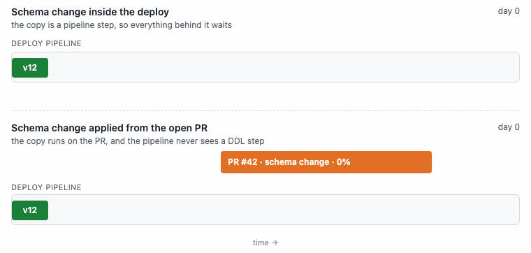

# The pre-merge workflow

<!-- BEGIN TOC (auto-generated by `make docs-toc`) -->

## Table of Contents

- [Why apply before merge](#why-apply-before-merge)
- [Declarative schema files](#declarative-schema-files)
- [The dev loop](#the-dev-loop)
  - [Converging a local database](#converging-a-local-database)
  - [Where the data-access layer fits](#where-the-data-access-layer-fits)
  - [When to ship the schema](#when-to-ship-the-schema)
- [The PR workflow, step by step](#the-pr-workflow-step-by-step)
  - [Applies happen before merge](#applies-happen-before-merge)
  - [What the check means](#what-the-check-means)
  - [Promotion order](#promotion-order)
  - [If the check is stuck](#if-the-check-is-stuck)
- [Destructive changes: two different workflows](#destructive-changes-two-different-workflows)
  - [Renaming a column or table](#renaming-a-column-or-table)
  - [Habits for a shared staging database](#habits-for-a-shared-staging-database)
- [The safety gates in the loop](#the-safety-gates-in-the-loop)
- [The CLI in the loop](#the-cli-in-the-loop)
- [Where to go next](#where-to-go-next)

<!-- END TOC (auto-generated by `make docs-toc`) -->

Apply the schema from an open pull request. Merge when the required environments
match its files. Deploy the code onto a database that is ready for it.


Iterate locally, review the plan in the PR, and carry the same schema through your environments.

This guide assumes your repository is connected to SchemaBot; the
[GitHub App setup guide](github-app-setup.md) gets you there. The examples use
MySQL with staging and production. Your engines, environments, and enabled
gates determine the steps available to you.

## Why apply before merge

**A schema change can take weeks without holding up everyone else’s releases.**
Run it from the open PR, and the database can take the time it needs while
unrelated code keeps shipping. The release that needs the change waits at the
merge gate, not inside a deploy.



Let the database change at its own pace while releases keep moving.

- **Choose when it goes live.** Where the engine supports deferred cutover,
  let the copy run and hold the final swap for a time you choose
- **Keep code deploys simple.** DDL runs separately, with its own progress,
  controls, and failure reporting in the PR
- **Merge what is already live.** The required checks confirm the schema
  work is complete in the required environments before the PR can merge

Apply-before-merge does not always mean schema-before-code. Add a
backward-compatible column before deploying code that uses it. Before dropping
one, deploy code that no longer uses it. Both schema changes run from an open PR.

## Declarative schema files

Schema lives in a directory with a `schemabot.yaml` that names the database,
and one subdirectory per schema name holding that schema's per-table files:

```
schema/
├── schemabot.yaml    # names the database
└── mydb/             # one directory per schema name
    ├── users.sql     # desired end state of the `users` table
    └── products.sql  # desired end state of the `products` table
```

Each `.sql` file holds the full `CREATE TABLE` for that table: the desired end
state, not a diff. To change a table, edit its file (add a column, add an
index) and open a PR. SchemaBot computes the DDL needed to move the live
database to what the file describes. Dropping is declarative too: delete the
file to drop the table, delete the column's line to drop the column. A flat
layout, with `schemabot.yaml` directly beside the `.sql` files, also works for
a single schema name, and
[`schemabot onboard`](github-app-setup.md#6-add-schemabotyaml-config-to-your-repository)
generates the directory from a live database, so you rarely author one by
hand. Multi-schema and per-environment naming is covered in
[namespaces.md](namespaces.md).

## The dev loop

Edit the desired schema, update your local database, and test the application.
Repeat until the shape is ready to share. The same files then describe what
staging and production should run.

### Converging a local database

For MySQL, [Spirit](https://github.com/block/spirit) can compare a local database
with your schema files and print the DDL needed to bring them into agreement:

```sh
spirit diff --source-dsn 'root:pass@tcp(127.0.0.1:3306)/mydb' --target-dir ./schema/mydb
```

For example, after adding a nullable email column to `users.sql`, the DDL
output could be:

```sql
ALTER TABLE `users` ADD COLUMN `email` varchar(255) DEFAULT NULL;
```

Review the output, then run the intended statements against your local database
using your SQL client. Lint findings appear as SQL comments, and the command
can print DDL even when it exits with a lint error; piping it directly into a
SQL client does not enforce those findings. Dropping a column or table still
removes its data locally.

If your framework already updates a local database from declarative schema
files, use that workflow. To try the PR workflow with a local server and test
databases, follow the [quick start](../README.md#quick-start).

### Where the data-access layer fits

Use the ORM or code generator you already have. Update the local database,
refresh the model, and run your tests. If generated models are checked in,
include their updated files in the PR. If generation runs during the build,
make sure it reads the updated schema.

A backward-compatible schema addition can share a PR with the feature that
uses it: apply the schema, merge, then deploy the code. Test with the old code
too, since it keeps running during the schema change and a rolling deploy.

### When to ship the schema

Ship the schema when its shape has settled and you have tested compatibility
with the running application. The whole feature does not need to be finished.
Keep experimenting locally while you are still changing columns and indexes.

Group related edits to one table so the engine can plan them together; this
can avoid paying for the same table copy twice. Keep unrelated work in separate
PRs so each plan is easy to review and recover from.

A small feature can carry its compatible schema addition in one PR. For a
larger feature, apply and merge the schema first, then build on it. Related
tables may belong in one PR, but deferred cutover does **not** promise an atomic
swap across tables. The application must tolerate the intermediate states.

## The PR workflow, step by step

Here is the workflow for a compatible schema addition. Screenshots use the
actual comment templates with illustrative values; each shows a different
stage of the workflow:

1. **Edit the table's `.sql` file and open a PR.**
2. **SchemaBot plans automatically.** It posts the DDL diff as a PR comment,
   stamped with the commit it was computed from, and re-plans on every new
   commit. When the files already match the live schema there is nothing to
   plan, so no comment is posted and the passing check is the signal.

   

3. **Apply to staging** by commenting `schemabot apply -e staging`. SchemaBot
   acknowledges the command with a 👀 reaction, re-plans the current head,
   takes the database lock, and starts the apply.

   

4. **Watch the status comment.** SchemaBot edits one progress comment in place
   for as long as the apply runs: rows copied, percent complete, an ETA, and
   the command to stop it. Use the reported
   progress and throttle reason to see how the copy is doing.

   

5. **The completion comment lands.** When the change is live, a summary posts
   at the bottom of the timeline with the DDL that ran and the apply ID.

   

6. **Apply to production** by commenting `schemabot apply -e production`. The
   same three comments follow, for the production database. With staging first in the
   promotion order, its check must pass before production can apply. An enabled
   [review gate](configuration.md#review-gate) also requires an approving review
   before an apply, including staging where configured.
7. **The checks turn green.** When the schema work is complete in the required
   environments, the schema checks pass. The PR can merge once its other
   required checks and reviews pass too.

   

8. **Merge.** Merging records the desired state the databases already run.

   

9. **Deploy as usual.** For an additive change, the code rolls out onto a
   database that already has the shape it expects.

The full command set, with every flag, is in the help comment
(`schemabot help` on any PR) and in
[architecture.md](architecture.md#user-layer-cli--pr-comments--api).
Every control operation (`stop`, `start`, `cutover`, `cancel`, `rollback`) is
a PR comment too, so the whole lifecycle of a change stays on the PR. Copy the
next command from SchemaBot's own comment rather than typing it: the comment
always renders the exact next command with the apply ID, the environment, and
any other required flags filled in.

### Applies happen before merge

You apply while the PR is open. Once the required schema checks pass, merging
records the desired state the databases already run.

- **No schema edits?** The PR gets a passing `No managed schema changes` check
- **Another PR holds the database lock?** The apply is refused and names the
  holder. Wait for that PR to merge or release the lock
- **Schema files changed on the base branch?** Rebase before applying so your
  desired state includes those changes. The freshness gate prevents a stale
  branch from silently undoing them
- **Stacked on another schema PR?** Your plan includes its changes until they
  are live. Finish the base PR and rebase; do not approve unsafe DDL just to
  get past a finding that belongs to it

See [schema freshness](configuration.md#base-branch-schema-freshness) for how
the gate scopes these checks to the relevant schema directory.

### What the check means

SchemaBot publishes one aggregate Check Run per environment it manages
(`SchemaBot (staging)`, `SchemaBot (production)`, or a single `SchemaBot` when
one deployment owns every environment), Configure branch protection to require the appropriate checks.
Internally SchemaBot keeps one row per database the PR touches and rolls them
up conservatively: any database still in progress, failed, or waiting on an
operator keeps the aggregate red, and only all-success turns it green
([MG-3](invariants.md#mg-3-the-rollup-is-conservative)).

There are exactly three ways a database's row turns green: a current plan finds
no changes, the apply the row represents completes successfully, or the PR
head no longer touches that database and no apply had started. Everything
else, including uncertainty about storage or GitHub, is a reason to stay red,
never a reason to pass
([MG-1](invariants.md#mg-1-uncertainty-is-never-converted-into-a-passing-check),
[MG-2](invariants.md#mg-2-absence-never-passes)).

Read the check's conclusion, not its color. GitHub renders an
`action_required` check with the same red mark as a failure, but it is not a
failure. It means the check is waiting on an action, usually an apply that has
not been posted yet, and the plan comment says which. Two edges are worth
knowing before you meet them:

- **A started apply stays authoritative.** If a later commit removes the
  schema change after its apply started, the check stays blocked until the
  apply settles and an operator reconciles the database with what the PR now
  says. Closing the PR does not cancel the apply, and closing and reopening it
  does not wash the block away
  ([MG-6](invariants.md#mg-6-started-applies-keep-blocking-after-the-change-disappears)).
  To stop a running apply, use `stop` or `cancel`; editing the files back
  never does it.
- **A completed rollback is never green.** After `rollback-confirm` succeeds,
  the row goes to `action_required`, because the database no longer contains
  what the PR describes. The PR either applies again or drops the change
  ([MG-7](invariants.md#mg-7-a-completed-rollback-never-shows-green)).

[check-runs.md](check-runs.md) has the full state table, every blocking
reason, and the branch protection setup, including why the required check must
be pinned to the SchemaBot GitHub App and not matched by name alone.

### Promotion order

Environments apply in the configured order, `staging` then `production` by
default. A production apply is refused while the prior environment's check is
anything other than success, including when no record exists at all. When
staging and production are served by separate SchemaBot deployments, the
production side reads the staging aggregate Check Run from GitHub and trusts it
by GitHub App identity rather than by name
([MG-8](invariants.md#mg-8-check-trust-is-by-app-identity-never-by-name)), so
a production instance needs no staging credentials. Cross-environment signals
sequence applies; they never authorize them. Rollbacks and the CLI are
deliberately not gated by promotion order, because they are the emergency
controls. The details, including chains longer than two environments and the
`promotion-check-name` override, are in
[check-runs.md](check-runs.md#environment-ordering).

### If the check is stuck

An “expected” check means GitHub is waiting for a check to be reported on the
current PR head. It does not explain why the check is missing. This can happen
on PRs without schema edits too. Try these ways to refresh it:

1. **Push a new commit**, ideally by rebasing onto the latest base branch,
   which also picks up any schema changes that merged since you branched. The
   push triggers a fresh PR event and SchemaBot creates the check on the new
   head.
2. **Comment `schemabot plan`.** That asks SchemaBot to re-plan the current
   head directly, refreshing the check without changing the branch.
3. **Close and reopen the PR.** Reopening triggers a PR event the same way a
   push does.

If the check is still missing, ask an operator to check event processing and
branch-protection configuration. Operators can also sweep every open PR for missing or stuck checks and recreate them with
`schemabot checks backfill`, described in
[check-runs.md](check-runs.md#backfilling-missing-check-runs). Disabling the
required check is the last resort, never the first, because it removes the
merge gate for every PR in the repository.

## Destructive changes: two different workflows

The workflow above assumes the running application can use both the old and
new schema. Removing a column, table, or index needs a different sequence:


- **Dropping an index** can change query performance and break queries that
  name it in index hints. On MySQL, check those queries and hide an eligible
  secondary index before dropping it: mark it `INVISIBLE`
  in the table file, let real traffic show you what the drop will cost, and
  flip it back instantly if anything regresses. Both edits are metadata-only.
  If the index is being replaced, add the replacement first and confirm the
  optimizer uses it before hiding the old one. SchemaBot's linter holds you to
  this: a `DROP INDEX` on an index that was never made invisible is an unsafe
  change.
- **Dropping a column or table** breaks any running instance still using it,
  so every code reference must be removed and deployed before the schema drops
  it. That is the additive order in reverse, across two PRs. First the code
  stops reading and writing the column and the generated model no longer
  includes it. Then, once nothing running references it, a schema PR drops it.
  `DROP TABLE`, `DROP COLUMN`, and type narrowing block apply until the
  operator passes `--allow-unsafe`, and the acknowledgment is recorded on the
  PR.

On MySQL, an applied `DROP TABLE` can be quarantined rather than executed: the
table is renamed into a holding database and stays restorable with one
`RENAME TABLE` until a retention period expires. It is off by default; see
[pending-drops.md](pending-drops.md).

### Renaming a column or table

Changing a name in a schema file does not request an in-place rename.
SchemaBot diffs the desired state against the
live one and cannot know that a changed name *means* a rename, so a renamed
column plans as a `DROP COLUMN` of the old name plus an `ADD COLUMN` of the
new one, which destroys the old column's data. The `DROP` makes the plan
unsafe, which is the gate doing its job. Which path to take depends on whether
the data has to survive:

- **If the data must survive,** treat it as an add followed by a drop, not a
  rename. PR 1 adds the new column, schema first. Deploy code that keeps both
  columns up to date, then backfill existing rows and verify the result. Move
  reads to the new column, and keep old and new code compatible throughout
  the rollout. Once no running code needs the old column, stop writing it
  and drop it in a later schema PR.
- **If the data is disposable** (the column is unused, empty, or safe to
  lose), the rename can go in one PR. Review the plan, confirm that the drop
  plus add is what you meant, and apply with `--allow-unsafe`.

Renaming a table works the same way. Change the table name in its `.sql` file,
and the filename to match, and the plan is a `DROP TABLE` of the old name plus
a `CREATE TABLE` of the new one: two statements in one apply that leave an
empty table under the new name. Any code still reading or writing the old name
breaks the moment the drop applies, so the application must be off the old
name before the change runs, exactly as for any other drop.

### Habits for a shared staging database

Your branch is yours alone. The staging database it applies to is not: every
other developer's tests read the same tables, and what you apply is still
there after your PR closes.

- **Keep changes compatible.** Test schema additions with the code already
  running in staging. A new required column or uniqueness constraint can
  break existing writes even though nothing was removed. Drop a column in a
  later PR, once no code reads or writes it.
- **To test dropping an index, hide it instead.** For an eligible MySQL secondary
  index, the schema file can declare:

  ```sql
  CREATE TABLE `orders` (
    `id` bigint unsigned NOT NULL AUTO_INCREMENT,
    `status` varchar(32) NOT NULL,
    PRIMARY KEY (`id`),
    KEY `idx_status` (`status`) INVISIBLE
  ) ENGINE=InnoDB DEFAULT CHARSET=utf8mb4 COLLATE=utf8mb4_0900_ai_ci;
  ```

  SchemaBot plans the edit as ``ALTER TABLE `orders` ALTER INDEX `idx_status`
  INVISIBLE``, which is metadata-only. MySQL keeps maintaining the index while
  the optimizer stops using it, so real traffic shows you what the drop would
  cost. Deleting the keyword and applying again brings the index back with no
  rebuild.
- **Prove a new index with `EXPLAIN`.** The mirror habit for index adds: once
  the staging apply completes, run `EXPLAIN` on the queries the index is meant
  to serve and confirm the optimizer actually chooses it. An index the planner
  never picks is pure write overhead, and staging is the cheapest place to
  learn that, before production pays the row copy to build it.
- **Add early.** A feature's schema usually settles long before its code does.
  Once you know which columns you need, put the schema change in its own PR,
  apply it, and merge it. Then build the feature against a schema that is
  already in place. If schema and code are already tangled in one branch, pull
  the `.sql` changes out into a separate PR.

## The safety gates in the loop

Each step of the workflow is guarded, and every guard fails closed:

| Gate | What it does | Where |
|---|---|---|
| Lint and unsafe changes | Plan-time linting with a real parser. Error-severity findings (`DROP TABLE`, `DROP COLUMN`, type narrowing, dropping a visible index) block apply until `--allow-unsafe`; changes the engine cannot run at all block with no override | [lint-and-safety-levels.md](lint-and-safety-levels.md) |
| Schema freshness | `apply` is refused when the PR head moved since the plan, when the confirmed plan no longer matches the head, or when the base branch's schema directory changed after the PR diverged | [configuration.md](configuration.md#base-branch-schema-freshness) |
| Database lock | One PR (or CLI operator) holds a database at a time, from `apply` until merge, close, or `unlock`; a competing apply is refused with the holder named | [check-runs.md](check-runs.md#unlock) |
| Promotion order | Production applies only after the prior environment's check is success | [check-runs.md](check-runs.md#environment-ordering) |
| PR checks gate | When enabled, requires the configured CI checks to pass before applying | [configuration.md](configuration.md#pr-checks-gate) |
| Review gate | When enabled, requires an approving review from a configured reviewer before applying; the author’s own approval never counts | [configuration.md](configuration.md#review-gate) |
| Merge gate | The required aggregate check passes only when every change is live in every environment | [check-runs.md](check-runs.md) |

The full list of what must never be false while SchemaBot runs is
[invariants.md](invariants.md); the merge gating family (MG) is the one this
workflow leans on hardest.

## The CLI in the loop

The CLI gives you the same planning and operator controls from your terminal.
It talks directly to the server, so it can also help during a GitHub outage.
For example, follow a running change:

```sh
schemabot progress apply-example-73
```

One frame from the live output (illustrative values):

```text
~ orders: 🟦🟦🟦🟦🟦🟦🟦🟦🟦🟦🟦🟦⬜⬜⬜⬜⬜⬜⬜⬜ 60.00% (throttled)
  ALTER TABLE `orders` ADD INDEX `idx_status`(`status`);
  • Rows: 6,000,000 / 10,000,000 · ETA: 42m 0s
  • ℹ️ Throttled: threads-running 21 > 18 · backing off while the database's active threads exceed its budget
```

The view refreshes until the apply finishes. Here, copying is slowing down
because active database threads exceed the configured budget.

Before applying from a local directory, update your checkout and review the
DDL. A stale file can describe an intent to undo someone else’s change.
Rollbacks also need review: they run a new schema change, and dropping a column
that was added earlier removes any data written to it since.

Access depends on your installation's
[authentication and authorization](configuration.md#authentication). See the
[CLI and PR command reference](architecture.md#user-layer-cli--pr-comments--api)
for planning, logs, and control operations.

## Where to go next

- [architecture.md](architecture.md): the layers, the engines, and the timeline
  of a change through them.
- [check-runs.md](check-runs.md): the merge gate in full, including the check
  lifecycle and branch protection setup.
- [apply-lifecycle.md](apply-lifecycle.md): what happens to an apply after it
  starts, and the one rule that a finished apply stays finished.
- [lint-and-safety-levels.md](lint-and-safety-levels.md): the severity ladder
  behind ⛔, ⚠️, ⚙️, and 💡.
- [github-app-setup.md](github-app-setup.md): wiring the PR workflow up for a
  repository.
