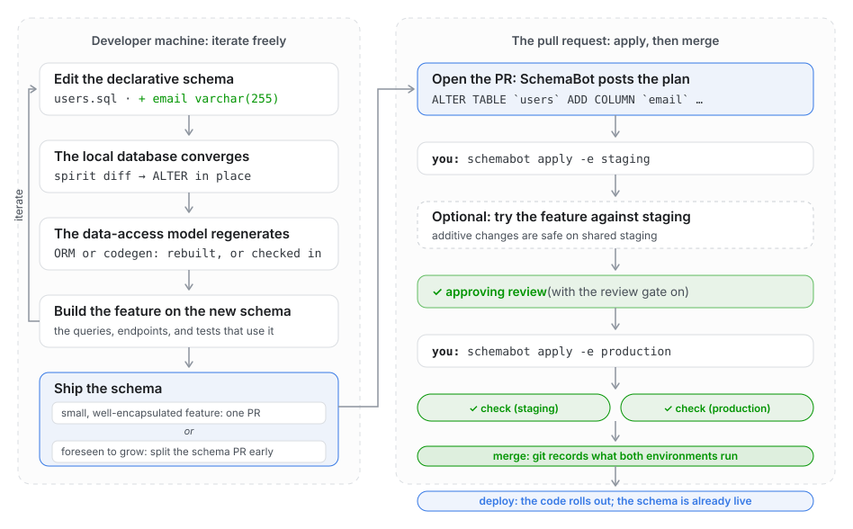
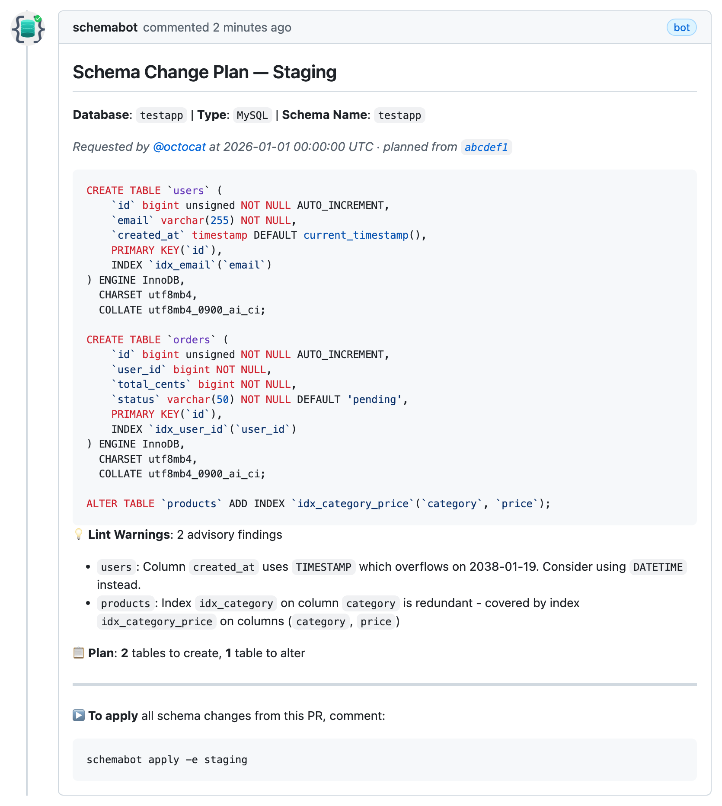
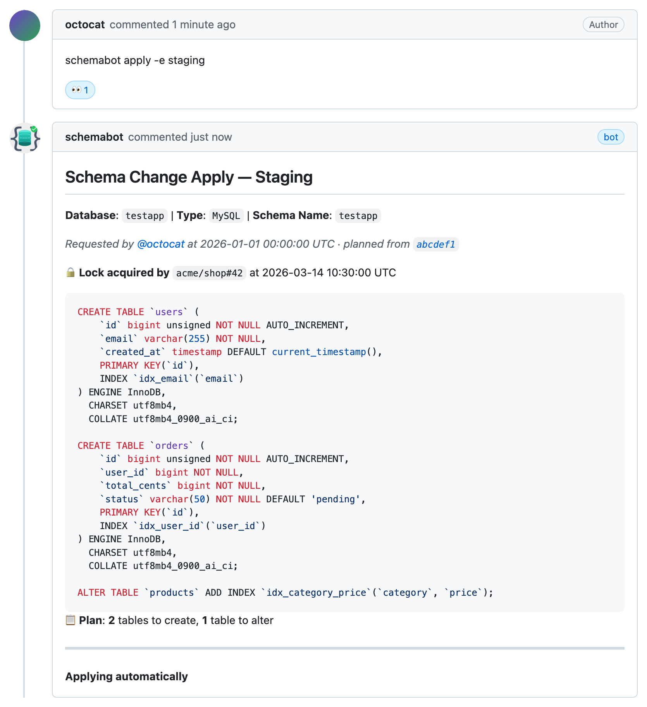
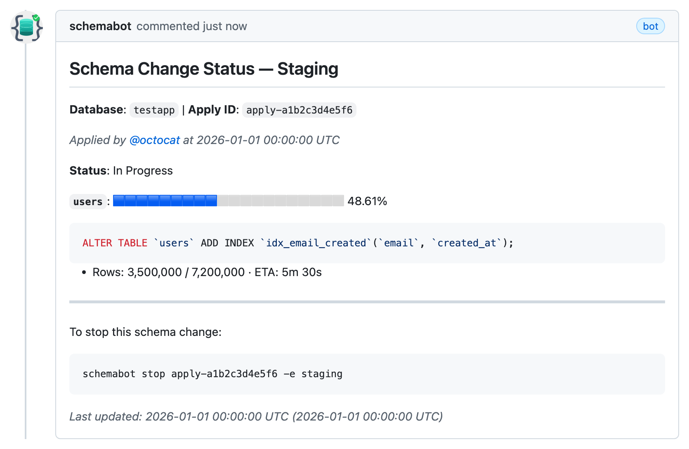
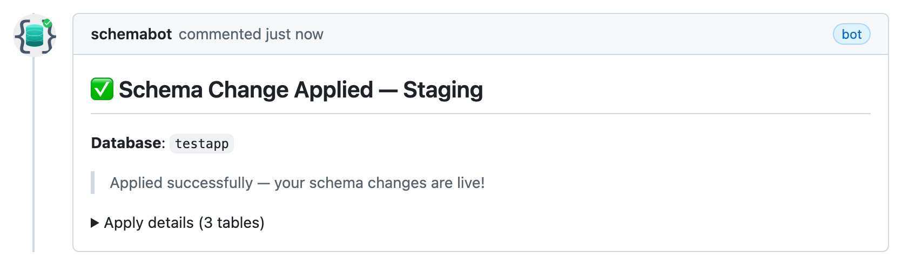
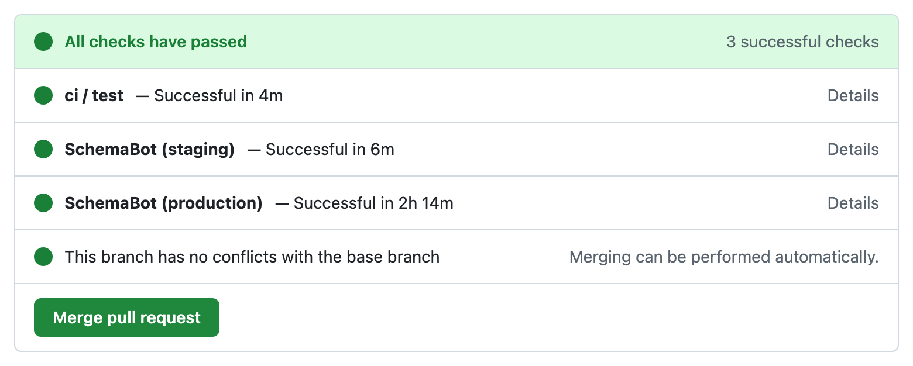
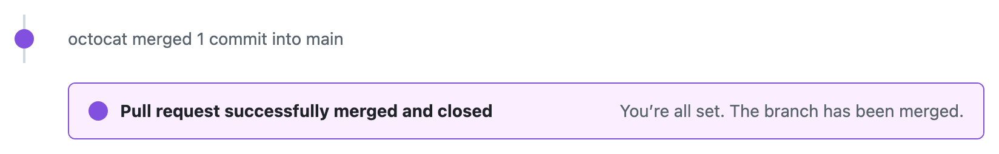
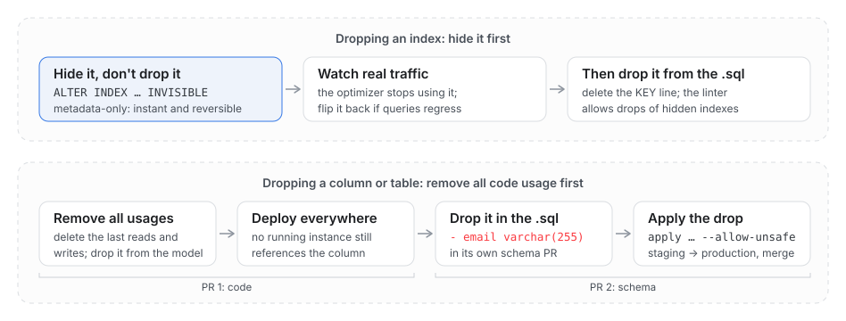

# The pre-merge workflow

<!-- BEGIN TOC (auto-generated by `make docs-toc`) -->

## Table of Contents

- [Why apply before merge](#why-apply-before-merge)
- [Declarative schema files](#declarative-schema-files)
- [The dev loop](#the-dev-loop)
  - [Converging a local database](#converging-a-local-database)
  - [Where the data-access layer fits](#where-the-data-access-layer-fits)
  - [When to ship the schema](#when-to-ship-the-schema)
- [The PR workflow, step by step](#the-pr-workflow-step-by-step)
  - [Applies happen before merge](#applies-happen-before-merge)
  - [What the check means](#what-the-check-means)
  - [Promotion order](#promotion-order)
  - [If the check is stuck](#if-the-check-is-stuck)
- [Destructive changes: two different workflows](#destructive-changes-two-different-workflows)
  - [Renaming a column or table](#renaming-a-column-or-table)
  - [Habits for a shared staging database](#habits-for-a-shared-staging-database)
- [The safety gates in the loop](#the-safety-gates-in-the-loop)
- [The CLI in the loop](#the-cli-in-the-loop)
- [Where to go next](#where-to-go-next)

<!-- END TOC (auto-generated by `make docs-toc`) -->

A schema change is applied to the database **from the open pull request**, and
the PR is allowed to merge only once the live schema matches the files in it.
At the moment of merge, git and every environment agree. That is the whole
product, and the picture below is the whole workflow:



The left half is your machine: edit a table's `.sql` file, converge a local
database to it, run the tests, repeat. The right half is the PR: SchemaBot
plans the DDL, you apply it to staging and then production from the PR
timeline, the required check turns green, the PR merges, and the code deploys
onto a database that already has the shape it expects.

This document explains why the apply happens before the merge, walks the
workflow end to end, and describes the day-to-day loop a developer runs inside
it. It links out to the reference docs rather than repeating them:
[check-runs.md](check-runs.md) for the merge gate,
[apply-lifecycle.md](apply-lifecycle.md) for what happens to an apply once it
starts, and [invariants.md](invariants.md) for the rules the gate must never
break.

## Why apply before merge

One fact forces the order: **a schema change can take weeks, and the pipeline
must never wait for it.** An online change that rewrites a large table copies
every row at whatever pace the database can spare. On a busy multi-terabyte
table that is days or weeks, not minutes. If that copy were a step in the
deploy, every release behind it would queue, the pipeline's timeout would
become the schema change's deadline, and a copy that throttled itself under
load would look like a stuck deploy. Applied from the open PR, the copy runs
for as long as the database needs while the rest of the team keeps merging and
deploying around it. CI and the deploy pipeline never see a DDL step at all.
The deploy that eventually follows is an ordinary code deploy.


Everything else follows from taking DDL out of the deploy path:

- **Merge means agreement.** The required check turns green only when every
  planned change is live in every environment. Merging records a desired state
  that the databases already run. Nothing is left to happen later, so nothing
  can happen differently later.
- **Deploys stay rollback-safe.** A code deploy rolls back in seconds; a schema
  change does not. When the schema is already live and additive, rolling back
  the code leaves a schema that the older code ignores. A bad release is a code
  rollback, not an incident with a half-altered table, and the deploy pipeline
  never has to reason about undoing DDL.
- **Failures land in the PR, not in a release.** DDL that runs at deploy time
  fails in production, part-way through a rollout, with nobody watching for
  it. Applied from the PR, it fails as a comment while the author is looking,
  before anything has merged, and the fix is another commit. The check stays
  red until the change is live.
- **Some changes truly need operator control.** An apply is a long-lived,
  observable operation, not a line in a deploy script. It throttles itself
  when the database is under load, streams progress into the PR, and can be
  stopped, resumed, cut over, or cancelled from the PR or the CLI. The one
  moment a row copy touches the application is the final table swap. On a busy
  table an operator starts the apply with `--defer-cutover`, lets the copy
  finish on its own schedule, and triggers the swap in a quiet window of their
  choosing. The same flag holds every table's swap in a multi-table change
  until all the copies are done, so tables that must change together do. And
  it keeps a change parked through a code freeze, a holiday, or a Friday, with
  the copy done and the swap waiting. None of that exists for DDL inside a
  deploy.
- **The PR is the review surface and the audit trail.** SchemaBot posts the
  exact DDL it will run as a comment. The apply is a comment from a named
  person, progress streams into the timeline, and the terminal summary lands
  there too. Nothing about the change lives outside the PR.
- **Nobody else's change can silently undo yours.** Applying takes a database
  lock that the PR holds until it merges or closes. A PR whose base branch
  gained schema changes after it diverged is refused at apply time and asked
  to rebase. The mechanics are in
  [Applies happen before merge](#applies-happen-before-merge).
- **Old and new code run against one schema.** A rolling deploy runs two
  versions of the code at once, and a schema both can trust is the only safe
  one. Applying an additive change ahead of the code makes that the default
  shape of every change, rather than a discipline each author has to remember.
- **The application never needs DDL privileges.** Schema changes run through
  SchemaBot's own credentials, so application users and deploy pipelines can
  be granted data access alone. A compromised service or pipeline cannot alter
  a table.

Apply-before-merge says nothing about whether the schema or the code changes
first. That depends on the change. An additive change (a new column, table, or
index) is invisible to code that predates it, so the schema PR goes first and
the feature follows. A destructive change runs the other way: the code stops
using the column, deploys, and only then does a schema PR drop it. In both
orders the schema PR is applied from the PR and merges once the change is
live. The destructive order has its own section in
[Destructive changes](#destructive-changes-two-different-workflows).

## Declarative schema files

Schema lives in a directory with a `schemabot.yaml` that names the database,
and one subdirectory per schema name holding that schema's per-table files:

```
schema/
├── schemabot.yaml    # names the database
└── mydb/             # one directory per schema name
    ├── users.sql     # desired end state of the `users` table
    └── products.sql  # desired end state of the `products` table
```

Each `.sql` file holds the full `CREATE TABLE` for that table: the desired end
state, not a diff. To change a table, edit its file (add a column, add an
index) and open a PR. SchemaBot computes the DDL needed to move the live
database to what the file describes. Dropping is declarative too: delete the
file to drop the table, delete the column's line to drop the column. A flat
layout, with `schemabot.yaml` directly beside the `.sql` files, also works for
a single schema name, and
[`schemabot onboard`](github-app-setup.md#6-add-schemabotyaml-config-to-your-repository)
generates the directory from a live database, so you rarely author one by
hand. Multi-schema and per-environment naming is covered in
[namespaces.md](namespaces.md).

## The dev loop

The whole loop, from an idea on your machine to production, runs through the
schema file. Because each `.sql` file describes an end state, any running
database can be converged to it, the one on your machine included, and
SchemaBot converges staging and production to that same end state from the PR.

No hand-written `ALTER` exists anywhere in that loop. Convergence is a schema
diff: compare two schemas (here, a live database against the directory of
`.sql` files) and emit exactly the DDL that transforms one into the other, or
nothing if they already match. Locally that means an in-place `ALTER`, so the
database keeps its data with no teardown and no restart. The plan SchemaBot
posts on the PR is the same computation, aimed at staging or production
instead of your local database.

### Converging a local database

[Spirit](https://github.com/block/spirit), the engine that runs SchemaBot's
MySQL changes, ships the diff as a subcommand. Point it at your local database
and your schema directory, and it prints the DDL that brings the database up to
date, with any lint findings as SQL comments above it, so the output can be
piped straight back in:

```bash
spirit diff --source-dsn 'root:pass@tcp(127.0.0.1:3306)/mydb' --target-dir ./schema/mydb | mysql -h 127.0.0.1 -u root -p mydb
```

Wire that into whatever your framework runs at startup or before its tests,
and the local loop becomes "edit the file, re-run the test". The compiler and
the test suite tell you what the schema change broke. Frameworks that already
support declarative schema directories can converge from the same files
directly. If you would rather exercise SchemaBot itself, `make demo` (see the
[README quick start](../README.md#quick-start)) brings up a local server and
databases, and `schemabot plan -s ./schema -e staging` against it shows
exactly what the PR comment will show.

### Where the data-access layer fits

SchemaBot is ORM-agnostic. It manages the database schema and does not care
what sits on top. Any ORM or code generator slots into the loop the same way:
converge the database, refresh the model, compile. A generator that runs at
build time cannot go stale, because editing the `.sql` file alone changes the
generated model on the next build. A generated model that is checked in needs
regenerating in the same PR as the schema edit, and the generated diff is worth
reviewing like any other code: exactly the expected columns should appear or
disappear, and nothing else.

At deploy time both modes give the same guarantee. SchemaBot applies the change
before the PR merges, so by the time an artifact built from the merged commit
rolls out, the database already has the shape the model expects. That ordering
is what makes an additive change safe to ship as a single PR: the schema
applies first, the code deploys after.

### When to ship the schema

The last step on your machine, shipping the schema, is a judgment call. Ship it
when:

- **Iterations have stopped touching the `.sql` file.** You are changing
  queries, endpoints, and tests now, not columns. The feature does not need to
  be finished; passing tests against the current shape is enough.
- **You want the schema live ahead of the feature.** An applied schema makes
  testing against a shared staging environment simpler, and lets the feature
  land incrementally.

Hold it locally when:

- **You are still changing your mind about the shape.** A column type or index
  you have reworked twice this session will get reworked again. That churn
  belongs in the local loop, where it costs nothing.
- **You expect another edit to the same table soon.** Each apply runs as its
  own online change. Adding a column is usually a metadata-only operation that
  finishes in milliseconds, but a change that rewrites rows, such as a new
  index or a changed column type, pays a full row copy on a big table. One PR
  with the full end state folds every edit into a single `ALTER`, so two
  changes to the same table pay that copy once.

Scope the PR the same way. Changes to one table belong in one PR. Unrelated
tables on a production database are better in separate PRs, so the plan, the
apply, and any rollback stay scoped to one change and you can watch the impact
of each. Tables that depend on each other (matching collations on columns they
join on, for example) belong in one PR applied with `--defer-cutover`, so
nothing swaps until every table's copy is done and live traffic never sees one
table changed and the other not.

That does not always mean two PRs. A feature that is small and
well-encapsulated can carry its schema change in a single PR: plan, apply,
merge, done. If the feature is likely to grow a lot bigger, split the schema PR
off early. When unsure, split: a schema PR is cheap to cut, and an applied
schema never blocks the feature the way an unapplied one does.

## The PR workflow, step by step

The right-hand half of the diagram at the top of this page, as it looks on the
PR. Every comment below is the real template SchemaBot posts:

1. **Edit the table's `.sql` file and open a PR.**
2. **SchemaBot plans automatically.** It posts the DDL diff as a PR comment,
   stamped with the commit it was computed from, and re-plans on every new
   commit. When the files already match the live schema there is nothing to
   plan, so no comment is posted and the passing check is the signal.

   

3. **Apply to staging** by commenting `schemabot apply -e staging`. SchemaBot
   acknowledges the command with a 👀 reaction, re-plans the current head,
   takes the database lock, and starts the apply.

   

4. **Watch the status comment.** SchemaBot edits one progress comment in place
   for as long as the apply runs: rows copied, percent complete, an ETA, and
   the command to stop it. A long-running copy is normal. Let it run.

   

5. **The completion comment lands.** When the change is live, a summary posts
   at the bottom of the timeline with the DDL that ran and the apply ID.

   

6. **Apply to production** by commenting `schemabot apply -e production`. The
   same three comments follow, for the production database. This requires the
   staging check to have passed, and an approving review when the
   [review gate](configuration.md#review-gate) is on.
7. **The checks turn green.** When every planned change is applied in every
   environment, the required check passes and the merge button unlocks.

   

8. **Merge.** Merging records the desired state the databases already run.

   

9. **Deploy as usual.** For an additive change, the code rolls out onto a
   database that already has the shape it expects.

The full command set, with every flag, is in the help comment
(`schemabot help` on any PR) and in
[architecture.md](architecture.md#user-layer-cli--pr-comments--api).
Every control operation (`stop`, `start`, `cutover`, `cancel`, `rollback`) is
a PR comment too, so the whole lifecycle of a change stays on the PR. Copy the
next command from SchemaBot's own comment rather than typing it: the comment
always renders the exact next command with the apply ID, the environment, and
any other required flags filled in.

### Applies happen before merge

SchemaBot gates the PR on what has actually been applied, not on what the diff
says. Four consequences follow:

- **The check turns green when the change is live.** You apply from the open
  PR. Once every planned change is applied in staging and production, the
  required check passes and the PR can merge. Merging records the desired
  state the databases already run.
- **PRs without schema changes pass automatically,** and someone else's apply
  to the same database never breaks your PR's check. A PR that touches no
  managed schema files gets a passing `No managed schema changes` check on
  every head, because GitHub cannot tell "no work" from "failed to report".
  No rebase is needed unless there is a genuine merge conflict.
- **Stale schema PRs are caught at apply time.** Applying takes a lock on the
  database that the PR holds until it merges or closes. While PR A's change is
  applied but unmerged, PR B's `apply` is refused with a comment naming A as
  the lock holder. Once A merges, B's view of the schema is stale: its plan
  now contains DDL that would undo A's change, because B's files describe a
  desired state without it. B's next `apply` is refused again, this time
  because the base branch's schema directory changed after B diverged, and B
  is asked to rebase. After the rebase the plan shrinks back to B's own
  change. B can never silently undo what A applied. The rule is path-scoped,
  so unrelated commits on the base branch never block anyone; see
  [Base Branch Schema Freshness](configuration.md#base-branch-schema-freshness).
- **A PR stacked on an unmerged PR plans both.** The plan is a diff of the
  branch's files against the live schema, and a stacked branch carries the
  base PR's edits too. Any unsafe finding that belongs to the base PR shows up
  on the stacked one until the base merges. Merge the base, rebase, and the
  plan shrinks to this PR's change. Do not reach for `--allow-unsafe` to get
  past a finding that is not yours.

### What the check means

SchemaBot publishes one aggregate Check Run per environment it manages
(`SchemaBot (staging)`, `SchemaBot (production)`, or a single `SchemaBot` when
one deployment owns every environment), and branch protection requires it.
Internally SchemaBot keeps one row per database the PR touches and rolls them
up conservatively: any database still in progress, failed, or waiting on an
operator keeps the aggregate red, and only all-success turns it green
([MG-3](invariants.md#mg-3-the-rollup-is-conservative)).

There are exactly three ways a database's row turns green: a current plan finds
no changes, the apply the row represents completes successfully, or the PR
head no longer touches that database and no apply had started. Everything
else, including uncertainty about storage or GitHub, is a reason to stay red,
never a reason to pass
([MG-1](invariants.md#mg-1-uncertainty-is-never-converted-into-a-passing-check),
[MG-2](invariants.md#mg-2-absence-never-passes)).

Read the check's conclusion, not its color. GitHub renders an
`action_required` check with the same red mark as a failure, but it is not a
failure. It means the check is waiting on an action, usually an apply that has
not been posted yet, and the plan comment says which. Two edges are worth
knowing before you meet them:

- **A started apply stays authoritative.** If a later commit removes the
  schema change after its apply started, the check stays blocked until the
  apply settles and an operator reconciles the database with what the PR now
  says. Closing the PR does not cancel the apply, and closing and reopening it
  does not wash the block away
  ([MG-6](invariants.md#mg-6-started-applies-keep-blocking-after-the-change-disappears)).
  To stop a running apply, use `stop` or `cancel`; editing the files back
  never does it.
- **A completed rollback is never green.** After `rollback-confirm` succeeds,
  the row goes to `action_required`, because the database no longer contains
  what the PR describes. The PR either applies again or drops the change
  ([MG-7](invariants.md#mg-7-a-completed-rollback-never-shows-green)).

[check-runs.md](check-runs.md) has the full state table, every blocking
reason, and the branch protection setup, including why the required check must
be pinned to the SchemaBot GitHub App and not matched by name alone.

### Promotion order

Environments apply in the configured order, `staging` then `production` by
default. A production apply is refused while the prior environment's check is
anything other than success, including when no record exists at all. When
staging and production are served by separate SchemaBot deployments, the
production side reads the staging aggregate Check Run from GitHub and trusts it
by GitHub App identity rather than by name
([MG-8](invariants.md#mg-8-check-trust-is-by-app-identity-never-by-name)), so
a production instance needs no staging credentials. Cross-environment signals
sequence applies; they never authorize them. Rollbacks and the CLI are
deliberately not gated by promotion order, because they are the emergency
controls. The details, including chains longer than two environments and the
`promotion-check-name` override, are in
[check-runs.md](check-runs.md#environment-ordering).

### If the check is stuck

Occasionally a PR shows the SchemaBot check as expected but never reported. It
happens on PRs that touch no schema files too, and it usually means a PR event
was lost to a GitHub hiccup or a SchemaBot deploy window. Any of these fixes
it, in order of convenience:

1. **Push a new commit**, ideally by rebasing onto the latest base branch,
   which also picks up any schema changes that merged since you branched. The
   push triggers a fresh PR event and SchemaBot creates the check on the new
   head.
2. **Comment `schemabot plan`.** That asks SchemaBot to re-plan the current
   head directly, refreshing the check without changing the branch.
3. **Close and reopen the PR.** Reopening triggers a PR event the same way a
   push does.

If none of these lands a check, the problem is wider than your PR. Operators
can sweep every open PR for missing or stuck checks and recreate them with
`schemabot checks backfill`, described in
[check-runs.md](check-runs.md#backfilling-missing-check-runs). Disabling the
required check is the last resort, never the first, because it removes the
merge gate for every PR in the repository.

## Destructive changes: two different workflows

The loop above is the additive loop, and additive is what makes its order
safe: a new column, table, or index is invisible to code that predates it, so
the schema can run ahead of the code. Removing something reverses that order,
and the right workflow depends on what you are removing:



- **Dropping an index** never breaks code, since no query names an index, but
  it can break query plans. So hide it before you drop it: mark it `INVISIBLE`
  in the table file, let real traffic show you what the drop will cost, and
  flip it back instantly if anything regresses. Both edits are metadata-only.
  If the index is being replaced, add the replacement first and confirm the
  optimizer uses it before hiding the old one. SchemaBot's linter holds you to
  this: a `DROP INDEX` on an index that was never made invisible is an unsafe
  change.
- **Dropping a column or table** breaks any running instance still using it,
  so every code reference must be removed and deployed before the schema drops
  it. That is the additive order in reverse, across two PRs. First the code
  stops reading and writing the column and the generated model no longer
  includes it. Then, once nothing running references it, a schema PR drops it.
  `DROP TABLE`, `DROP COLUMN`, and type narrowing block apply until the
  operator passes `--allow-unsafe`, and the acknowledgment is recorded on the
  PR.

On MySQL, an applied `DROP TABLE` can be quarantined rather than executed: the
table is renamed into a holding database and stays restorable with one
`RENAME TABLE` until a retention period expires. It is off by default; see
[pending-drops.md](pending-drops.md).

### Renaming a column or table

There is no in-place rename. SchemaBot diffs the desired state against the
live one and cannot know that a changed name *means* a rename, so a renamed
column plans as a `DROP COLUMN` of the old name plus an `ADD COLUMN` of the
new one, which destroys the old column's data. The `DROP` makes the plan
unsafe, which is the gate doing its job. Which path to take depends on whether
the data has to survive:

- **If the data must survive,** treat it as an add followed by a drop, not a
  rename. PR 1 adds the new column, schema first. A backfill job copies the
  data from the old column to the new one. The application moves onto the new
  column and deploys. PR 2 drops the old column, in the code-first order
  above.
- **If the data is disposable** (the column is unused, empty, or safe to
  lose), the rename can go in one PR. Review the plan, confirm that the drop
  plus add is what you meant, and apply with `--allow-unsafe`.

Renaming a table works the same way. Change the table name in its `.sql` file,
and the filename to match, and the plan is a `DROP TABLE` of the old name plus
a `CREATE TABLE` of the new one: two statements in one apply that leave an
empty table under the new name. Any code still reading or writing the old name
breaks the moment the drop applies, so the application must be off the old
name before the change runs, exactly as for any other drop.

### Habits for a shared staging database

Your branch is yours alone. The staging database it applies to is not: every
other developer's tests read the same tables, and what you apply is still
there after your PR closes.

- **Only add.** A new column, table, or index goes unnoticed by code that
  predates it, so it is safe for instances older and newer than your change,
  which is the same property a clean production rollout needs. Drop a column
  in a later PR, once no code reads it.
- **To test dropping an index, hide it instead.** Indexes are the one removal
  you can safely try on shared staging:

  ```sql
  CREATE TABLE `orders` (
    `id` bigint unsigned NOT NULL AUTO_INCREMENT,
    `status` varchar(32) NOT NULL,
    PRIMARY KEY (`id`),
    KEY `idx_status` (`status`) INVISIBLE
  ) ENGINE=InnoDB DEFAULT CHARSET=utf8mb4 COLLATE=utf8mb4_0900_ai_ci;
  ```

  SchemaBot plans the edit as ``ALTER TABLE `orders` ALTER INDEX `idx_status`
  INVISIBLE``, which is metadata-only. MySQL keeps maintaining the index while
  the optimizer stops using it, so real traffic shows you what the drop would
  cost. Deleting the keyword and applying again brings the index back with no
  rebuild.
- **Prove a new index with `EXPLAIN`.** The mirror habit for index adds: once
  the staging apply completes, run `EXPLAIN` on the queries the index is meant
  to serve and confirm the optimizer actually chooses it. An index the planner
  never picks is pure write overhead, and staging is the cheapest place to
  learn that, before production pays the row copy to build it.
- **Add early.** A feature's schema usually settles long before its code does.
  Once you know which columns you need, put the schema change in its own PR,
  apply it, and merge it. Then build the feature against a schema that is
  already in place. If schema and code are already tangled in one branch, pull
  the `.sql` changes out into a separate PR.

## The safety gates in the loop

Each step of the workflow is guarded, and every guard fails closed:

| Gate | What it does | Where |
|---|---|---|
| Lint and unsafe changes | Plan-time linting with a real parser. Error-severity findings (`DROP TABLE`, `DROP COLUMN`, type narrowing, dropping a visible index) block apply until `--allow-unsafe`; changes the engine cannot run at all block with no override | [lint-and-safety-levels.md](lint-and-safety-levels.md) |
| Schema freshness | `apply` is refused when the PR head moved since the plan, when the confirmed plan no longer matches the head, or when the base branch's schema directory changed after the PR diverged | [configuration.md](configuration.md#base-branch-schema-freshness) |
| Database lock | One PR (or CLI operator) holds a database at a time, from `apply` until merge, close, or `unlock`; a competing apply is refused with the holder named | [check-runs.md](check-runs.md#unlock) |
| Promotion order | Production applies only after the prior environment's check is success | [check-runs.md](check-runs.md#environment-ordering) |
| PR checks gate | Your other CI must be passing before SchemaBot applies | [configuration.md](configuration.md#pr-checks-gate) |
| Review gate | Production apply requires an approving review from a configured reviewer; the author's own approval never counts | [configuration.md](configuration.md#review-gate) |
| Merge gate | The required aggregate check passes only when every change is live in every environment | [check-runs.md](check-runs.md) |

The full list of what must never be false while SchemaBot runs is
[invariants.md](invariants.md); the merge gating family (MG) is the one this
workflow leans on hardest.

## The CLI in the loop

Everything above runs through GitHub, and for day-to-day schema changes GitHub
is the right interface: the PR is the audit trail, the plan comment is the
review surface, and the check is the merge gate. The `schemabot` CLI is for the
moments GitHub is not enough. It talks to the server directly, so it works
independently of GitHub, including during a GitHub outage.

- **Watching.** `schemabot status -e staging` lists recent schema changes on
  an environment with their database, state, and caller; `schemabot status
  <apply-id>` shows one apply with per-table progress, the DDL, and an ETA;
  `schemabot progress <apply-id>` stays attached and redraws until the apply
  finishes.
- **Debugging.** `schemabot logs <apply-id>` reads SchemaBot's own log for an
  apply (`-f` follows it live). Without `--deployment` you get the control
  plane: when the apply was queued, where it was dispatched, each state
  change. With `--deployment <name>` you get the data plane that is driving
  the change, including the row-copy status line that says whether a slow
  change is throttled.
- **Planning.** `schemabot plan -s ./schema -e staging` computes the same diff
  the PR comment shows, from a local schema directory instead of the PR. On a
  fresh checkout that matches the live schema, the plan comes back empty,
  which proves your setup end to end.
- **Applying.** `schemabot apply -s ./schema -e staging` shows the DDL, asks
  for confirmation (`-y` skips the prompt), runs the change, and attaches the
  live progress view. `--defer-cutover` and `--allow-unsafe` work here too.
  One thing the PR workflow does for you that the CLI cannot: keep the files
  fresh. The diff is computed against whatever your local directory says, so
  a stale checkout reads as an intent to undo changes other people applied
  since. Pull before applying, and read the DDL in the prompt for anything you
  did not write.
- **Rolling back.** `schemabot rollback <apply-id> -e staging` computes the
  reverse DDL and runs it as a new schema change with its own apply ID,
  progress, and logs. A rollback of a change that added a column drops the
  column, along with any data written to it in the meantime.

Reads are open to anyone the server authenticates. Writes from the CLI are a
grant an operator makes deliberately, and how far it reaches is a
configuration decision covered in
[configuration.md](configuration.md#authentication).

## Where to go next

- [architecture.md](architecture.md): the layers, the engines, and the timeline
  of a change through them.
- [check-runs.md](check-runs.md): the merge gate in full, including the check
  lifecycle and branch protection setup.
- [apply-lifecycle.md](apply-lifecycle.md): what happens to an apply after it
  starts, and the one rule that a finished apply stays finished.
- [lint-and-safety-levels.md](lint-and-safety-levels.md): the severity ladder
  behind ⛔, ⚠️, ⚙️, and 💡.
- [github-app-setup.md](github-app-setup.md): wiring the PR workflow up for a
  repository.
