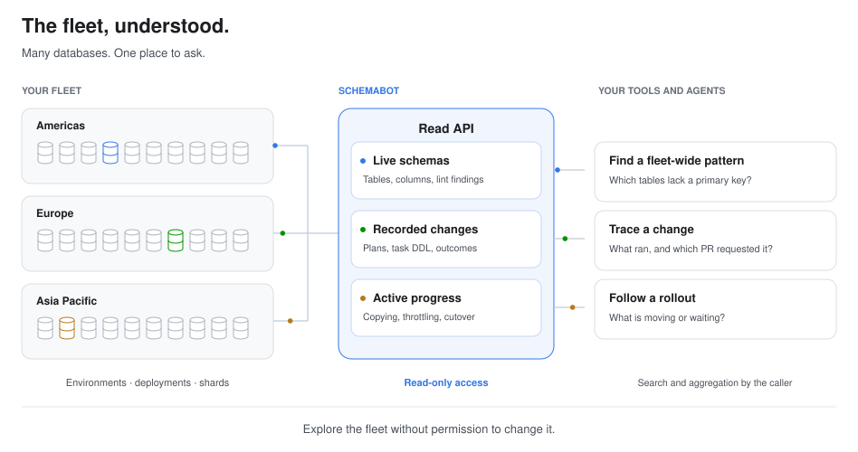

# Schema intelligence

<!-- BEGIN TOC (auto-generated by `make docs-toc`) -->

## Table of Contents

- [What databases exist?](#what-databases-exist)
- [What’s in this database?](#whats-in-this-database)
  - [Read structured columns and indexes](#read-structured-columns-and-indexes)
  - [Find schema issues](#find-schema-issues)
  - [Engine support](#engine-support)
  - [What a pull costs](#what-a-pull-costs)
- [What changed in this database?](#what-changed-in-this-database)
- [What happened in this change?](#what-happened-in-this-change)
  - [Watch a change live](#watch-a-change-live)
- [What’s running across the fleet?](#whats-running-across-the-fleet)
- [Inspect a stored plan](#inspect-a-stored-plan)
- [Read the lifecycle log](#read-the-lifecycle-log)
  - [Read deployment logs](#read-deployment-logs)
- [Check locks](#check-locks)
- [Give a tool read-only access](#give-a-tool-read-only-access)
- [What SchemaBot does not remember](#what-schemabot-does-not-remember)

<!-- END TOC (auto-generated by `make docs-toc`) -->

SchemaBot can tell you what is in your databases, how it got there, and what is
changing now. Give your tools and agents that context with read-only access.



The examples use illustrative values and excerpts of the CLI output. Expand
**API equivalent** for requests and response fields. See
[read-only access](#give-a-tool-read-only-access) to configure your caller.
All API paths are relative to your SchemaBot server URL. For OIDC installations,
include `Authorization: Bearer <token>`; for forward-auth, send requests through
your installation's authenticating proxy. Local installations with authentication
disabled need no token. The examples below omit authentication headers.

## What databases exist?

Start with `schemabot databases`. It lists the
managed databases, their engines, and their configured environments and deployments.

```sh
schemabot databases
```

```text
DATABASE   TYPE      ENVIRONMENTS         DEPLOYMENTS
shop       mysql     staging, production  staging: us-east; production: eu-west, us-east
analytics  postgres  production           production: us-east
```

<details>
<summary>API equivalent</summary>

```http
GET /api/databases
```

```json
{
  "databases": [
    {
      "database": "shop",
      "type": "mysql",
      "environments": [
        {"environment": "staging", "deployments": ["us-east"]},
        {"environment": "production", "deployments": ["us-east", "eu-west"]}
      ]
    },
    {
      "database": "analytics",
      "type": "postgres",
      "environments": [
        {"environment": "production", "deployments": ["us-east"]}
      ]
    }
  ]
}
```

</details>

Use a database name and environment from this inventory in the reads below.

## What’s in this database?

Pull its live schema using a database
and environment from the inventory. The response groups `CREATE TABLE`
statements by namespace: a schema on MySQL or PostgreSQL, a keyspace on Vitess.
Use `--namespace` (API: `namespaces`) to select namespaces; omit it to discover
the non-reserved namespaces.

```sh
schemabot pull -d shop -e production
```

SQL output excerpt:

```sql
-- Namespace `shop` — 1 table

CREATE TABLE `orders` (
  `id` bigint unsigned NOT NULL,
  PRIMARY KEY (`id`)
) ENGINE=InnoDB DEFAULT CHARSET=utf8mb4 COLLATE=utf8mb4_0900_ai_ci;
```

To focus on a table, add `--table orders`; it filters names by substring.

<details>
<summary>API equivalent</summary>

```http
POST /api/pull
Content-Type: application/json

{"database": "shop", "environment": "production"}
```

```json
{
  "database": "shop",
  "environment": "production",
  "namespaces": {
    "shop": {
      "tables": {
        "orders": "CREATE TABLE `orders` (\n  `id` bigint unsigned NOT NULL,\n  PRIMARY KEY (`id`)\n) ENGINE=InnoDB DEFAULT CHARSET=utf8mb4 COLLATE=utf8mb4_0900_ai_ci"
      }
    }
  }
}
```

</details>

The response gives you the table definitions without logging into the database.
A pull reads the environment's **primary deployment**, not every deployment or
shard independently; it does not prove every copy in the fleet matches.
The primary is first in the configured rollout order, otherwise first
alphabetically. The pull request has no deployment selector.

### Read structured columns and indexes

A normal
pull puts each table's SQL in `namespaces.<name>.tables`. On MySQL,
`catalog_detail: detailed` keeps that SQL and adds `table_catalog`: columns
with types and nullability, indexes with their parts and uniqueness, foreign
keys, and estimated row counts and sizes. It also adds a `namespace_catalog`
summary. Your tool reads JSON fields instead of interpreting `CREATE TABLE`.

Request it from the CLI:

```sh
schemabot pull -d shop -e production --table orders --catalog-detail detailed
```

The CLI adds this line above the table's SQL:

```sql
-- Table `orders` — rows ~18,402,551, size ~4.0 GiB (engine estimates)
```

To see the structured payload, add `-o json`:

```sh
schemabot pull -d shop -e production --table orders --catalog-detail detailed -o json
```

The pretty view keeps columns and indexes in the SQL instead of repeating them.
The JSON response includes the catalog shown below. Row counts and sizes are
engine estimates; the available catalog detail varies by dialect.

Response excerpt for `orders`:

```json
{
  "database": "shop",
  "environment": "production",
  "namespaces": {
    "shop": {
      "table_catalog": {
        "orders": {
          "name": "orders",
          "kind": "table",
          "columns": [
            {
              "name": "id",
              "type": "bigint unsigned",
              "nullable": false
            }
          ],
          "indexes": [
            {
              "name": "PRIMARY",
              "primary": true,
              "unique": true,
              "parts": [
                "id"
              ]
            }
          ],
          "estimated_row_count": 18402551,
          "data_size_bytes": 4294967296
        }
      },
      "namespace_catalog": {
        "name": "shop",
        "engine": "mysql",
        "table_count": 1
      }
    }
  }
}
```

<details>
<summary>API equivalent</summary>

```http
POST /api/pull
Content-Type: application/json

{"database": "shop", "environment": "production", "catalog_detail": "detailed"}
```

The CLI's `--table` filter runs client-side.

</details>

### Find schema issues

Which tables are missing a primary key? Add `--lint` to inspect a live
schema for issues. On a MySQL database, a finding looks like this:

```sh
schemabot pull -d shop -e production --lint
```

Lint output excerpt:

```sql
-- Lint: 1 violation
--   [warning] order_events: No primary key defined
```

<details>
<summary>API equivalent</summary>

```http
POST /api/pull
Content-Type: application/json

{"database": "shop", "environment": "production", "lint": true}
```

```json
{
  "database": "shop",
  "environment": "production",
  "namespaces": {
    "shop": {
      "lint": [{
        "table": "order_events",
        "linter": "primary_key",
        "severity": "warning",
        "message": "No primary key defined"
      }]
    }
  }
}
```

</details>

Repeat across the supported databases and environments in your inventory, then
group these findings with their database, environment, namespace, and table.
Your agent can list the affected tables; your dashboard can track fixes over
time. Schedule pulls and cache results rather than scanning the fleet on every
question.

A clean audit returns `lint: []`; an omitted field means lint was not requested.
Pull runs schema-shape rules only. Rules about proposed changes, such as unsafe
drops, require a plan. See [lint and safety levels](lint-and-safety-levels.md#auditing-a-live-schema-pull---lint).

### Engine support

The envelope differs by dialect:

- **Vitess.** The namespace's VSchema comes back as an artifact beside the
  tables. `detailed` returns the namespace catalog without the per-table
  catalog, since that metadata is read from the information schema on the
  MySQL path and has no Vitess equivalent wired up yet.
- **PostgreSQL.** A schema is the namespace, ordinary and partitioned tables
  are exported, and only `basic` catalog detail is available. The full
  envelope is in [postgresql.md](postgresql.md).
- **Lint.** The linters parse MySQL-family DDL only, so a lint request against
  another dialect is rejected rather than answered clean.

### What a pull costs

A pull reads the live database: one connection per namespace, one
`SHOW CREATE TABLE` per table, and at `detailed` several scans over the
information schema. That is cheap for a single database and expensive for a
tight loop over a fleet, so pull is rate limited in two lanes that must both
have budget: per caller and per target database. A refused pull is a `429`
with a `Retry-After` header and a machine-readable `rate_limited` error code,
so a well-behaved client backs off and retries rather than treating it as a
failure. The default budgets, and how to tune them, are in
[configuration.md](configuration.md#rate-limits). The expected shape of a
consumer is a periodic sync that pulls each database on a schedule and keeps
its own copy, not a per-request passthrough.

<details>
<summary>Rate-limited pull example (HTTP 429)</summary>

The same pull request can return:

```http
HTTP/1.1 429 Too Many Requests
Content-Type: application/json
Retry-After: 3
```

```json
{
  "error": "too many pull requests for this database and environment; retry in 3s",
  "error_code": "rate_limited",
  "retry_after_seconds": 3
}
```

Wait at least the advertised delay before retrying. Match `error_code` rather
than parsing `error`. Other API errors use the same `error` and `error_code`
fields, but `error_code` can be empty; also check the HTTP status. Correct an
invalid request or authentication failure before retrying it.

</details>

## What changed in this database?

`GET /api/history/{database}` lists every apply ever run against a database,
newest first, optionally filtered to one environment. Each entry names the
apply, its state, engine, environment, caller, error and error code if it
failed, and when it started and completed. The caller is the stored identity,
with `cli` or `owner/repo#N` as a fallback when it was not recorded.
Start with the database and environment you inspected:

```sh
schemabot status -d shop -e production
```

```text
Schema change history for shop

  APPLY ID          ENV         STATE      STARTED      DURATION  SOURCE
  apply-example-42  production  Completed  2 hours ago  2m        example/store#42

Use 'schemabot status <apply_id>' to view details
```

Take an `apply_id` from this history into the next section.

<details>
<summary>Request and response example</summary>

```http
GET /api/history/shop?environment=production
```

Response excerpt (illustrative values):

```json
{
  "database": "shop",
  "applies": [
    {
      "apply_id": "apply-example-42",
      "caller": "example/store#42",
      "engine": "spirit",
      "environment": "production",
      "state": "completed",
      "started_at": "2026-09-01T03:00:00Z",
      "completed_at": "2026-09-01T03:02:00Z"
    }
  ]
}
```

</details>

## What happened in this change?

Use an `apply_id` from history to inspect one execution.
Check the recorded table DDL and task outcome, and follow the PR URL when one
is present. The apply's completion time tells you when that apply finished;
it is not a separate timestamp for each DDL statement. Stored plans add the
proposed DDL and source commit, but history exposes no plan ID to join a plan
to its exact execution. A plan alone does not prove a change ran.

```sh
schemabot status apply-example-42
```

Output excerpt:

```text
~ orders: 🟩🟩🟩🟩🟩🟩🟩🟩🟩🟩🟩🟩🟩🟩🟩🟩🟩🟩🟩🟩 ✓ Complete
  ALTER TABLE `orders` ADD COLUMN `discount_code` varchar(32);
```

<details>
<summary>API equivalent</summary>

```http
GET /api/progress/apply/apply-example-42
```

```json
{
  "apply_id": "apply-example-42",
  "state": "completed",
  "database": "shop",
  "environment": "production",
  "pull_request": "https://github.com/example/store/pull/42",
  "completed_at": "2026-09-01T03:02:00Z",
  "tables": [{
    "table_name": "orders",
    "ddl": "ALTER TABLE `orders` ADD COLUMN `discount_code` varchar(32) DEFAULT NULL",
    "status": "completed"
  }]
}
```

</details>

The completed task supplies the DDL evidence; the PR URL supplies the review
context.

### Watch a change live

```sh
schemabot progress apply-example-73
```

The command refreshes progress until the apply finishes. One frame from the
live view:

```text
~ orders: 🟦🟦🟦🟦🟦🟦🟦🟦🟦🟦🟦🟦⬜⬜⬜⬜⬜⬜⬜⬜ 60.00% (throttled)
  ALTER TABLE `orders` ADD INDEX `idx_status`(`status`);
  • Rows: 6,000,000 / 10,000,000 · ETA: 42m 0s
  • ℹ️ Throttled: threads-running 21 > 18 · backing off while the database's active threads exceed its budget
```

Use `schemabot status apply-example-73` for a single snapshot.

While an apply runs, `GET /api/progress/apply/{apply_id}` is the live view.
Table entries identify the DDL and task state. Available metrics depend on the
engine and execution phase: copying can report rows and percent complete;
`eta_seconds` is an estimate and may be omitted. Do not interpret an absent ETA
as zero time remaining. Throttled tasks can include `throttle_reason`.
Sharded engines can add per-shard progress, and multi-deployment applies list
operations with their deployment, target, state, and cutover policy.

<details>
<summary>Request and response example</summary>

```http
GET /api/progress/apply/apply-example-73
```

Response excerpt (illustrative values):

```json
{
  "apply_id": "apply-example-73",
  "database": "shop",
  "environment": "production",
  "engine": "spirit",
  "state": "running",
  "tables": [
    {
      "table_name": "orders",
      "ddl": "ALTER TABLE `orders` ADD INDEX `idx_status` (`status`)",
      "status": "running",
      "rows_copied": 6000000,
      "rows_total": 10000000,
      "percent_complete": 60,
      "eta_seconds": 2520,
      "throttled": true,
      "throttle_reason": "threads-running 21 > 18"
    }
  ]
}
```

</details>

The numbers come from the engine while the apply is active, so they are as
fresh as the last poll. Once the apply is terminal, the same endpoint answers
from storage: rows, throttle state, and checksum counts are preserved on the
task record; ETA and per-shard rows are not persisted in this view.

## What’s running across the fleet?

```sh
schemabot status -e production
```

```text
2 active schema changes
3 total: 1 Completed · 1 Running · 1 Waiting for cutover

  APPLY ID          DATABASE  ENV         STATE                STARTED         SOURCE
  apply-example-72  billing   production  Waiting for cutover  2 hours ago     example/billing#73
  apply-example-73  shop      production  Running              20 minutes ago  example/store#42
  apply-example-71  accounts  production  Completed            1 hour ago      example/accounts#18

Use 'schemabot status <apply_id>' to view details
```

To see what’s happening with a change, use its apply ID:

```sh
schemabot status apply-example-73
```

Output excerpt:

```text
~ orders: 🟦🟦🟦🟦🟦🟦🟦🟦🟦🟦🟦🟦⬜⬜⬜⬜⬜⬜⬜⬜ 60.00% (throttled)
  ALTER TABLE `orders` ADD INDEX `idx_status`(`status`);
  • Rows: 6,000,000 / 10,000,000 · ETA: 42m 0s
  • ℹ️ Throttled: threads-running 21 > 18 · backing off while the database's active threads exceed its budget
```

Here, `orders` is 60% copied with an estimated 42 minutes remaining. Copying
is backing off because 21 active threads exceed the configured budget of 18.

`GET /api/status` spans the registered databases. It returns the
most recent applies across the SchemaBot instance. Alongside the list it returns
`state_counts`, a tally of every apply matching the filters regardless of the
list size. For example, `failed=true&last=24h` counts failed applies updated
within the last day.

| Filter | Meaning |
|---|---|
| `environment`, `deployment` | Scope to one environment or one data plane |
| `active=true` | Only applies still in flight |
| `state=<state>` or `failed=true` | Only applies in a state, or only failures |
| `last=<duration>` | Only applies updated within a window, such as `24h` |
| `limit` | Result limit: default 20, maximum 1,000 |

Check `has_more` before treating the list as complete. There is no pagination
cursor; increase the limit or narrow the filters. Even at the maximum, a
busy scope can exceed the returned list. `state_counts` still covers all
matching applies.

Applies being driven right now are listed first, oldest start first — the
longer a schema change has held a table, the higher it sits — and the rest
follow, most recently active first.

Each row carries the apply ID, database, environment, state, engine, caller,
error message, and started, completed, and updated timestamps. A row carries
`deployment` only when the request is deployment-filtered; an unfiltered list
omits the field on every row. `schemabot status` renders it;
`schemabot status --json` returns it raw.

<details>
<summary>Request and response example</summary>

```http
GET /api/status?environment=production&limit=20
```

Response excerpt (illustrative values):

```json
{
  "active_count": 2,
  "limit": 20,
  "max_limit": 1000,
  "state_counts": {
    "running": 1,
    "waiting_for_cutover": 1,
    "completed": 1
  },
  "applies": [
    {
      "apply_id": "apply-example-72",
      "database": "billing",
      "environment": "production",
      "engine": "spirit",
      "state": "waiting_for_cutover",
      "caller": "example/billing#73",
      "started_at": "2026-09-01T01:01:00Z",
      "updated_at": "2026-09-01T03:01:00Z"
    },
    {
      "apply_id": "apply-example-73",
      "database": "shop",
      "environment": "production",
      "engine": "spirit",
      "state": "running",
      "caller": "example/store#42",
      "started_at": "2026-09-01T02:41:00Z",
      "updated_at": "2026-09-01T03:01:00Z"
    },
    {
      "apply_id": "apply-example-71",
      "database": "accounts",
      "environment": "production",
      "engine": "spirit",
      "state": "completed",
      "caller": "example/accounts#18",
      "started_at": "2026-09-01T02:01:00Z",
      "completed_at": "2026-09-01T02:58:00Z",
      "updated_at": "2026-09-01T03:01:00Z"
    }
  ]
}
```

</details>

## Inspect a stored plan

List recent plans across the databases in an environment:

```sh
schemabot list-plans -e staging
```

```text
Recent plans

  PLAN ID          DATABASE   ENV      CHANGES                 CREATED      SOURCE
  plan-example-42  shop       staging  1 alter, 2 drop · ⚠️ 2  2 hours ago  example/store#42
  plan-example-41  shop       staging  1 alter, 2 drop · ⚠️ 2  3 hours ago  example/store#42
  plan-example-40  accounts   staging  no changes              4 hours ago  example/accounts#18
  plan-example-39  billing    staging  1 create                5 hours ago  example/billing#73
  plan-example-38  inventory  staging  2 alter                 6 hours ago  example/warehouse#29

  ⚠️ unsafe change
```

To inspect a plan from the list, use its plan ID:

```sh
schemabot list-plans plan-example-42
```

```text
plan-example-42
  Database:    shop (mysql)
  Environment: staging
  Source:      example/store#42
  Created:     2026-09-01T02:55:00Z

     - old_orders
       DROP TABLE `old_orders`;

     - old_order_events
       DROP TABLE `old_order_events`;

     ~ orders
       ALTER TABLE `orders` ADD COLUMN `discount_code` varchar(32);

⚠️ Unsafe Changes Detected:
  1. old_orders: Dropping a table permanently deletes its data
  2. old_order_events: Dropping a table permanently deletes its data

📋 Plan: 1 table to alter, 2 tables to drop
```

Each replan has its own ID, so one PR can appear more than once. The warning
marker identifies plans with unsafe changes.

History records executions. Plans describe what was proposed.
`GET /api/plans` lists stored plans, filterable by `database`, `environment`,
`repository`, and `pull_request` (with `repository`), plus a `last` window.
Each summary carries the plan ID, database, database type, environment, and
creation time, plus a count of changes by operation and how many were unsafe
or blocked; a plan with no changes omits the counts. The repository, PR, and
head SHA it was planned from appear when the plan came from a PR (an ad-hoc
CLI plan has none, and older plans may lack the SHA); `deployment` names the
primary deployment the plan was computed against, when one was recorded.

`GET /api/plans/{plan_id}` returns the full plan: for every table, the exact
DDL that was computed, the change type, whether it was classified unsafe and
why, and whether it was classified for direct execution. Because a plan is
stamped with the commit it was computed from, a caller can join it back to the
repository to inspect the proposed change at that commit. To establish what
actually ran, inspect the apply's task DDL and outcome through progress.
`schemabot list-plans` and `schemabot list-plans <plan_id>` render
both, with `--json` for the raw response.

The list defaults to 20 plans and caps at 200. Check `has_more`; there is no
pagination cursor. Filters narrow the recent results but do not provide an
exhaustive search across all historical DDL.

<details>
<summary>List stored plans</summary>

```http
GET /api/plans?environment=staging
```

Response excerpt (illustrative values):

```json
{
  "limit": 20,
  "max_limit": 200,
  "has_more": false,
  "plans": [
    {
      "plan_id": "plan-example-42",
      "database": "shop",
      "database_type": "mysql",
      "environment": "staging",
      "repository": "example/store",
      "pull_request": 42,
      "created_at": "2026-09-01T02:55:00Z",
      "change_counts": {
        "alter": 1,
        "drop": 2
      },
      "unsafe_count": 2
    },
    {
      "plan_id": "plan-example-41",
      "database": "shop",
      "database_type": "mysql",
      "environment": "staging",
      "repository": "example/store",
      "pull_request": 42,
      "created_at": "2026-09-01T01:55:00Z",
      "change_counts": {
        "alter": 1,
        "drop": 2
      },
      "unsafe_count": 2
    },
    {
      "plan_id": "plan-example-40",
      "database": "accounts",
      "database_type": "mysql",
      "environment": "staging",
      "repository": "example/accounts",
      "pull_request": 18,
      "created_at": "2026-09-01T00:55:00Z"
    },
    {
      "plan_id": "plan-example-39",
      "database": "billing",
      "database_type": "mysql",
      "environment": "staging",
      "repository": "example/billing",
      "pull_request": 73,
      "created_at": "2026-08-31T23:55:00Z",
      "change_counts": {
        "create": 1
      }
    },
    {
      "plan_id": "plan-example-38",
      "database": "inventory",
      "database_type": "mysql",
      "environment": "staging",
      "repository": "example/warehouse",
      "pull_request": 29,
      "created_at": "2026-08-31T22:55:00Z",
      "change_counts": {
        "alter": 2
      }
    }
  ]
}
```

</details>

<details>
<summary>Read one stored plan</summary>

```http
GET /api/plans/plan-example-42
```

Response excerpt (illustrative values):

```json
{
  "plan_id": "plan-example-42",
  "database": "shop",
  "database_type": "mysql",
  "environment": "staging",
  "repository": "example/store",
  "pull_request": 42,
  "created_at": "2026-09-01T02:55:00Z",
  "change_counts": {
    "alter": 1,
    "drop": 2
  },
  "unsafe_count": 2,
  "plan": {
    "plan_id": "plan-example-42",
    "engine": "spirit",
    "changes": [
      {
        "namespace": "shop",
        "table_changes": [
          {
            "table_name": "orders",
            "ddl": "ALTER TABLE `orders` ADD COLUMN `discount_code` varchar(32) DEFAULT NULL",
            "change_type": "alter"
          },
          {
            "table_name": "old_orders",
            "ddl": "DROP TABLE `old_orders`",
            "change_type": "drop",
            "is_unsafe": true,
            "unsafe_reason": "Dropping a table permanently deletes its data"
          },
          {
            "table_name": "old_order_events",
            "ddl": "DROP TABLE `old_order_events`",
            "change_type": "drop",
            "is_unsafe": true,
            "unsafe_reason": "Dropping a table permanently deletes its data"
          }
        ]
      }
    ]
  }
}
```

</details>

## Read the lifecycle log

`GET /api/logs/{database}?apply_id=…` (or `GET /api/logs?apply_id=…`) returns
SchemaBot's stored lifecycle events for an apply, including state transitions
and errors. In local mode, this also includes engine logs. For remote engine
logs, see [Read deployment logs](#read-deployment-logs).

<details>
<summary>Read the lifecycle log</summary>

```http
GET /api/logs/shop?apply_id=apply-example-73
```

Response excerpt (illustrative values):

```json
{
  "apply_id": "apply-example-73",
  "logs": [
    {
      "id": 81,
      "apply_id": "apply-example-73",
      "level": "info",
      "event_type": "state_transition",
      "message": "Apply state changed",
      "old_state": "pending",
      "new_state": "running",
      "created_at": "2026-09-01T03:00:00Z"
    }
  ]
}
```

</details>

The database-independent route, `GET /api/logs?apply_id=apply-example-73`,
returns the same shape. The default window is the latest 50 entries, returned
oldest first. Set `limit` to request a larger window. When `truncated` is true,
older entries exist; increasing the limit reads further back. There is no
pagination cursor. Remote deployment logs cap the window at 999 entries per
source, so increasing the limit cannot always recover the whole lifecycle.

### Read deployment logs

In local mode, omit `--deployment`. In [gRPC mode](release.md#two-planes-and-deploy-ordering),
use it to see engine-level details about how the schema change is progressing,
including copying, throttling, and cutover.

`--deployment` (API: `deployment`) selects the remote data plane's logs:

- **Use a configured deployment name**, such as `us-east`, from the apply's
  `operations[].deployment` in progress. It selects where that apply ran;
  it is not an environment, database name, or shard selector.
- **Pass the SchemaBot apply ID.** The flag requires an explicit apply ID;
  SchemaBot resolves the corresponding remote apply IDs for you. The selected
  deployment must have an operation in that apply and use a remote client.
  Local-only deployments reject this option; omit it in local mode.
- **Check for partial results.** One deployment can return several log sources.
  The response's `errors` array reports sources that could not be read, and
  each source has its own truncation flag. Operations not yet dispatched have
  no remote logs; inspect their control-plane logs instead.

Deployment logs group results by source:

<details>
<summary>Read deployment logs</summary>

```http
GET /api/logs?apply_id=apply-example-73&deployment=us-east
```

Response excerpt (illustrative values):

```json
{
  "apply_id": "apply-example-73",
  "deployment": "us-east",
  "sources": [
    {
      "external_id": "remote-apply-example-73",
      "operations": [
        {
          "operation_key": "shop/-80/orders"
        }
      ],
      "logs": [
        {
          "id": 12,
          "apply_id": "remote-apply-example-73",
          "level": "info",
          "event_type": "state_transition",
          "message": "Apply state changed",
          "old_state": "pending",
          "new_state": "running",
          "created_at": "2026-09-01T03:00:00Z"
        }
      ]
    }
  ],
  "errors": []
}
```

</details>

The outer `apply_id` identifies the SchemaBot apply; each source's `external_id`
and log entries' `apply_id` identify the remote execution. Each source lists
the operations it ran; `operation_key` (`namespace/shard/table`) appears only
for sharded operations, where one apply fans out per shard — a
single-operation apply lists its operation without a key. A successful HTTP
response can still contain source errors. Keep the readable sources and report
the missing ones; do not treat partial logs as a complete record.

<details>
<summary>Partial result example (HTTP 200)</summary>

For the same request, one source may succeed while another cannot be read.
The successful source below has no log entries yet:

```json
{
  "apply_id": "apply-example-73",
  "deployment": "us-east",
  "sources": [{
    "external_id": "remote-apply-example-73",
    "operations": [{"operation_key": "shop/-80/orders"}],
    "logs": []
  }],
  "errors": [{
    "external_id": "remote-apply-example-74",
    "operations": [{"operation_key": "archive/-80/events"}],
    "code": "RemoteLogReadFailed",
    "reason": "remote_log_read_failed",
    "message": "Data-plane logs could not be read; check server logs and retry."
  }]
}
```

</details>

## Check locks

`GET /api/locks` lists every database lock currently held and who holds it (a
PR or a CLI operator), which is how a dashboard shows what is claimed before it
shows what is running.

<details>
<summary>List locks</summary>

```http
GET /api/locks
```

Response excerpt (illustrative values):

```json
{
  "locks": [
    {
      "database": "shop",
      "database_type": "mysql",
      "owner": "example/store#42",
      "repository": "example/store",
      "pull_request": 42,
      "created_at": "2026-09-01T02:55:00Z"
    }
  ]
}
```

</details>

## Give a tool read-only access

Every endpoint in this guide belongs to the read tier. `POST /api/pull` uses a
request body to select what to read; it does not change the schema.

Configure authentication before connecting a service or agent. With OIDC,
keep its identity outside the admin groups that grant write access. With
forward-auth, use the allowlisted read-service identity lane, which rejects
write requests. See [authentication](configuration.md#authentication) for setup.

A schema catalog or replication service can start with two calls: `databases`
to discover registered sources, then `pull` with `catalog_detail: detailed`
where supported to read their table structure without parsing DDL. Store each
snapshot with its database, environment, namespace, table, and fetch time;
refresh periodically and respect `Retry-After` when a pull is rate limited.

Add `history` and `progress` when you need execution context, such as the DDL
and recorded task timestamps for a SchemaBot-managed change. These records
complement the live snapshot; they are not a stream of every schema change
made by any means.

The CLI exposes the same reads: `schemabot status`, `databases`, `list-plans`,
and `logs` accept `--json`; `schemabot pull` uses `-o json`.

## What SchemaBot does not remember

Keep these boundaries in mind when interpreting a result:

- **Lint findings on a plan.** The lint results and errors that appear on the
  PR comment are computed at plan time and not persisted with the plan. A
  stored plan returns them empty, and empty means "not stored", not "clean".
  To audit a live schema after the fact, use `pull` with `lint`.
- **Table sizes on a plan.** A plan carries DDL and classification, not row
  counts. Sizes live on the pull catalog (engine estimates) and on progress
  (exact rows copied).
- **Changes outside SchemaBot.** History starts when SchemaBot started
  managing the database. Changes made outside SchemaBot have no corresponding
  plan or apply in its history; a pull shows their current schema, not who made them.
- **Reversals as erased history.** A rollback is itself an apply
  with its own ID, so the record shows the change and then the reversal,
  never a gap.
