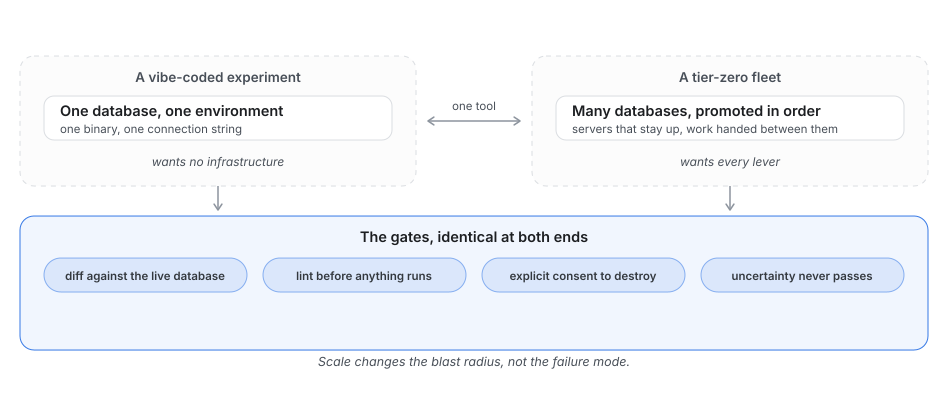
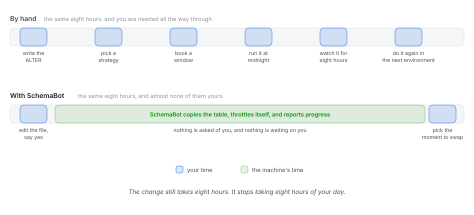
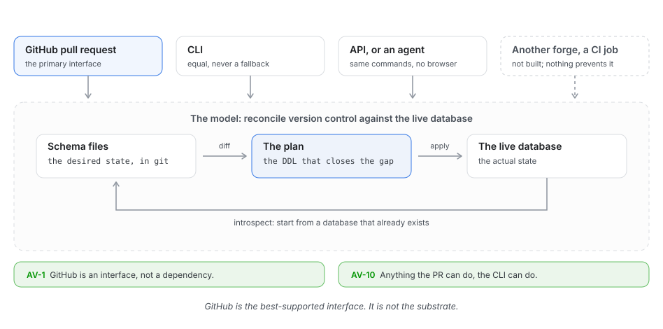
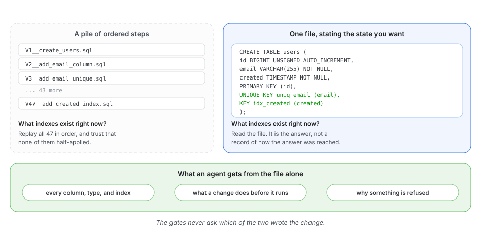
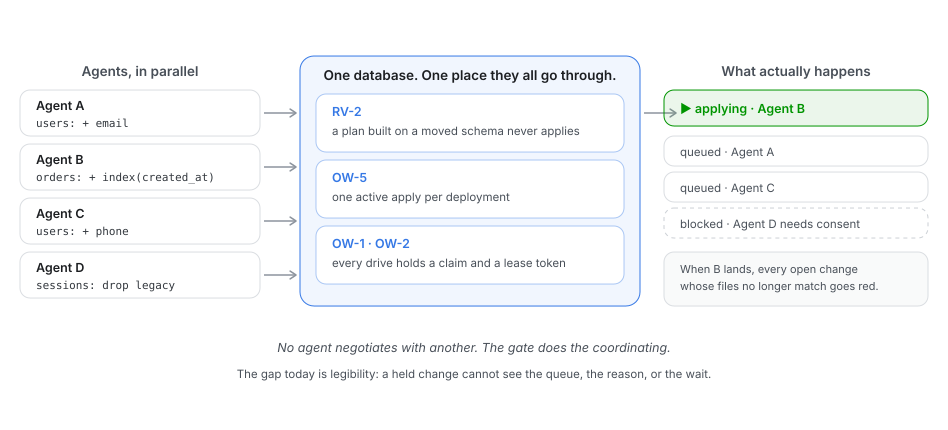
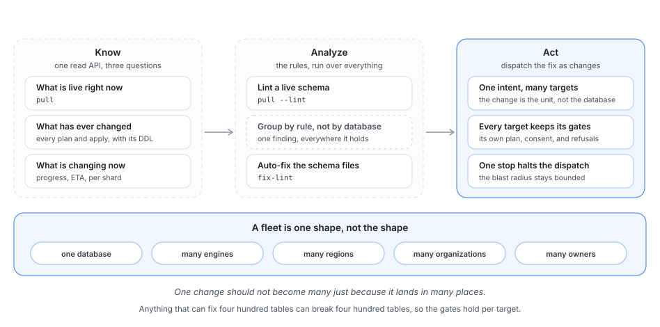
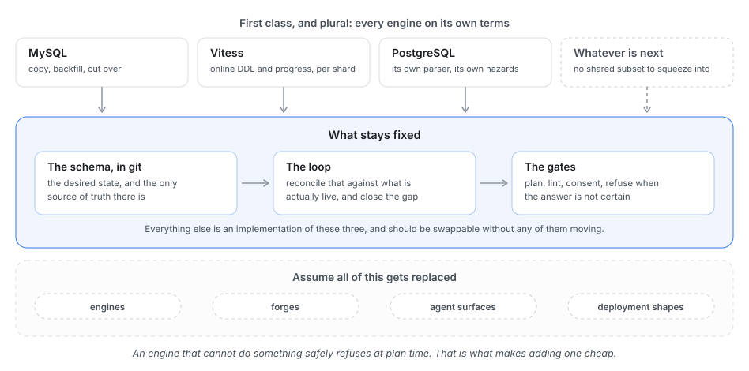

# Vision

## The northstar

Every database should be able to evolve safely, from a weekend project to the tier-zero fleet a
business runs on. Anyone should be able to build with agents against a real database, without
becoming a database expert or giving up control of their data. Ask for a feature, approve its
database changes, and ship knowing the database matches what you approved.

SchemaBot offers the path from a proposed schema to a verified change in a live database.
This is what we’re building toward.

> **One person shipping a feature.** You ask your coding agent to add a feature that requires a
> schema change. It updates the app and declares the schema it needs. SchemaBot shows you exactly
> what will change in your database. You approve, SchemaBot applies and verifies the change, and
> the agent tests the feature. You ship from the tool where you started, without becoming a
> database expert.

> **Many agents, one database.** Four agents are building different features. Two need to change
> the same table. When one change lands, the other's plan becomes stale. SchemaBot tells that agent
> to reconcile and replan. Another proposes dropping a column, and that one waits for a person.
> Nobody arbitrates between the agents. They work independently because the safety gates are shared
> and the protocols are clear.

> **A change that runs for three weeks.** An index add on a table holding tens of terabytes. There is no
> version of that which is fast. SchemaBot builds a new copy of the table alongside the live one and
> fills it for three weeks. The whole time, it watches how long each batch takes and how much
> capacity the database has to spare. When there is room, it speeds up. When pressure climbs, it
> backs off or pauses. The copy moves as fast as the database can safely handle, without anyone
> tuning it by hand. The application writes to the old table for all twenty-one days and never
> notices any of it. The only
> moment that touches the application is the swap at the end, and that was scheduled three weeks
> earlier in the pull request: 3am on Tuesday, when traffic is low. It happens then, on its own, and
> nobody is awake for it. Total human involvement: opening a pull request and picking a time.

> **A large database fleet spread across the company.** An engineer asks their agent: “Where are we still using the
> old primary-key type?” Across thousands of databases, SchemaBot supplies the live schemas, lint
> findings, and recorded change history. The agent returns the affected tables and the evidence
> behind each finding. SchemaBot asks: “Fix this category across the fleet?” The engineer says yes.
> SchemaBot opens pull requests in the owning repositories, each with the proposed schema edits
> and a plan against the live database, ready for the owners to review. Every change goes through
> the same gates. Nobody logs into a hundred databases, copies the same fix between repositories,
> or turns an audit spreadsheet into a week of tickets.

Agents are making it faster to build and iterate on features. SchemaBot helps the database keep up
by turning the schema you want into changes it plans, checks, and runs for you. Each change stays
reviewable: SchemaBot shows you what will happen, asks before destroying anything, and stops when
the answer is uncertain. You keep building, without having to become a database expert—with the
confidence to evolve your database at any scale, at any hour.

## From a vibe-coded experiment to a tier-zero database

SchemaBot should earn the trust of teams running tier-zero databases and be easy enough to use
on a side project. You get that foundation from the start, whether your project stays small or
grows into a company.

Start with the database you have. Bring its schema into version control, preview a real change,
and use the tools you already work in. The first useful plan should be minutes away, with the
same safeguards trusted in production.

Choose how SchemaBot fits: one binary and a connection string, a running service, or a component
inside your favorite developer tool. The same loop at every size, with the same guarantees. Close
a laptop or restart a server: the work must stay accounted for, ready to recover from where it left
off. Start with a simple setup and add what you need as you grow, all the way to running a large
company’s database fleet.

## Safe should also mean fast

A safe schema change should also be an easy one. Spend your attention on what you want to build;
let SchemaBot take care of getting the database ready.

You edit a file. You do not have to work out the `ALTER`, choose an execution strategy, pick a
batch size, tune a throttle, or wake up at midnight because that is when traffic is low.

Four things should disappear:

- **The second tool.** No separate console, form, or ticket. Drive the change where you already work.
- **The waiting.** Copying takes as long as it takes. That should be the machine's time, not yours.
- **The coordination tax.** Know what can ship first and what needs another step. Get guidance
  on deploy order and stale plans, with a clear question when application context is needed.
- **The follow-through.** Declare the schema once. SchemaBot carries it across environments,
  deployments, and shards, so you don't have to drive each one by hand.

The number that matters is how much of your day a schema change costs. The floor should be a
couple of minutes: write the schema, read what will happen, say yes. When conditions call for a
pause, SchemaBot should make the reason and next step clear. You should not have to choose between
moving quickly and taking care of your data.

## GitOps, not GitHub

The source of truth for the desired schema is version control. SchemaBot is the loop that
reconciles it against the live database. That loop is the product. Everything else, including
GitHub, is a way to reach it.

GitHub is the best-supported interface by a wide margin, and that is deliberate. It is still not
the substrate. CLI and API applies keep working while GitHub is down, and the process that touches
your database never needs GitHub credentials.

Bring the workflow to wherever people build: another forge, a terminal, or an agent calling an API.
Every interface should drive the same loop. Developers should be able to embed that capability in
their tools and give their users the full experience, with the gates already in place.

## Guardrails and context for agents

An agent should have the context to make a good change and the guidance to carry it through.
Schema files show what should exist, the live database shows what has landed, and version control
records how the declaration changed. The agent can understand the schema and propose what the
feature needs without reconstructing a history of change scripts.

SchemaBot turns that proposal into answers the agent can use: this change needs a table copy,
this one can run instantly, this one needs your decision. It should be just as clear about what
happened during execution and what to do next, so the agent can keep working without someone
interpreting every result.

You don't have to trust an agent's judgment about database safety. SchemaBot checks each proposed
change, applies what was reviewed, and requires explicit consent before destroying anything. If
the plan changes, it checks again. If the outcome is uncertain, it stops. Those safeguards give
you the confidence to let agents do more.

## Many agents, one database

One agent writing a schema change is the easy case. The hard question becomes: what happens when
three of them are right at the same time?

Each agent should be free to focus on its feature, even when another process planned against the
same table forty seconds ago. SchemaBot gives them a shared place to coordinate changes, with
execution authority behind the gates.

SchemaBot coordinates ownership, excludes overlapping applies, and rejects stale plans. Agents do
not need to negotiate, discover each other, or agree on an ordering. They need a shared source of
truth and a gate that fails closed when their view of it is stale.

An agent waiting behind another should know why, what it needs to do next, and when it can continue.
That turns a conflict into a next step. More agents can build in parallel without asking a person
to untangle every collision.

## One database, or ten thousand

A team running thousands of databases should be able to understand them as easily as one.
SchemaBot brings together what is live, what has changed, and what is changing now. An engineer,
an agent, or a dashboard can ask across the fleet and follow an answer down to the schema and
recorded changes behind it, with read-only access.

A rule broken by four hundred tables across sixty databases is one question, not four hundred.
See the affected tables, choose what to fix, and have SchemaBot open pull requests for their owners
to review. What starts as a question about the fleet becomes work ready to ship, without a week
of copying fixes between repositories.

The same desired schema can reach every environment, deployment, and shard that needs it. Each
target gets a plan against its own live state. SchemaBot should handle the rollout order, show
what has finished and what needs attention, and let you stop further rollout from one place.

## Everything underneath will change

MySQL, Vitess, and PostgreSQL are each meant to be first class. Use each engine's strengths and
respect its semantics. A common workflow should give you the best path that engine supports, with
a clear answer when a change is outside its capabilities. Every new engine should expand what you
can build with the same confidence.

The same holds for forges, agent interfaces, and deployment shapes. Assume the parts get replaced.
What does not: the schema in version control, the loop that reconciles it against what is live,
and the gates in between.

## What does not change

However far any of the above gets, these hold:

- **Uncertainty fails closed.** An ambiguous result blocks. It never passes.
- **The operator is never surprised.** Nothing runs without the plan and authorization it requires.
  Work that has started stays accounted for until it is resolved.
- **A narrower engine is not a looser one.** Adding an engine or deployment shape never costs a
  guarantee. Unsupported work gets an explicit refusal.
- **Integrity outranks everything else.** Convenience, speed, and scope all lose to it. Every
  database deserves protection from data loss and corruption, regardless of its size.

## Build with us

Help us make this the tool you’d trust with your own database. Try it, tell us where it falls short,
or contribute the engine support or integration you need.

## Reading further

This is the direction. The current capabilities and their boundaries live here:

- [invariants.md](./invariants.md): the enforced guarantees and where they stop.
- [engines.md](./engines.md): what each engine can do today.
- [postgresql.md](./postgresql.md): the current PostgreSQL support envelope.
- [schema-intelligence.md](https://github.com/block/schemabot/blob/c8f803dc39b1be3afe4906cc660847e28994ec11/docs/schema-intelligence.md): what SchemaBot knows and how to query it.
- [architecture.md](./architecture.md): how the pieces fit together.
- [CONTRIBUTING.md](../CONTRIBUTING.md): how to contribute.
