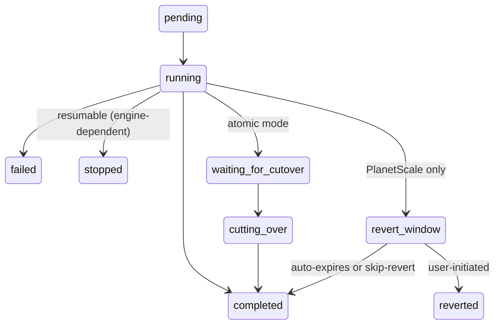
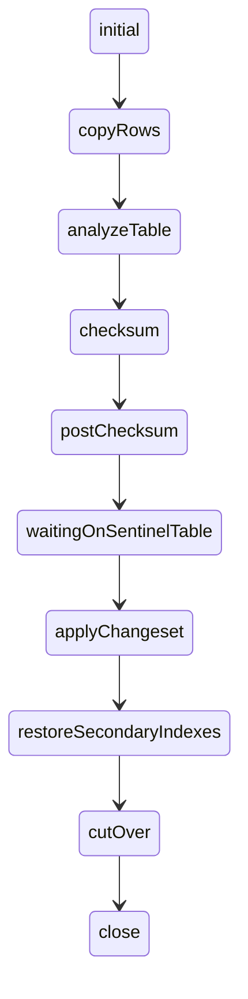
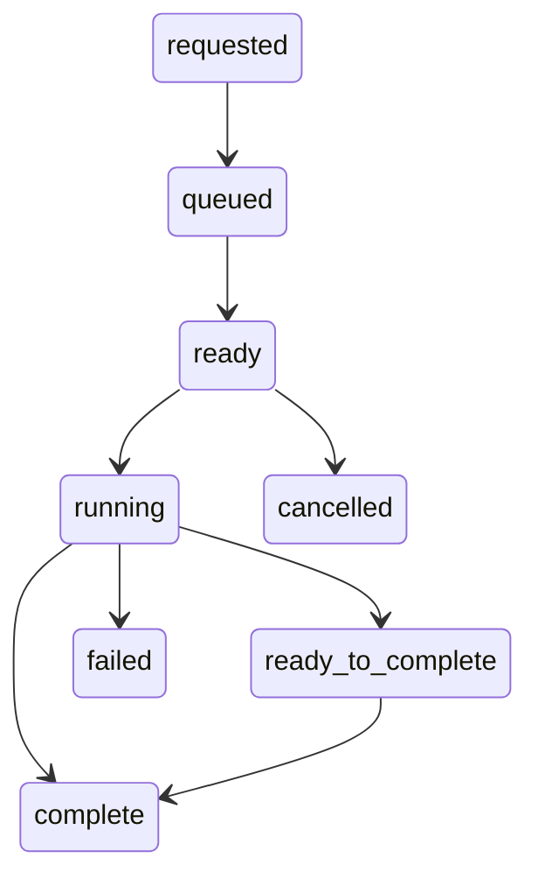

# pkg/state

Canonical state constants for SchemaBot.

## State hierarchy

```
Apply (1) ──→ Tasks (many) ──→ Engine reports per table/shard
state.Apply     state.Task       vitess schema / spirit status
```

An apply includes one or more tasks, where a task tracks the execution of a single table. Both `Apply` and `Task` are
SchemaBot's internal states (stored in DB) that operate in a state machine. Engine states are external — what
Vitess OnlineDDL and Spirit report — and they are translated into Task and Apply states.

## Apply states

| State | Value | Description |
|-------|-------|-------------|
| Pending | `pending` | Apply created, no tasks started |
| Running | `running` | At least one task is actively executing |
| WaitingForCutover | `waiting_for_cutover` | All tasks ready, waiting for manual cutover (atomic mode only — in sequential mode each task cuts over independently) |
| CuttingOver | `cutting_over` | Cutover in progress (atomic mode only) |
| Completed | `completed` | All tasks finished successfully |
| Failed | `failed` | At least one task failed |
| Stopped | `stopped` | User requested stop, resumable via start (engine-dependent) |
| RevertWindow | `revert_window` | Schema change applied, revert available. Only meaningful for PlanetScale; Spirit doesn't support revert so SchemaBot auto-advances to completed |
| Reverted | `reverted` | Schema change was reverted |



- `waiting_for_cutover`/`cutting_over`: Only with `--defer-cutover` or atomic mode (Spirit)
- `revert_window`: Only with `--enable-revert`. Spirit auto-advances through it; PlanetScale holds until expiry or user action. Maps from PlanetScale's `complete_pending_revert` deploy state

## Task states

Per-table execution state. Same state machine as Apply, plus `cancelled`:

| State | Value | Description |
|-------|-------|-------------|
| Pending | `pending` | Task created, not yet started |
| Running | `running` | Engine is actively executing (row copy, checksum, etc.) |
| WaitingForCutover | `waiting_for_cutover` | Row copy complete, waiting for cutover signal |
| CuttingOver | `cutting_over` | Table cutover in progress |
| Completed | `complete` | Schema change applied successfully |
| Failed | `failed` | Engine reported failure |
| Stopped | `stopped` | User requested stop, checkpoint saved |
| RevertWindow | `revert_window` | Schema change applied, revert available (PlanetScale only) |
| Reverted | `reverted` | Schema change was reverted |
| Cancelled | `cancelled` | Task never executed due to earlier failure (sequential mode) |

## Deriving apply state

`DeriveApplyState()` computes the apply state from the collective task states. Priority rules (highest to lowest):

1. Any task **failed** → apply `failed`
2. Any task **stopped** → apply `stopped`
3. Any task **reverted** → apply `reverted`
4. All tasks **completed** → apply `completed`
5. Any task **cutting_over** → apply `cutting_over`
6. All non-completed tasks **waiting_for_cutover** → apply `waiting_for_cutover`
7. Any task **revert_window** → apply `revert_window`
8. Any task **running** → apply `running`
9. Otherwise → apply `pending`

Terminal states (`completed`, `failed`, `reverted`, `cancelled`) are checked via `IsTerminalApplyState()`. Note: `stopped` is NOT terminal at the task level — a stopped task can be resumed via Start.

## Spirit states

Per table, sub-states within "running". Constants from [`github.com/block/spirit/pkg/status`](https://github.com/block/spirit/blob/main/pkg/status/status.go):



Values are camelCase strings from `status.State.String()`.

## Vitess OnlineDDL states

Per shard, from `SHOW VITESS_MIGRATIONS`. Constants from [`vitess.io/vitess/go/vt/schema`](https://github.com/vitessio/vitess/blob/main/go/vt/schema/online_ddl.go):



7 core states from `schema.OnlineDDLStatus` plus derived `ready_to_complete`.

## Normalization

`NormalizeTaskStatus()` maps raw engine states → Task constants. It imports
[`github.com/block/spirit/pkg/status`](https://github.com/block/spirit/blob/main/pkg/status/status.go) and
[`vitess.io/vitess/go/vt/schema`](https://github.com/vitessio/vitess/blob/main/go/vt/schema/online_ddl.go)
directly in the switch so it's clear where each status originates.

| Engine input | Example values | Normalized to |
|---|---|---|
| Spirit sub-states | `copyRows`, `analyzeTable`, `checksum` | `running` |
| Spirit sentinel wait | `waitingOnSentinelTable` | `waiting_for_cutover` |
| Spirit cutover | `cutOver` | `cutting_over` |
| Spirit close | `close` | `complete` |
| Vitess queue states | `requested`, `queued`, `ready` | `pending` |
| Vitess running | `running` | `running` |
| Vitess complete | `complete` | `complete` |
| Vitess failed/cancelled | `failed`, `cancelled` | `failed`, `cancelled` |
| Storage completed | `completed` | `complete` |
| Already-normalized | `stopped`, `reverted`, etc. | pass-through |

What's common: Both engines produce completed, running, waiting_for_cutover, failed, pending equivalents.
What's different: Spirit has granular sub-states → normalize to `running`. Vitess has queue lifecycle → normalize to `pending`.

## Progress rendering

The CLI renders progress via `pkg/cmd/templates/`. The data flow:

```
Engine (Spirit/Vitess)
  → Tern client (LocalClient or GRPCClient)
  → API (ProgressResponse proto)
  → CLI (ParseProgressResponse → ProgressData)
  → Terminal (WriteProgress)
```

Two normalization layers:

1. **`NormalizeTaskStatus()`** (this package) — maps engine-specific strings to canonical Task constants. Called at the parsing boundary so rendering code can compare against `Task.*` directly.

2. **`NormalizeState()`** (`pkg/cmd/templates/progress_parse.go`) — strips the `STATE_` prefix and lowercases (`STATE_RUNNING` → `running`). The prefix exists because protobuf enums require a common prefix by convention (see `State` enum in `tern.proto`: `STATE_PENDING`, `STATE_RUNNING`, etc.). Applied to the apply-level state and per-table status during `ParseProgressResponse()`.

The rendering layer (`WriteProgress`) uses normalized states to select progress bar styles and display labels (`StateLabel()`). Each state maps to a color:

| State | Color | Example |
|-------|-------|---------|
| Running | Blue | `🟦🟦🟦🟦🟦🟦⬜⬜⬜⬜⬜⬜⬜⬜⬜⬜⬜⬜⬜⬜ 32%` |
| Waiting for cutover | Yellow | `🟨🟨🟨🟨🟨🟨🟨🟨🟨🟨🟨🟨🟨🟨🟨🟨🟨🟨🟨🟨 Waiting for cutover` |
| Cutting over | Yellow | `🟨🟨🟨🟨🟨🟨🟨🟨🟨🟨🟨🟨🟨🟨🟨🟨🟨🟨🟨🟨 🔄 Cutting over...` |
| Completed | Green | `🟩🟩🟩🟩🟩🟩🟩🟩🟩🟩🟩🟩🟩🟩🟩🟩🟩🟩🟩🟩 ✓ Complete` |
| Stopped | Orange | `🟧🟧🟧🟧🟧🟧🟧⬜⬜⬜⬜⬜⬜⬜⬜⬜⬜⬜⬜⬜ ⏹️ Stopped at 35%` |
| Failed | Red | `🟥🟥🟥🟥🟥⬜⬜⬜⬜⬜⬜⬜⬜⬜⬜⬜⬜⬜⬜⬜ ❌ Failed` |

Bars are 20 squares wide; filled squares represent percent complete. Defined in `pkg/cmd/templates/progress_render.go`.

## Comment states

PR comment tracking for applies. Each apply can have up to 3 comments, one per comment state:

| State | Value | Description |
|-------|-------|-------------|
| Progress | `progress` | Main progress comment, created on `pending`, edited throughout execution |
| Cutover | `cutover` | Cutover confirmation comment, created only with `--defer-cutover` when entering `cutting_over` |
| Summary | `summary` | Final summary comment, created when the apply reaches a terminal state |

Stored in the `apply_comments` table with `UNIQUE(apply_id, comment_state)`. Upsert semantics allow Start/resume to replace old comment IDs with fresh ones.

### How it works

At any point during an apply, exactly one comment is the **active comment** — the one that gets edited on each state change or progress tick. Initially the progress comment is active. If `--defer-cutover` is used, a second cutover comment is created when the apply enters `cutting_over`, and that comment becomes the active one (the progress comment is frozen). When the apply reaches a terminal state, the active comment is edited one last time with the final state, and a separate summary comment is posted.

The `apply_comments` table maps `(apply_id, comment_state)` to a GitHub comment ID. This lets the webhook handler look up which comment to edit without carrying state between requests. The active comment is resolved by checking if a cutover comment exists — if so, it's active; otherwise, the progress comment is active:

```go
cutover, _ := store.Get(ctx, applyID, state.Comment.Cutover)
if cutover != nil {
    return cutover  // cutover is active
}
return store.Get(ctx, applyID, state.Comment.Progress)  // progress is active
```

### Comment lifecycle

```
           ┌──────────────────┐
           │       init       │   No comments exist yet
           └────────┬─────────┘
                    │ on: pending
                    │ action: CREATE progress comment
                    ▼
           ┌──────────────────┐
           │     progress     │   Progress comment being edited
           │     (active)     │   (edit on: running, waiting_for_cutover,
           └───────┬──┬───────┘    cutting_over(auto), revert_window(auto))
                   │  │
    on: terminal   │  │ on: cutting_over with defer_cutover
                   │  │ action: CREATE cutover comment
                   │  │ (progress frozen, cutover becomes active)
                   │  ▼
                   │  ┌──────────────────┐
                   │  │     cutover      │  Cutover comment being edited
                   │  │     (active)     │  (edit on: revert_window(defer))
                   │  └────────┬─────────┘
                   │           │ on: terminal
                   │           │
                   ▼           ▼
              ┌──────────────────┐
              │       done       │  EDIT active to final, CREATE summary
              └──────────────────┘
                       │
                       │ on: Start (resume from stopped)
                       │ action: UPSERT progress & summary with new IDs
                       ▼
              (back to progress)
```

### Transition table

| Active Comment | Apply Event | Comment Actions |
|----------------|-------------|-----------------|
| (none) | pending | CREATE progress |
| progress | running / waiting_for_cutover | EDIT progress |
| progress | cutting_over (auto) | EDIT progress |
| progress | cutting_over (defer_cutover) | CREATE cutover (becomes active) |
| progress | revert_window (auto) | EDIT progress |
| progress | terminal | EDIT progress to final, CREATE summary |
| cutover | revert_window (defer) | EDIT cutover |
| cutover | terminal | EDIT cutover to final, CREATE summary |
| (done) | Start (resume from stopped) | UPSERT progress and summary with new IDs |

### Example: apply with `--defer-cutover`

1. User runs `schemabot apply-confirm -e staging` → apply created in `pending`
   - **CREATE** progress comment: "Schema change pending..."
2. Apply starts → `running`, progress ticks at 10%, 20%, ...
   - **EDIT** progress comment: "Running... 20% complete"
3. Row copy finishes → `waiting_for_cutover`
   - **EDIT** progress comment: "Waiting for cutover"
4. User runs `schemabot cutover -e staging` → `cutting_over`
   - **CREATE** cutover comment: "Cutover in progress..." ← cutover is now active
   - Progress comment is frozen (still shows "Waiting for cutover")
5. Cutover completes → `completed`
   - **EDIT** cutover comment: "Cutover complete"
   - **CREATE** summary comment: "Schema change completed successfully"

Result: 3 comments on the PR (progress, cutover, summary). Without `--defer-cutover`, there would be 2 (progress, summary) — the progress comment covers the entire lifecycle including cutover.

## Engine trust model

How SchemaBot treats engine-reported states depends on how the engine runs:

**Spirit** — SchemaBot runs Spirit in-process as a library. SchemaBot starts the runner, polls `eng.Progress()`,
and maps the result to storage states. SchemaBot owns the full lifecycle: start, poll, stop, resume.

**Vitess/PlanetScale** — Vitess runs autonomously. SchemaBot submits a deploy request and polls
`SHOW VITESS_MIGRATIONS` or the PlanetScale API to observe progress. The engine progresses independently;
SchemaBot records what it sees.

In both cases:

- **Terminal states are trusted.** When an engine reports completed, failed, or equivalent, SchemaBot
  persists it immediately.
- **"No active schema change" is not trusted.** This could mean completed, never started, or crashed.
  SchemaBot marks the task as failed with an abandonment message.
- **`stopped` and `cancelled` are SchemaBot-owned.** These are set by user action (stop command) or
  SchemaBot logic (earlier failure cancels remaining tasks in sequential mode), not reported by engines.
- **Stop checkpoints conservatively.** When a user requests stop, SchemaBot marks all non-terminal
  tasks as `stopped` regardless of engine sub-state — even if row copy is 100% done. A schema
  change isn't complete until cutover finishes, so SchemaBot won't promote a task to `completed`
  based on partial engine progress. On resume, SchemaBot re-checks the actual table schema to
  determine which tables still need changes vs which already cut over before the stop took effect.

## State representations

The same logical states exist in four representations across different layers:

| Layer | Type | Format | Example | Package |
|-------|------|--------|---------|---------|
| Engine | `engine.State` | lowercase | `"completed"` | `pkg/engine` |
| Storage | `storage.TaskState` | UPPERCASE | `"COMPLETED"` | `pkg/storage` |
| Proto (gRPC) | `ternv1.State` | enum with `STATE_` prefix | `STATE_COMPLETED` | `pkg/proto/ternv1` |
| Canonical | `state.Apply` / `state.Task` | lowercase | `"completed"` / `"complete"` | `pkg/state` |

Conversion between layers is handled by `pkg/tern/state_converters.go`:

```
Engine (Spirit/Vitess)
  → engineStateToStorage()  → Storage (DB)
  → storageStateToProto()   → Proto (gRPC wire)
  → ProtoStateToStorage()   → back to canonical for CLI
  → taskStateToApplyState() → Apply state for DB
```

Engines report their own native states (Spirit camelCase, Vitess lowercase). The engine adapter
(`pkg/engine/spirit`, `pkg/engine/planetscale`) translates these into `engine.State` values. From
there, `state_converters.go` maps to the UPPERCASE `storage.TaskState` for DB persistence. Applies
store state as lowercase strings directly from `state.Apply.*`.

`NormalizeTaskStatus()` in this package handles the reverse direction — raw engine strings arriving
via the progress API are normalized to canonical `state.Task.*` constants for rendering.
